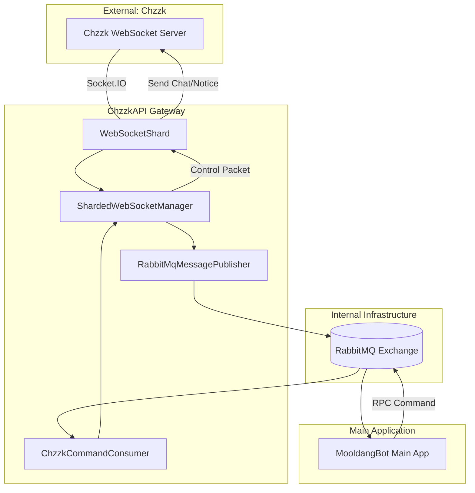

# ChzzkAPI 서비스 아키텍처 (Architecture)

본 문서는 `MooldangBot.ChzzkAPI` 게이트웨이의 고수준 아키텍처와 서비스 간 상호작용 구조를 설명합니다.

---

## 1. 개요 (Overview)

ChzzkAPI 게이트웨이는 치지직 스트리밍 서비스와 `MooldangBot` 메인 시스템 사이의 가교 역할을 하는 마이크로서비스입니다. 
외부 WebSocket 연결의 수명을 관리하고, 복잡한 Socket.IO 프로토콜을 추상화하여 내부 시스템에 정제된 이벤트를 전달합니다.

---

## 2. 서비스 구조 및 데이터 흐름

### 고수준 데이터 흐름도

---

## 3. 핵심 컴포넌트

### 3.1 샤딩 시스템 (Sharding System)
- **`ShardedWebSocketManager`**: 모든 샤드(Shard)의 생명주기를 관리하는 관제 센터입니다. 
- **`WebSocketShard`**: 실제 1:1 WebSocket 연결을 담당하는 단위입니다. 
  - 각 샤드는 독립적인 세션 키를 사용하여 치지직의 중계 서버와 연결됩니다.
  - 연결 끊김 시 지수 백오프(Exponential Backoff) 기반의 재연결 로직을 수행합니다.

### 3.2 메시징 파이프라인 (Messaging Pipeline)
- **Outbound (이벤트 사출)**: 게이트웨이에서 발생한 채팅, 후원 등의 이벤트를 RabbitMQ로 보냅니다.
- **Inbound (명령어 수신)**: 메인 앱으로부터 채팅 발송 요구나 연결 제어 명령을 수신하여 실행합니다.

---

## 4. 환경 변수 및 설정 (Configuration)

게이트웨이 기동을 위해 다음 환경 변수가 필수적으로 설정되어야 합니다:

| 변수명 | 설명 | 비고 |
| :--- | :--- | :--- |
| `CHZZKAPI__CLIENTID` | 치지직 OpenAPI 클라이언트 ID | |
| `CHZZKAPI__CLIENTSECRET` | 치지직 OpenAPI 클라이언트 시크릿 | |
| `INTERNAL_API_SECRET` | 게이트웨이와 메인 앱 간의 인증 비밀키 | |
| `RABBITMQ_HOST` | RabbitMQ 서버 주소 | |
| `SHARD_INDEX` | 현재 인스턴스가 담당할 샤드 번호 | 수평 확장을 위해 사용 |

---

## 5. 결합도 및 의존성

- **Contracts 프로젝트 연동**: 게이트웨이와 메인 앱은 `MooldangBot.ChzzkAPI.Contracts` 프로젝트를 공유하여 이벤트 모델의 정합성을 유지합니다.
- **상태 비저장(Stateless)**: 게이트웨이는 인증 정보를 메모리에 저장하지 않으며(세션 키만 관리), 모든 지속성 데이터는 메인 앱과 데이터베이스에서 관리합니다.
