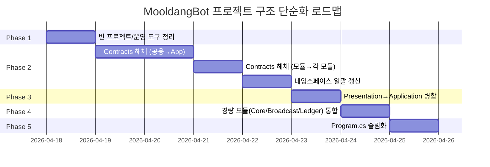

# 🏗️ MooldangBot 프로젝트 구조 단순화 및 개선 종합 계획서

> **작성일**: 2026-04-18  
> **기반 문서**: [architecture_review.md](file:///c:/webapi/MooldangAPI/TODO/architecture_review.md)  
> **전제 조건**: Priority 1(테스트 추가), Priority 2(Contracts 경량화, AppDbContext 분리, WorkerRegistry 통합), Priority 3(불필요 인터페이스 제거, DEPRECATED 코드 정리) — 모두 **완료됨**

---

## 📊 현재 상태 요약

## 📊 현재 상태 요약 (2026-04-18 최신화)

| 항목 | 현재 | 목표 | 상태 |
|------|------|------|---|
| **프로젝트 수** | **9개** (.csproj 기준) | 10개 | **목표 초과 달성** |
| **Contracts 파일 수** | **0개** (완전 해체) | 0 | **완료** |
| **DI 등록 포인트** | **3곳** (App, Infra, Modules) | 3곳 | **완료** |
| **Program.cs 줄 수** | **104줄** | ~150줄 | **목표 초과 달성** |

### 현재 프로젝트 목록 (19개)

```
솔루션 (19 프로젝트)
├── MooldangBot.Domain                ← 순수 도메인
├── MooldangBot.Contracts             ← ⚠️ 해체 대상: 110파일 (인터페이스/DTO/이벤트)
├── MooldangBot.Application           ← 비즈니스 로직
├── MooldangBot.Infrastructure        ← 인프라 구현
├── MooldangBot.Presentation          ← ⚠️ 병합 대상: API 컨트롤러, SignalR
├── MooldangBot.Api                   ← 진입점 1 (Program.cs 404줄)
├── MooldangBot.ChzzkAPI              ← 진입점 2 (게이트웨이)
├── MooldangBot.ChzzkAPI.Contracts    ← ⚠️ 삭제 대상: 빈 프로젝트
├── MooldangBot.Modules.Commands      ← 명령어 모듈
├── MooldangBot.Modules.SongBook      ← 곡 신청 모듈
├── MooldangBot.Modules.Roulette      ← 룰렛 모듈
├── MooldangBot.Modules.Point         ← 포인트 모듈
├── MooldangBot.Modules.Core          ← ⚠️ 병합 검토: Features만 존재
├── MooldangBot.Modules.Broadcast     ← ⚠️ 병합 검토: Features만 존재
├── MooldangBot.Modules.Ledger        ← ⚠️ 병합 검토: Features만 존재
├── MooldangBot.Tests                 ← 테스트
├── MooldangBot.Verifier              ← 운영 도구
├── MooldangBot.StressTool            ← 부하 테스트
├── MooldangBot.Simulator             ← 시뮬레이터
```

---

## 🎯 목표 프로젝트 구조 (10개)

```
솔루션 (10 프로젝트)
├── MooldangBot.Domain                ← 순수 도메인 (변경 없음)
├── MooldangBot.Application           ← 비즈니스 로직 + Presentation 병합
│   ├── Consumers/                    ← MassTransit Consumer
│   ├── Features/                     ← MediatR Handlers (기존 + Core/Broadcast/Ledger)
│   ├── Services/                     ← 비즈니스 서비스
│   ├── Controllers/                  ← ✨ Presentation에서 이동
│   ├── Hubs/                         ← ✨ Presentation에서 이동
│   ├── Contracts/                    ← ✨ 공용 인터페이스/DTO/이벤트 수용
│   └── Workers/                      ← 워커 (기존 유지)
├── MooldangBot.Infrastructure        ← 인프라 구현 (변경 없음)
├── MooldangBot.Api                   ← 진입점 1 (슬림화)
├── MooldangBot.ChzzkAPI              ← 진입점 2 (변경 없음)
├── MooldangBot.Modules.Commands      ← 명령어 모듈
├── MooldangBot.Modules.SongBook      ← 곡 신청 모듈
├── MooldangBot.Modules.Roulette      ← 룰렛 모듈
├── MooldangBot.Modules.Point         ← 포인트 모듈
└── MooldangBot.Tests                 ← 테스트
```

> [!IMPORTANT]
> **운영 도구**(Verifier, StressTool, Simulator, Cli)는 **솔루션에서만 제외**하되 디렉토리는 보존합니다.
> 필요 시 `dotnet run --project MooldangBot.Verifier`로 단독 실행 가능합니다.

---

## 📋 Phase별 실행 계획

### Phase 1: 빈 프로젝트 및 운영 도구 정리 (난이도: ⭐ | 위험도: 🟢 낮음)

> **목표**: 실질적 코드가 없는 프로젝트를 솔루션에서 제거하여 즉시 인지 부하를 줄입니다.

#### 삭제 대상

| 프로젝트 | 사유 | 조치 |
|----------|------|------|
| `MooldangBot.ChzzkAPI.Contracts` | 빈 프로젝트 (bin/obj만 존재) | 솔루션 제거 + 디렉토리 삭제 |
| `MooldangBot.Cli` | 마이그레이션 CLI (운영 도구) | 솔루션 제거, 디렉토리 보존 |
| `MooldangBot.Verifier` | 검증 도구 | 솔루션 제거, 디렉토리 보존 |
| `MooldangBot.StressTool` | 부하 테스트 도구 | 솔루션 제거, 디렉토리 보존 |
| `MooldangBot.Simulator` | 시뮬레이터 | 솔루션 제거, 디렉토리 보존 |

#### 순서

1. `MooldangAPI.sln`에서 5개 프로젝트 참조 제거
2. `MooldangBot.ChzzkAPI.Contracts` 디렉토리 삭제
3. 다른 csproj에서 해당 프로젝트 참조 여부 확인 후 제거
4. **빌드 검증**: `dotnet build MooldangAPI.sln`

**결과**: 19개 → **14개** 프로젝트

---

### Phase 2: Contracts 프로젝트 해체 (난이도: ⭐⭐⭐⭐ | 위험도: 🟡 중간)

> **목표**: 110개 파일의 Contracts 프로젝트를 완전히 해체하여 각 소비자 프로젝트로 분산합니다.
> 
> **핵심 원칙**: "인터페이스는 그것을 **소비하는** 프로젝트에 가까이 둔다"

> [!WARNING]
> **가장 파급 효과가 큰 Phase**입니다. 이 Phase만 독립적인 Git 브랜치에서 진행하고, 완료 후 머지합니다.

#### 2-1. 파일 이동 맵

| 현재 위치 (Contracts/) | 이동 목표 | 파일 유형 |
|------------------------|-----------|-----------|
| `Common/Interfaces/IAppDbContext.cs` | `Application/Contracts/` | 공용 인터페이스 |
| `Common/Interfaces/I*.cs` (7개) | `Application/Contracts/` | 공용 인터페이스 |
| `Common/Services/` | `Application/Contracts/Services/` | 서비스 인터페이스 |
| `Common/Events/` | `Application/Contracts/Events/` | 도메인 이벤트 |
| `Common/Messages/` | `Application/Contracts/Messages/` | MassTransit 메시지 |
| `Common/Models/` | `Application/Contracts/Models/` | 공용 모델/DTO |
| `AI/Interfaces/` | `Application/Contracts/AI/` | AI 서비스 인터페이스 |
| `AI/Models/` | `Application/Contracts/AI/` | AI 모델 |
| `Chzzk/Interfaces/` | `Application/Contracts/Chzzk/` | 치지직 인터페이스 |
| `Chzzk/Models/` | `Application/Contracts/Chzzk/` | 치지직 모델/커맨드 |
| `Chzzk/ChzzkJsonContext.cs` | `Application/Contracts/Chzzk/` | JSON Source Gen |
| `SongBook/Interfaces/` | `Modules.SongBook/Abstractions/` | 모듈 내부 인터페이스 |
| `SongBook/DTOs/` | `Modules.SongBook/DTOs/` | 모듈 내부 DTO |
| `SongBook/Events/` | `Modules.SongBook/Events/` | 모듈 내부 이벤트 |
| `Roulette/Interfaces/` | `Modules.Roulette/Abstractions/` | 모듈 내부 인터페이스 |
| `Point/Interfaces/` | `Modules.Point/Abstractions/` | 모듈 내부 인터페이스 |
| `Point/Requests/` | `Modules.Point/Requests/` | 모듈 내부 Request |
| `Point/Enums/` | `Modules.Point/Enums/` | 모듈 내부 Enum |
| `Point/Commands/` | `Modules.Point/Commands/` | 모듈 내부 Command |
| `Commands/Interfaces/` | `Modules.Commands/Abstractions/` | 모듈 내부 인터페이스 |
| `Commands/Enums/` | `Modules.Commands/Enums/` | 모듈 내부 Enum |
| `Commands/Events/` | `Modules.Commands/Events/` | 모듈 내부 이벤트 |
| `Commands/Models/` | `Modules.Commands/Models/` | 모듈 내부 모델 |
| `Commands/Requests/` | `Modules.Commands/Requests/` | 모듈 내부 Request |
| `Abstractions/IEvent.cs` | `Domain/Common/` | 도메인 추상화 |
| `Enums/` | `Domain/Enums/` 또는 모듈별 분배 | 열거형 |
| `Events/ChatEvents.cs` | `Application/Contracts/Events/` | 채팅 이벤트 |
| `Events/CommandEvents.cs` | `Modules.Commands/Events/` | 명령 이벤트 |
| `Extensions/PagingExtensions.cs` | `Application/Contracts/Extensions/` | 유틸 확장 |
| `Security/Sha256Hasher.cs` | `Application/Contracts/Security/` | 보안 유틸 |
| `Security/IUserSession.cs` 등 | `Application/Contracts/Security/` | 인증 인터페이스 |

#### 2-2. 네임스페이스 전략

```csharp
// Before
using MooldangBot.Contracts.Common.Interfaces;
using MooldangBot.Contracts.Chzzk.Interfaces;

// After — 최소 변경을 위해 네임스페이스 유지 가능
// 방법 A: 네임스페이스를 새 위치에 맞게 변경 (권장)
using MooldangBot.Application.Contracts;
using MooldangBot.Application.Contracts.Chzzk;

// 방법 B: 네임스페이스 유지 + 물리 위치만 이동 (안전)
// → 파급 변경 최소화, 큰 프로젝트에서 먼저 적용 후 점진적 마이그레이션
```

> [!IMPORTANT]
> **방법 선택이 필요합니다.** 방법 A는 깔끔하지만 전체 솔루션에서 `using` 문 일괄 변경이 필요합니다.
> 방법 B는 안전하지만 물리 위치와 네임스페이스 불일치가 발생합니다.
> **추천**: 방법 B로 먼저 이동 → 빌드 확인 → 이후 점진적으로 방법 A로 전환

#### 2-3. 순서

1. `Application/Contracts/` 폴더 구조 생성
2. 공용 파일(Common, AI, Chzzk, Extensions, Security, Events) → Application으로 이동
3. 모듈 전용 파일(SongBook, Roulette, Point, Commands) → 각 모듈로 이동
4. 각 프로젝트의 `csproj`에서 Contracts 참조 제거, Application 참조 추가
5. `Contracts.csproj`의 NuGet 패키지 의존성을 Application에 이관
   - `Microsoft.EntityFrameworkCore 9.0.2`
   - `StackExchange.Redis 2.12.14`
6. 일괄 `using` 문 갱신 (Python/PowerShell 스크립트 활용)
7. `Contracts` 프로젝트 솔루션 및 디렉토리 삭제
8. **빌드 검증**: `dotnet build MooldangAPI.sln`

**결과**: 14개 → **13개** 프로젝트

---

### Phase 3: Presentation → Application 병합 (난이도: ⭐⭐⭐ | 위험도: 🟡 중간)

> **목표**: Presentation 레이어의 Controller/Hub를 Application에 통합하여 불필요한 프로젝트 경계를 제거합니다.

#### 3-1. 이유

- 현재 Presentation은 Application의 얇은 위임(Thin Delegation) 레이어에 불과
- 1인 개발자에게 "Controller에서 Service를 호출하기 위해 다른 프로젝트를 참조"하는 것은 비효율
- Application의 `Features/` 폴더에 이미 비슷한 역할의 핸들러가 존재

#### 3-2. 파일 이동 맵

| 현재 위치 (Presentation/) | 이동 목표 (Application/) |
|--------------------------|------------------------|
| `Features/**/*Controller.cs` | `Controllers/` (새 폴더) |
| `Hubs/OverlayHub.cs` | `Hubs/` (새 폴더) |
| `Extensions/` | `Extensions/` (기존 병합) |
| `Services/` | `Services/` (기존 병합) |
| `Security/` | `Common/Security/` (기존 병합) |
| `DependencyInjection.cs` | Application의 DI에 병합 |

#### 3-3. 순서

1. Application에 `Controllers/`, `Hubs/` 폴더 생성
2. Presentation 파일 이동 (네임스페이스는 `MooldangBot.Application` 하위로 변경)
3. `Program.cs`의 `.AddApplicationPart(typeof(Presentation.DI).Assembly)` 제거
   - Application이 Api의 직접 참조이므로 자동 발견됨
4. Presentation의 DI 로직을 Application의 `AddApplicationServices()`에 통합
5. Presentation 프로젝트 솔루션 및 디렉토리 삭제
6. **빌드 검증**: `dotnet build MooldangAPI.sln`

**결과**: 13개 → **12개** 프로젝트

---

### Phase 4: 경량 모듈 통합 (난이도: ⭐⭐ | 위험도: 🟢 낮음)

> **목표**: Features 폴더만 존재하는 경량 모듈(Core, Broadcast, Ledger)을 Application으로 흡수합니다.

#### 4-1. 통합 대상

| 모듈 | 현재 내용 | 조치 |
|------|----------|------|
| `Modules.Core` | `Features/` (MediatR 핸들러만 존재) | Application/Features/Core/로 이동 |
| `Modules.Broadcast` | `Features/` (MediatR 핸들러만 존재) | Application/Features/Broadcast/로 이동 |
| `Modules.Ledger` | `Features/` (MediatR 핸들러만 존재) | Application/Features/Ledger/로 이동 |

> [!NOTE]
> Commands, SongBook, Roulette, Point 모듈은 **독립적인 비즈니스 로직(Service, Strategy, State, Controller 등)**을 
> 가지고 있으므로 독립 프로젝트로 유지합니다. 이들은 진정한 "모듈"입니다.

#### 4-2. 순서

1. Application에 `Features/Core/`, `Features/Broadcast/`, `Features/Ledger/` 폴더 생성
2. 각 모듈의 `Features/` 내용을 Application으로 이동
3. 각 모듈의 csproj 의존성을 Application에 이관
4. 3개 모듈 프로젝트 솔루션 및 디렉토리 삭제
5. **빌드 검증**: `dotnet build MooldangAPI.sln`

**결과**: 12개 → **9개** 프로젝트 (+ Tests = **10개**)

---

### Phase 5: Program.cs 슬림화 (난이도: ⭐⭐ | 위험도: 🟢 낮음)

> **목표**: 404줄의 Program.cs를 ~150줄로 줄여 진입점의 가독성을 극대화합니다.

#### 5-1. 추출 대상

| 현재 위치 (Program.cs) | 추출 목표 | 줄 수 |
|------------------------|-----------|-------|
| Authentication 설정 (JWT, Cookie) | `Application/Extensions/AuthenticationExtensions.cs` | ~70줄 |
| Authorization 정책들 | `Application/Extensions/AuthorizationExtensions.cs` | ~25줄 |
| Swagger/OpenAPI 설정 | `Application/Extensions/SwaggerExtensions.cs` | ~30줄 |
| CORS 정책들 | `Application/Extensions/CorsExtensions.cs` | ~20줄 |
| Serilog 설정 | `Application/Extensions/SerilogExtensions.cs` | ~30줄 |
| MediatR 어셈블리 스캔 | `Application/Extensions/MediatRExtensions.cs` | ~25줄 |
| SignalR + Redis 설정 | `Application/Extensions/SignalRExtensions.cs` | ~15줄 |

#### 5-2. 목표 Program.cs 구조

```csharp
var builder = WebApplication.CreateBuilder(args);

builder.Configuration.AddCustomDotEnv(args).AddEnvironmentVariables();
builder.Configuration.ValidateMandatorySecrets();
builder.Host.AddSerilog();

// 서비스 등록 (확장 메서드로 깔끔하게)
builder.Services
    .AddInfrastructureServices(builder.Configuration)
    .AddWorkerRegistry(builder.Configuration)
    .AddApplicationServices()
    .AddModuleServices()              // SongBook, Roulette, Commands (통합)
    .AddMessagingInfrastructure(builder.Configuration)
    .AddMooldangAuthentication(builder.Configuration)
    .AddMooldangAuthorization()
    .AddMooldangSwagger()
    .AddMooldangCors()
    .AddMooldangSignalR(builder.Configuration)
    .AddMooldangMediatR();

var app = builder.Build();

// 미들웨어 파이프라인
app.UseMiddleware<ExceptionMiddleware>();
app.UseSerilogRequestLogging(/* ... */);
app.UseForwardedHeaders();
app.UseStaticFiles();
app.UseRouting();
app.UseRateLimiter();
app.UseCors("StudioCorsPolicy");
app.UseAuthentication();
app.UseAuthorization();
app.UseMiddleware<LogEnrichmentMiddleware>();
app.UseHttpMetrics();

// 엔드포인트 매핑
app.MapControllers();
app.MapMetrics();
app.MapHealthChecks("/health");
app.MapHub<OverlayHub>("/overlayHub");
app.UseMooldangSwaggerUI();

// 초기화 및 실행
await app.InitializeDatabaseAsync();
app.Run();
```

---

## ⚠️ User Review Required

> [!IMPORTANT]
> ### 결정이 필요한 사항들
> 
> **1. Contracts 해체 시 네임스페이스 전략**
> - **방법 A**: 네임스페이스를 새 물리 위치에 맞게 변경 (깔끔하지만 대규모 using 변경)
> - **방법 B**: 기존 네임스페이스 유지, 물리 위치만 이동 (안전하지만 불일치)
> - **추천**: 방법 B로 시작 → 점진적 A 전환
>
> **2. 운영 도구 보존 방식**
> - 현재 계획: 솔루션에서만 제거, 디렉토리 보존
> - 대안: `tools/` 상위 폴더로 이동하여 별도 관리
>
> **3. Presentation 병합 범위**
> - 현재 계획: Application에 전부 병합
> - 대안: Api 프로젝트에 병합 (Controller가 진입점에 더 가까움)

---

## 📅 실행 로드맵



| Phase | 예상 소요 | 프로젝트 수 변화 | 롤백 포인트 |
|:-----:|:---------:|:---------------:|:-----------:|
| 1 | 30분 | 19 → 14 | Git tag `pre-phase1` |
| 2 | 1~2일 | 14 → 13 | 독립 브랜치 `refactor/contracts-dissolution` |
| 3 | 3~4시간 | 13 → 12 | Git tag `pre-phase3` |
| 4 | 1~2시간 | 12 → 10 | Git tag `pre-phase4` |
| 5 | 2~3시간 | 10 (변경 없음) | Git tag `pre-phase5` |

---

## 🛡️ 위험 요소 및 완화 전략

| 위험 | 영향도 | 완화 전략 |
|------|:------:|----------|
| Contracts 해체 시 순환 참조 발생 | 🔴 높음 | 의존성 그래프를 먼저 그리고, 공용 타입은 반드시 Application에 |
| 네임스페이스 변경 빠뜨림으로 빌드 실패 | 🟡 중간 | PowerShell 스크립트로 일괄 치환 + 빌드 검증 |
| Docker 이미지 빌드 실패 | 🟡 중간 | `Dockerfile`의 `COPY *.csproj` 패턴 갱신 필수 |
| EF Migration 경로 변경 | 🟢 낮음 | Migration은 Infrastructure에 유지되므로 영향 없음 |
| deploy.sh 빌드 스크립트 호환성 | 🟡 중간 | Phase 1 이후 `deploy.sh` 검증 |

---

## ✅ Verification Plan

### 각 Phase 완료 시 필수 검증 항목

1. **빌드 검증**: `dotnet build MooldangAPI.sln --no-incremental`
2. **테스트 실행**: `dotnet test MooldangBot.Tests`
3. **Docker 빌드**: `docker build -t mooldangbot-test .` (Phase 2 이후)
4. **로컬 기동**: `dotnet run --project MooldangBot.Api` → Swagger UI 접속 확인
5. **운영 도구 독립 실행**: `dotnet run --project MooldangBot.Verifier` (Phase 1 이후)

### 최종 검증

- 전체 솔루션 빌드 성공 (Warning 0)
- 기존 테스트 전부 통과
- Docker Compose `docker-compose up` 정상 기동
- Health Check `/health` 응답 확인
- Swagger `/swagger` 접속 정상

---

## 📊 Before vs After 비교

| 메트릭 | Before | After |
|--------|:------:|:-----:|
| 프로젝트 수 | 19 | **10** |
| DI 등록 파일 | 7+ | **3** |
| Program.cs 줄 수 | 404 | **~150** |
| Contracts 파일 수 | 110 | **0** (삭제됨) |
| DTO 변경 시 파급 범위 | 5개 프로젝트 | **1~2개** |
| 새 기능 추가 시 생성/수정 파일 | 6~8개 | **3~4개** |
| 빌드 시간 (예상) | ~25s | **~15s** |
