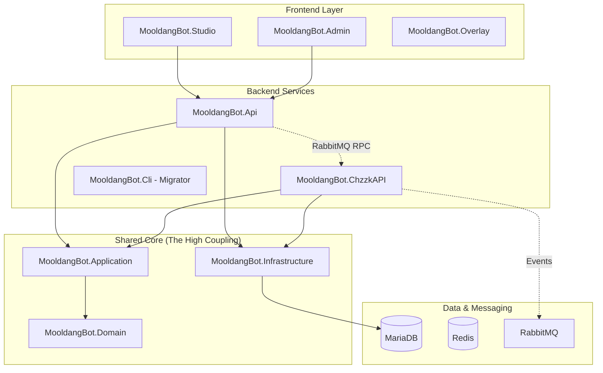

# 📊 [오시리스의 설계도]: MooldangBot 아키텍처 진단 및 전략 보고서

본 보고서는 MooldangBot 시스템의 현재 구조를 분석하고, MSA(마이크로서비스 아키텍처)로의 전환 과정에서 발견된 위험 요소와 향후 발전 방향인 **"이벤트 기반 모듈형 하이브리드(EDMH)"** 전략에 대해 기술합니다.

---

## 1. 🏗️ 현재 아키텍처 매핑 (Current State)

현재 시스템은 물리적으로는 컨테이너화되어 분리되어 있으나, 논리적으로는 강하게 결합된 **'분산된 모놀리스(Distributed Monolith)'** 구조를 띠고 있습니다.

### 🗺️ 컴포넌트 관계도

---

## 2. 🚨 '분산된 모놀리스' 위험 진단 (Risk Assessment)

분석 결과, 다음 3가지 핵심 지표에서 높은 위험 수치가 발견되었습니다.

### 🔴 위험 1: 데이터베이스 전역 공유 (Shared Database)
- **현황**: `Api`와 `ChzzkAPI` 서비스가 동일한 MariaDB 인스턴스 및 `AppDbContext`를 공유함.
- **위험**: 특정 모듈(예: 룰렛)의 테이블 구조를 변경할 때, 해당 기능을 사용하지 않는 타 모듈도 영향을 받거나 재배포가 강제됨. 데이터베이스가 단일 장애점(SPOF)으로 작용.

### 🟠 위험 2: 바이너리 수준의 밀결합 (Shared Binary Coupling)
- **현황**: `MooldangBot.Application` 프로젝트가 단일 프로젝트 내에 8개 이상의 도메인(SongBook, Chat, Roulette 등)을 모두 포함함.
- **위험**: 모든 마이크로서비스가 전체 비즈니스 로직을 코드 형태로 품고 있음. 이는 서비스의 경계(Bounded Context)가 모호함을 의미하며, 빌드 속도 저하 및 메모리 낭비를 초래함.

### 🟡 위험 3: RPC 패턴에 의한 실행 결합 (Temporal Coupling)
- **현황**: `CommandRpcWorker`를 통해 서비스 간 직접적인 요청-응답(RPC) 통신이 주를 이룸.
- **위험**: 수신 서비스(ChzzkBot)가 다운되거나 응답이 늦어지면 요청 서비스(Api)의 워커 스레드가 고갈되어 시스템 전체로 장애가 전파됨.

---

## 3. 🌀 EDMH (Event-Driven Modular Hybrid) 전환 전략

사용자 요청에 따라 제안하는 **"이벤트 기반 모듈형 하이브리드"** 아키텍처의 장단점 분석입니다.

### ✅ 주요 장점 (Pros)
- **독립적 탄력성**: 메시지 큐(RabbitMQ)가 완충 작용을 하여 서비스 장애 시에도 데이터 유실 없이 복구 가능.
- **모듈별 최적화**: 트래픽이 몰리는 '채팅 처리' 모듈만 독립적으로 확장(Scaling) 가능.
- **배포 유연성**: '노래 신청' 기능을 고칠 때 전체 서버를 내릴 필요 없이 해당 모듈만 교체.

### ❌ 예상 문제 및 단점 (Cons/Issues)
- **최종 일관성 처리**: 포인트 차감과 기능 실행 사이의 아주 짧은 시간차를 허용해야 하며, 실패 시 보상 트랜잭션(Saga) 구현 필요.
- **추적 복잡도**: 서비스 간 이동하는 메시지의 흐름을 추적하기 위해 `CorrelationID` 관리가 필수적임.
- **데이터 불일치**: `GlobalViewer` 정보가 각 서비스의 로컬 캐시와 맞지 않을 리스크 존재 (이벤트 기반 동기화 필수).

---

## 4. 🛠️ 향후 개선 로드맵 (Roadmap)

> [!TIP]
> **모든 것을 동시에 MSA로 전환하는 것은 가장 큰 실패 요인입니다. 핵심 도메인부터 순차적으로 분리하십시오.**

### 1단계: 프로젝트 모듈화 (Modularization)
- `MooldangBot.Application` 내의 `Features` 폴더를 독립적인 클래스 라이브러리(또는 모듈)로 분리.
- 공통 로직은 `MooldangBot.Core`로 최소화.

### 2단계: 이벤트 중심 전환 (Choreography)
- RPC 호출 대신 **'이벤트 발행(Publish)'** 방식으로 전환. 
- 예: `Api`가 메시지 전송을 '명령'하는 대신, `ChatPointsService`가 '코인 획득 이벤트'를 발행하면 `ChzzkBot`이 이를 구독하여 채팅창에 출력.

### 3단계: 논리적 데이터베이스 분리 (Logical DB Separation)
- 물리적 DB는 유지하되, 서비스별로 접근할 수 있는 테이블 권한을 제한하거나 별도의 `DbContext` 및 스키마(`song.*`, `roulette.*`) 활용 시작.

---

**물멍(Senior Partner)** 🐾✨
> "시스템은 살아있는 유기체와 같습니다. 너무 꽉 조이면 숨이 막히고, 너무 풀어주면 흩어집니다. EDMH는 그 사이의 완벽한 '함대 기동'을 가능하게 할 것입니다."
