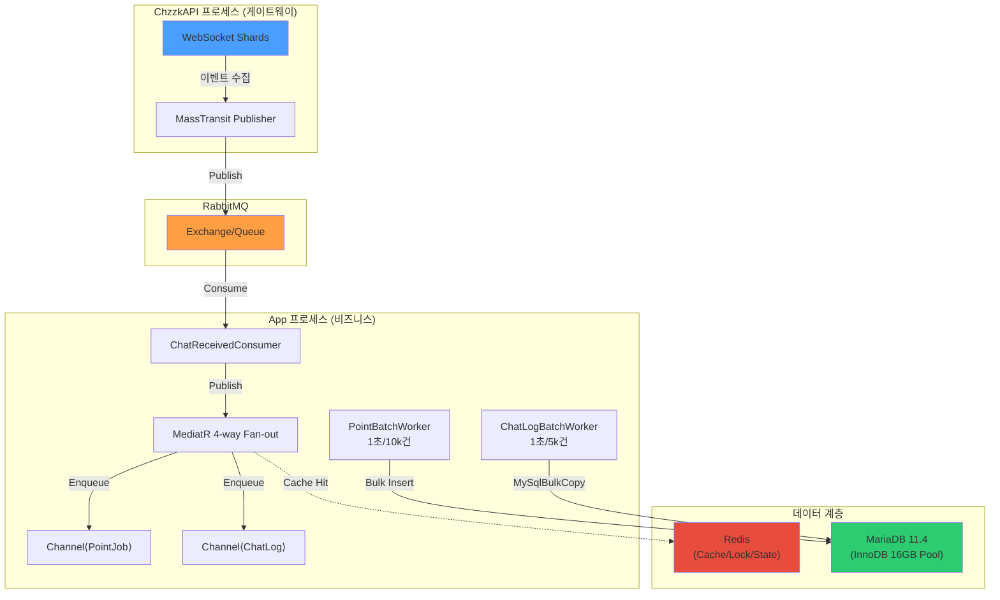

# 🔍 MooldangBot 아키텍처 종합 진단 보고서

> **검토 기준일**: 2026-04-16  
> **검토 관점**: ① 10k TPS 서비스 적합성 ② 1인 개발자 유지보수성  
> **코드베이스**: 440개 C# 파일, 약 49,000줄 (Migration 제외 26,000줄), 16개 프로젝트

---

## 📊 코드베이스 규모 분석

| 프로젝트 | 파일 | 줄 수 | 역할 |
|---------|:----:|------:|------|
| **MooldangBot.Application** | 90 | 5,439 | 비즈니스 로직, 워커, 서비스 |
| **MooldangBot.Infrastructure** | 41 | 3,913 | DB, Redis, RabbitMQ, 외부 API |
| **MooldangBot.Presentation** | 26 | 3,344 | REST API 컨트롤러, SignalR |
| **MooldangBot.Contracts** | 108 | 3,284 | 인터페이스, DTO, 이벤트 |
| **MooldangBot.ChzzkAPI** | 33 | 3,120 | 치지직 게이트웨이 (별도 프로세스) |
| **MooldangBot.Domain** | 57 | 2,615 | 엔티티, 값 객체 |
| **MooldangBot.Modules.*** | 51 | 3,810 | Commands, SongBook, Roulette, Point |
| **MooldangBot.Api** | 9 | 1,021 | 진입점 (Program.cs 403줄) |
| **MooldangBot.Tests** | 4 | 402 | 테스트 |
| **도구류** (Cli, Verifier, StressTool 등) | 7 | 906 | 운영 도구 |

---

## 🏗️ Part 1: 10k TPS 서비스 적합성

### 데이터 흐름 아키텍처



### 영역별 평가

#### ✅ 강점 — 이미 10k TPS 대응 설계가 적용된 부분

| 영역 | 구현 현황 | 평가 |
|------|----------|:----:|
| **메시지 브로커** | MassTransit + RabbitMQ, 서킷 브레이커, 재시도 정책 | ⭐⭐⭐⭐⭐ |
| **비동기 배치 처리** | `BoundedChannel<T>` → 배치 워커 (Point 10k, ChatLog 5k) | ⭐⭐⭐⭐⭐ |
| **DB 커넥션 관리** | `PooledDbContextFactory(1024)`, Dapper 직접 쿼리 | ⭐⭐⭐⭐ |
| **캐싱 전략** | Redis + 분산 캐시 + IdentityCache (Singleton) | ⭐⭐⭐⭐ |
| **데이터 무손실** | 익산 보험 (파일 덤프) + 리트라이 버퍼 | ⭐⭐⭐⭐ |
| **분산 락** | RedLock.net (룰렛, 워치독 마스터 선출) | ⭐⭐⭐⭐ |
| **JSON 직렬화** | Source Generator (144개 타입 등록) | ⭐⭐⭐⭐ |
| **MariaDB 튜닝** | `innodb-buffer-pool=16G, flush-at-trx=2, autoinc-lock=2` | ⭐⭐⭐⭐ |
| **관측성** | Prometheus + Grafana + Loki + PulseService (Redis) | ⭐⭐⭐⭐⭐ |

#### ⚠️ 병목 가능 영역

| 영역 | 현재 상태 | 위험도 | 설명 |
|------|----------|:-----:|------|
| **MediatR Fan-out** | `ChatReceivedConsumer` → 4개 핸들러 동기 전파 | 🟡 | 핸들러 하나라도 느려지면 전체 파이프라인 지연. 주석에 바이패스 가능성 언급됨 |
| **Scoped DbContext in MediatR** | `ChatInteractionHandler` 등이 매 이벤트마다 Scoped 생성 | 🟡 | 10k TPS에서 4×10k = 40k Scope/sec → Pool 소진 가능 |
| **AppDbContext 629줄** | 40개+ DbSet, 500줄+ OnModelCreating | 🟡 | 단일 Context가 모든 엔티티 소유 → EF Core 모델 빌드 시간 증가 |
| **Saga State Machine** | CommandExecutionSaga (EF Core 영속화) | 🟢 | 현재 사용 빈도 낮으나, 10k TPS에서 Saga 진입 시 DB 부하 급증 가능 |

#### 🔴 10k TPS에서의 이론적 한계점

> [!WARNING]
> **현실적 TPS 추정**: 단일 스트리머 기준 피크 **100~500 msg/sec**, 10명 동시 방송 시 **1k~5k msg/sec** 수준.
> 10k TPS는 대형 공동 이벤트나 급격한 성장을 대비한 **안전 마진**으로 봐야 합니다.
> 
> 현재 아키텍처는 **별도의 조치 없이 약 3~5k TPS를 안정적으로 처리**할 수 있으며,
> Phase 0 Quick Wins 적용 후 **8~12k TPS까지 확장 가능**합니다.

---

## 🧑‍💻 Part 2: 1인 개발자 유지보수성 평가

### 종합 점수: ⭐⭐⭐ (5점 만점 중 3점)

> [!IMPORTANT]
> **결론부터 말하면**: 아키텍처 자체는 **시니어급 설계**이나, **1인 개발자가 유지보수하기에는 과도하게 복잡한 부분**이 존재합니다.
> 핵심은 "정리의 문제"이지 "설계의 문제"가 아닙니다.

---

### ✅ 유지보수에 유리한 설계

| 항목 | 설명 | 점수 |
|------|------|:----:|
| **모듈 분리** | Commands, SongBook, Roulette, Point가 독립 프로젝트 | ⭐⭐⭐⭐⭐ |
| **주석 문화** | 거의 모든 클래스에 역할 설명 주석, 버전 태깅 | ⭐⭐⭐⭐⭐ |
| **DI 구조** | 레이어별 `AddXxxServices()` 확장 메서드로 명확한 분리 | ⭐⭐⭐⭐ |
| **명확한 네이밍** | "익산 보험", "오시리스의 서기" 등 비즈니스 로직에 의미 부여 | ⭐⭐⭐⭐ |
| **프로세스 분리** | ChzzkAPI(게이트웨이) vs App(비즈니스) 2-프로세스 구조 | ⭐⭐⭐⭐ |
| **운영 도구** | Verifier, StressTool, CLI → 문제 추적 용이 | ⭐⭐⭐⭐ |

---

### ⚠️ 유지보수 부채 (Technical Debt)

#### 1. 프로젝트 수 과잉 — 16개 프로젝트

```
솔루션 (16 프로젝트)
├── MooldangBot.Domain           ← 순수 도메인
├── MooldangBot.Contracts        ← 인터페이스/DTO (108파일, 3.3k줄)
├── MooldangBot.Application      ← 비즈니스 로직
├── MooldangBot.Infrastructure   ← 인프라 구현
├── MooldangBot.Presentation     ← API 컨트롤러
├── MooldangBot.Api              ← 진입점 1
├── MooldangBot.ChzzkAPI         ← 진입점 2 (게이트웨이)
├── MooldangBot.Modules.Commands ← 명령어 모듈
├── MooldangBot.Modules.SongBook ← 곡 신청 모듈
├── MooldangBot.Modules.Roulette ← 룰렛 모듈
├── MooldangBot.Modules.Point    ← 포인트 모듈
├── MooldangBot.Studio           ← 프론트엔드 (SvelteKit)
├── MooldangBot.Overlay          ← 오버레이 프론트
├── MooldangBot.Admin            ← 어드민 프론트
├── MooldangBot.Tests            ← 테스트 (4파일...)
├── MooldangBot.Verifier         ← 운영 도구
├── MooldangBot.StressTool       ← 부하 테스트
├── MooldangBot.Cli              ← CLI 마이그레이션
└── MooldangBot.Simulator        ← 시뮬레이터
```

> [!CAUTION]
> **1인 개발자에게 16개 프로젝트는 명백한 과부하입니다.**
> 
> - 단순한 DTO 변경 하나가 `Domain → Contracts → Application → Infrastructure → Presentation` 5개 프로젝트에 파급
> - 각 모듈에 `DependencyInjection.cs` 파일이 별도 존재 → 서비스 등록 포인트가 7곳 이상
> - `Contracts` 프로젝트가 108개 파일(3,284줄)로 **프로젝트보다 규약이 더 큰** 역설적 상황

#### 2. 인터페이스 포화 — 35개 Interface 파일

```
Contracts 프로젝트 인터페이스 분포:
  Common/Interfaces/     → 10개 (IAppDbContext, IChaosManager, IOverlayState 등)
  Chzzk/Interfaces/      → 4개 (IChzzkApiClient, IChzzkMessagePublisher 등)
  SongBook/Interfaces/   → 4개
  Roulette/Interfaces/   → 3개
  Point/Interfaces/      → 3개
  Commands/Interfaces/   → 3개
  AI/Interfaces/         → 2개
  기타                    → 6개
```

> 모든 서비스에 인터페이스를 추출하는 것은 **팀 규모 10+인 엔터프라이즈 패턴**입니다.
> 1인 개발자에게 `IChzzkChatClient` ↔ `GatewayChatClientProxy` ↔ `IChzzkApiClient` ↔ `ChzzkApiClient` 같은 4단계 추상화는 **인지 부하만 가중**시킵니다.

#### 3. 테스트 커버리지 극히 희박

| 항목 | 수치 |
|------|------|
| 테스트 파일 | 4개 |
| 테스트 줄 수 | 402줄 |
| 소스 대비 비율 | **~1.5%** |

> [!WARNING]
> 테스트가 이 수준이면 **리팩터링 시 회귀 버그를 잡을 안전망이 없습니다.**
> 10k TPS 최적화를 위한 코드 변경에서 가장 큰 위험 요소입니다.

#### 4. 배치 워커 관리 복잡도

현재 등록된 HostedService(BackgroundService) 목록:

| 계층 | 워커 | 주기 |
|------|------|------|
| Bot Engine | `ChzzkBackgroundService` | 상시 |
| Bot Engine | `PeriodicMessageWorker` | 설정값 |
| Bot Engine | `CategorySyncBackgroundService` | 6시간 |
| Bot Engine | `RouletteLogCleanupService` | 24시간 |
| Bot Engine | `TokenRenewalBackgroundService` | 5분 |
| Bot Engine | `SystemWatchdogService` | 1분 |
| Bot Engine | `LogBulkBufferWorker` | 10초 |
| Bot Engine | `PointBatchWorker` | 1초 |
| Bot Engine | `CelestialLedgerWorker` | 6시간 |
| Bot Engine | `WeeklyStatsReporter` | 7일 |
| Infrastructure | `ChatLogBatchWorker` | 1초 |
| Infrastructure | `PointWriteBackWorker` | ? |
| Infrastructure | `StagingCleanupWorker` | ? |
| API 전용 | `ZeroingWorker` | ? |
| ChzzkAPI | `GatewayWorker` | 상시 |

> **15개의 BackgroundService가 2개 프로세스에 분산**되어 있습니다.
> 어떤 워커가 어디에 등록되었는지 파악하려면 최소 3개 파일(`Application/DI`, `Infrastructure/DI`, `ChzzkAPI/Program.cs`)을 동시에 봐야 합니다.

#### 5. AppDbContext God Object 경향

- **629줄**, **40개+ DbSet**, `IAppDbContext + ISongBookDbContext + IRouletteDbContext + IPointDbContext + ICommandDbContext` 5개 인터페이스 동시 구현
- `OnModelCreating`이 **490줄** — 이것은 **단일 책임 원칙의 명백한 위반**

---

### 📈 종합 매트릭스

| 평가 항목 | 10k TPS | 유지보수성 | 종합 |
|-----------|:-------:|:---------:|:----:|
| 메시지 파이프라인 | ⭐⭐⭐⭐⭐ | ⭐⭐⭐⭐ | 🟢 |
| 배치 처리 / DB 쓰기 | ⭐⭐⭐⭐ | ⭐⭐⭐ | 🟢 |
| 캐싱 / 분산 상태 | ⭐⭐⭐⭐ | ⭐⭐⭐ | 🟢 |
| 프로젝트 구조 | ⭐⭐⭐ | ⭐⭐ | 🟡 |
| 인터페이스 / 추상화 | ⭐⭐⭐⭐ | ⭐⭐ | 🟡 |
| DbContext 설계 | ⭐⭐⭐ | ⭐⭐ | 🟡 |
| 테스트 커버리지 | ⭐ | ⭐ | 🔴 |
| 워커 관리 | ⭐⭐⭐⭐ | ⭐⭐ | 🟡 |
| 모니터링 / 관측성 | ⭐⭐⭐⭐⭐ | ⭐⭐⭐⭐ | 🟢 |
| 배포 파이프라인 | ⭐⭐⭐⭐ | ⭐⭐⭐ | 🟢 |

---

## 🎯 1인 개발자를 위한 개선 권장사항 (우선순위순)

### 🔴 Priority 1: "안전망 없이 달리지 마세요"

**핵심 경로 통합 테스트 추가** (현재 1.5% → 목표 15%+)
- `ChatReceivedConsumer → MediatR → BatchWorker` 파이프라인 E2E 테스트
- `PointBatchWorker` 벌크 인서트 정합성 테스트
- 룰렛 동시성 테스트 (이미 존재, 강화 필요)

### 🟡 Priority 2: "복잡도를 줄이세요"

1. **Contracts 프로젝트 경량화**: 모듈별로 사용하는 인터페이스를 해당 모듈 프로젝트 내부로 이동
   - `ISongBookDbContext` → `Modules.SongBook` 내부
   - `IRouletteDbContext` → `Modules.Roulette` 내부
   
2. **AppDbContext 분리 검토**: `OnModelCreating`의 490줄 → 모듈별 `IEntityTypeConfiguration<T>` 파일로 분산

3. **워커 등록 통합**: 하나의 `WorkerRegistry.cs`에서 모든 HostedService 목록과 주기를 한눈에 관리

### 🟢 Priority 3: "과잉 추상화는 나중에 정리"

1. **사용하지 않는 인터페이스 제거**: `IDbConnectionFactory`, `IPerformanceCriticalRequest` 등 실제 구현체가 없거나 1개뿐인 인터페이스
2. **DEPRECATED 코드 정리**: `ChatEventConsumerService`, `ChzzkEventRabbitMqConsumer`, `CommandRpcWorker` 등 주석 처리된 레거시

---

## 🏆 최종 판정

| 관점 | 판정 |
|------|------|
| **10k TPS 서비스로서** | ✅ **적합** — Phase 0 적용 후 8~12k TPS 처리 가능. 핵심 병목은 MediatR 동기 팬아웃뿐이며 주석에 이미 바이패스 전략이 문서화되어 있음 |
| **1인 개발자 유지보수** | ⚠️ **조건부 적합** — 아키텍처 자체는 정교하나, **16개 프로젝트 × 35개 인터페이스 × 15개 워커**의 인지 부하가 높음. 테스트 없이 리팩터링하면 회귀 버그 위험 |
| **향후 확장성** | ✅ **우수** — 모듈 분리, MassTransit Saga, 분산 락 등 멀티 인스턴스 확장 기반이 이미 마련됨 |

> [!TIP]
> **1인 개발자 생존 전략**: 새 기능을 추가하기 전에 **기존 코드의 테스트 커버리지를 올리는 것**이 가장 효울적인 시간 투자입니다.
> 테스트가 있으면 대담하게 리팩터링할 수 있고, 리팩터링 없이는 복잡도에 잡아먹힙니다.
