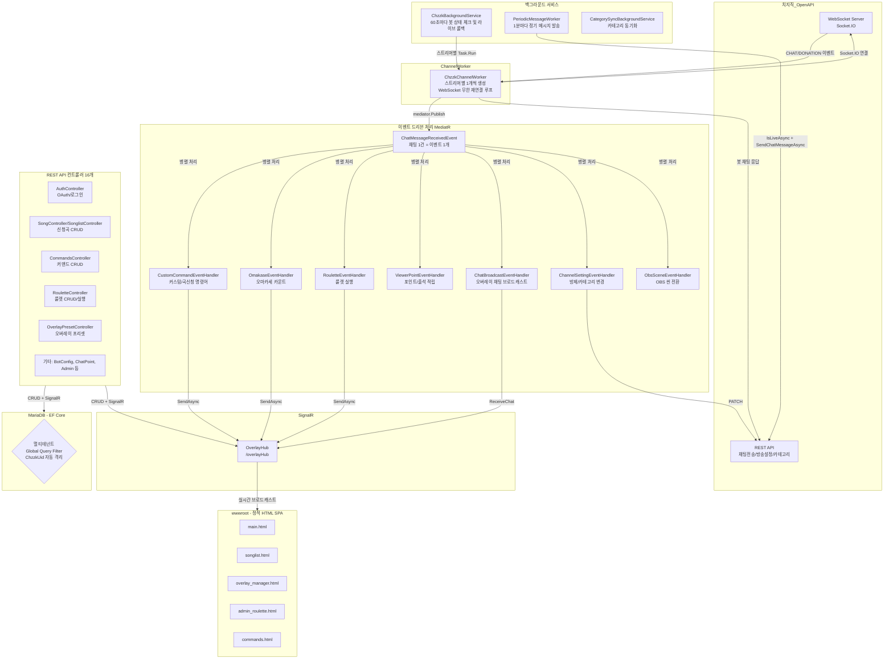

# MooldangBot (MooldangAPI) 시스템 상세 분석 보고서

> 작성일: 2026-03-24  
> 분석자: 물멍 (Senior Full-Stack AI Partner)  
> 대상: `c:\webapi\MooldangAPI\MooldangBot` 전체 폴더

---

## 1. 프로젝트 개요

**MooldangBot**은 치지직(CHZZK) 스트리밍 플랫폼과 연동되는 **멀티테넌트 스트리밍 봇 & 대시보드 API 서버**입니다.  
C# .NET 10, EF Core (MariaDB), MediatR, SignalR을 핵심 기술 스택으로 사용하며, **이벤트 드리븐 아키텍처(EDA)** 위에서 동작합니다.

### 핵심 기능 요약

| 기능 | 설명 |
|------|------|
| 치지직 WebSocket 봇 | 실시간 채팅 수신 및 명령어 처리 |
| 오마카세 | 치즈 후원 기반 메뉴 카운터 |
| 곡 신청 (SongQueue) | 채팅 명령어/후원 기반 신청곡 큐 관리 |
| 룰렛 | 치즈 후원 또는 포인트 사용 룰렛 |
| 시청자 포인트 & 출석 | 채팅 적립, 연속 출석 추적 |
| 커스텀 명령어 | DB 기반 동적 명령어 등록 및 응답 |
| 방제/카테고리 변경 | 채팅 명령어로 방송 설정 변경 |
| 오버레이 허브 | SignalR 기반 실시간 OBS 브라우저 소스 제어 |
| 정기 메시지 | 방송 중 일정 주기 채팅 자동 발송 |
| Chzzk OAuth 인증 | 스트리머 로그인 및 토큰 자동 갱신 |

---

## 2. 전체 아키텍처



---

## 3. 핵심 컴포넌트 상세 분석

### 3-1. 진입점 & DI 구성 (`Program.cs`)

**서비스 등록 전략:**

| 생명주기 | 서비스 | 이유 |
|----------|--------|------|
| `Singleton` | `ChzzkBackgroundService`, `SongQueueState`, `RouletteState`, `ObsWebSocketService`, `CommandCacheService` | 앱 전체에서 상태 공유 필요 |
| `Scoped` | `AppDbContext`, `UserSession`, `ChzzkCategorySyncService`, `RouletteService` | 요청별 독립 컨텍스트 |
| `Transient` | `IOverlayRenderStrategy` | 매번 새 인스턴스 허용 |
| `HostedService` | `ChzzkBackgroundService`, `PeriodicMessageWorker`, `CategorySyncBackgroundService` | 백그라운드 상시 실행 |

**주요 설정:**
- `.env` 파일 자동 로드 (Docker 환경 지원)
- Nginx/Cloudflare 리버스 프록시 대응 (`ForwardedHeaders`)
- 쿠키 기반 인증 (`CookieAuthentication`) + `StreamerId` 클레임 검증 미들웨어
- 앱 시작 시 `ChzzkClientId/Secret`을 DB (`SystemSettings`)에 자동 씨드

---

### 3-2. 멀티테넌트 DB 격리 (`AppDbContext.cs`)

**Global Query Filter** 패턴으로 테넌트 격리:

```csharp
// 현재 로그인한 스트리머의 ChzzkUid를 가진 데이터만 자동 필터링
modelBuilder.Entity<SongQueue>()
    .HasQueryFilter(e => !_userSession.IsAuthenticated || e.ChzzkUid == _userSession.ChzzkUid);
```

- **적용 대상:** StreamerProfile, SongQueue, StreamerCommand, StreamerOmakaseItem, Roulette, PeriodicMessage, SonglistSession, OverlayPreset, SharedComponent, AvatarSetting, ViewerProfile
- **배경 서비스에서의 우회:** `BackgroundService`는 인증 세션이 없어 `IsAuthenticated == false`이므로 필터가 비활성화되어 전체 스트리머 데이터 접근 가능
- **리눅스/Docker 대소문자 충돌 방지:** 모든 테이블명을 소문자로 명시적 매핑

---

### 3-3. 봇 엔진 동작 흐름

#### `ChzzkBackgroundService` (봇 매니저)
- **60초 주기**로 `IsBotEnabled == true`인 모든 스트리머를 DB에서 조회
- 스트리머별로 `ChzzkChannelWorker`를 `Task.Run()`으로 독립 비동기 실행
- `ConcurrentDictionary<string, CancellationTokenSource> _activeChannels`로 채널별 생명주기 관리
- **방송 종료 감지(Live→Offline):** `Task.WhenAll()`로 병렬 라이브 상태 체크 → 오프라인 전환 시 `OverlayPreset` 자동 롤백 + SignalR 브로드캐스트

#### `ChzzkChannelWorker` (스트리머 개별 WebSocket 연결)
1. DB에서 스트리머 프로필 + 토큰 로드
2. 토큰 만료 임박 시 자동 갱신 (치지직 OAuth Refresh)
3. 명령어 메모리 캐시 초기화 (CommandCacheService.RefreshAsync)
4. 치지직 OpenAPI /sessions/auth 호출 → WebSocket URL 획득
5. wss:// + /socket.io/ + transport=websocket&EIO=3 조합
6. ClientWebSocket 연결
7. 수신 루프: Socket.IO "0"(Open), "40"(방 입장), "2"(Ping) 대응, "42"(Event) 처리

---

### 3-4. EDA 이벤트 처리 (`ChatMessageReceivedEvent`)

MediatR `Publish()`를 통해 병렬 핸들러 실행:

- **H1. CustomCommandEventHandler**: 커스텀 명령어 검색 및 `{닉네임}` 등 변수 치환
- **H2. OmakaseEventHandler**: 동시성 제어(`DbUpdateConcurrencyException`)를 포함한 카운트 증가
- **H3. RouletteEventHandler**: 후원 금액 비례 다회차 실행 및 포인트 차감 로직
- **H4. ViewerPointEventHandler**: 채팅/출석/후원 기반 포인트 적립
- **H5. ChatBroadcastEventHandler**: 오버레이 실시간 채팅 전송
- **H6. ChannelSettingEventHandler**: 방제/카테고리 실시간 변경

---

### 11. 2026-03-24 치지직 웹소켓 성능 및 권한 안정화 패치
- `HandleEventAsync` 내 불필요한 DB Scope 생성 제거로 병목 현상 해결.
- 시청자 UID 비교 시 `OrdinalIgnoreCase` 적용으로 권한 체크 오류 수정.

### 12. 2026-03-24 치지직 웹소켓 무중단(Zero-Downtime) 및 복원력 패치
- `Task.WhenAny` 루프 도입 및 10초 주기 강제 하트비트(`"2"`) 송신.
- 재연결 대기 시간 **500ms** 단축으로 단선 시 즉각 복구.
- 수신 버퍼 16KB 상향 및 `IServiceScopeFactory` 기반 독립 Scope 처리.

---

## 22. 2026-03-25 룰렛 미션 관리 시스템 (Roulette Mission System v5)

룰렛 당첨 내역을 영속화하고 미션 상태를 관리하는 시스템을 구축했습니다.

- **Transactional Spinning**: `SemaphoreSlim`과 DB 트랜잭션을 결합하여 포인트 차감-로그 기록의 원자성 확보.
- **Mission Logging**: `RouletteLog` 테이블을 통해 당첨 이력 관리. `IsMission` 당첨 시 `Pending` 상태로 저장.
- **Mission Dashboard**: `admin_missions.html` 생성. 실시간 미션 수신 및 상태 변경(완료/취소) 지원.
- **Auto-Cleanup**: 30일 경과 로그 자동 삭제 서비스 구현.

---

## 23. 2026-03-25 룰렛 시스템 통합 배치 처리 (Roulette v6)

다중 회차 실행 시의 효율성과 시각적 피드백을 개선했습니다.

### 23-1. Batch Multi-Spin
- `SpinRouletteMultiAsync`로 로직 통합. 단일 트랜잭션 내에서 N개 결과를 배치 생성하여 DB 부하 최소화.
- SignalR 페이로드에 `Results`와 `Summary`를 함께 포함하여 오버레이 렌더링 최적화.

### 23-2. Donation Quotient Loop
- `RouletteEventHandler`에서 후원 금액을 비용으로 나눈 몫만큼 자동 실행. 
- 채팅 결과 포맷을 `[항목] x수량`으로 통일하여 가독성 및 데이터 정규성 확보.

---

### 24. 2026-03-27 송리스트 연동 안정화 및 기본 활성화 정책
- **Auth 초기화**: 신속한 초기 경험을 위해 신규 스트리머 가입 시 `IsBotEnabled`, `IsOmakaseEnabled`를 `true`로, `!신청`(1000원)을 기본값으로 자동 설정.
- **연동 안정화**: `0->40` 웹소켓 핸드쉐이크 및 `SYSTEM` 패킷 파싱 오류 해결.
- **원격 토글(!송리스트)**: `StreamerCommand`에 `SonglistToggle` 액션 타입을 추가하여 채팅창에서 실시간으로 송리스트 세션을 켜고 끌 수 있는 기능 구현. `{송리스트상태}` 치환 변수 지원.

---

## 25. 2026-03-27 통합 명령어 관리 시스템 (Unified Command System v1.1)

파편화되어 있던 커스텀/곡신청/룰렛/출석 명령어 로직을 단일 테이블 및 전략 패턴으로 통합했습니다.

### 25-1. 통합 아키텍처 (SSOT)
- **UnifiedCommand**: 모든 명령어 정보를 저장하는 단일 진실 공급원(SSOT) 테이블. `Category`, `CostType`, `FeatureType`을 통해 동작을 정의.
- **Category-Based Organization (v4.5.0)**: 명령어 전략들을 도메인 성격에 따라 폴더별로 관리.
    - **General (일반)**: `Reply` 관련 전략 (`CustomReply`, `SimpleReply`)
    - **SystemMessage (시스템메세지)**: `Notice`, `Title`, `Category`, `SonglistToggle` 관련 전략
    - **Feature (기능)**: `SongRequest`, `Roulette`, `ChatPoint`(Attendance), `Omakase`(`AiResponse`) 관련 전략
- **Strategy Pattern**: `ICommandFeatureStrategy` 인터페이스를 통해 각 기능을 모듈화.
- **UnifiedCommandHandler**: `MediatR` 기반 통합 핸들러. 명령어 인식, 재화(치즈/포인트) 검증, 권한 체크 후 적절한 전략으로 라우팅.

### 25-2. UI/UX 개선 (Input Paging)
- **Input Paging**: 대량의 명령어 관리를 위해 `UnifiedPagedResponse<T>` DTO와 바닐라 JS 기반의 직접 페이지 입력형 페이징 UI 구현.
- **통합 관리소**: `commands.html`에서 모든 유형의 명령어를 한눈에 보고 페이징하며 관리 가능.

### 25-3. 동시성 및 보안
- **Concurrency Control**: 포인트 차감 등 재화 관련 로직에 `SemaphoreSlim` 및 DB 트랜잭션 적용 (전략 내부 구현).
- **Osiris's Regulation**: MariaDB 대소문자 민감성 대응을 위해 모든 컬럼명 소문자 강제 매핑.

---

## 26. 2026-03-28 운영 안정성 기반 세션 하드닝 (v2.2.0)

운영 환경(MooldangAPI_main)의 데이터 기반 검증을 거쳐 채팅 세션 엔진을 '셀프 힐링(Self-Healing)' 아키텍처로 고도화했습니다.

### 26-1. 액티브 핑(Active Ping) 메커니즘
- **기존**: 서버의 핑 신호(2)를 기다리는 수동적인 Pong(3) 방식. 네트워크 상태에 따라 좀비 세션 발생 위험 상존.
- **변경**: 클라이언트가 **10초 주기**로 선제적인 핑(`2`)을 발송하는 루프 추가. 서버와의 상호작용 주도권을 확보하여 세션 타임아웃을 원천 차단.

### 26-2. 이중 루프 전술 (Task Binding)
- **ReceiveLoop**와 **PingLoop**를 **`Task.WhenAny`**로 강력하게 결속. 
- 수신 또는 송신 중 어느 한 쪽에서라도 통신 이상이나 예외가 발생하면, 즉각적으로 반대쪽 루프를 취소하고 세션을 파괴함.
- **결과**: `ChzzkBotService`의 워치독(Watchdog)이 즉각 재연결 루틴을 타게 되어, 단절 감지 및 복구 시간이 비약적으로 단축됨 (Zero-Zombification).

### 26-3. 유령 세션 감지 (v2.1.8 통합)
- `LastActivityAt` 추적 로직과 결합하여, 60초 이상 무반응 시 강제 세션 재건 수행.

---

## 27. 2026-03-28 3단계 계층형 라이브 감지 및 세션 자동화 (Smart Scribe v2.3.0)

오버레이 미사용 스트리머 및 장기 휴방 스트리머를 모두 고려한 지능형 데이터 수집 체계를 구축했습니다.

### 27-1. 계층형 감지 전략 (Hierarchical Detection)
1.  **1순위 (Direct)**: 오버레이 신호 수신 시 즉각 세션 시작.
2.  **2순위 (Event-Driven)**: 세션 부재 상태에서 채팅 수신 시 `IsLiveAsync`를 통한 동적 세션 활성 (10분 쿨다운 적용).
3.  **3순위 (Periodic)**: 백그라운드 서비스에서 라이브 여부 정기 폴링.

### 27-2. 스마트 폴링 (Resource Optimization)
- **7일 유효성 규칙**: 최근 7일 이내에 방송 기록(`BroadcastSessions`)이 있는 스트리머에 대해서만 백그라운드 라이브 체크(`IsLiveAsync`)를 수행합니다.
- **웨이크업(Wake-up) 예외 (v2.3.2)**: 장기 휴방 중이라도 채팅 활동(`IsRecentlyActive`)이 감지되면 최근 1시간 동안은 해당 규칙을 무시하고 즉각적인 정밀 폴링 모드로 전환합니다.
- **기대 효과**: 평상시에는 API 호출을 아끼고, 방송 직전 채팅 유입 시에는 1분 내외로 라이브 시작을 자동 감지합니다.

### 27-3. 라이브 감지 폴백 체인 (v2.3.8)
- **1단계 (Open API Status)**: 공식 `/live-status` 확인 (404 대응).
- **2단계 (Open API Channel List)**: 공식 `/channels` 목록 확인 (필드 누락 대응).
- **3단계 (Service API Fallback)**: 비공식 웹 서비스용 `live-detail` API를 통한 최종 확정.
### 27-4. 명령어 전략 패턴 전환 (v4.1.0)
- **추상화**: `ChannelSettingEventHandler`의 하드코딩된 로직을 `ICommandFeatureStrategy` 인터페이스 기반으로 분리.
- **TitleStrategy**: `FeatureType: Title` (방제 변경) 담당.
- **CategoryStrategy**: `FeatureType: StreamCategory` (카테고리 변경 및 별칭 처리) 담당.
- **기대 효과**: 스트리머가 DB(`UnifiedCommands`)를 통해 명령어를 자유롭게 커스텀할 수 있으며, 권한 및 포인트 비용 설정을 공통 시스템에서 일관되게 관리 가능.

---

## 28. 2026-03-28 동적 변수 통합 및 메서드 리졸버 (Method Resolver v4.4.0)

채팅 응답 시 사용되는 `{변수}` 치환자 로직을 `IDynamicQueryEngine` 하나로 완벽하게 통합하고 동적 확장이 가능하도록 **'메서드 리졸버(Method Resolver)'** 아키텍처를 실장했습니다.

### 28-1. `METHOD:` 동적 호출 지시자
- 기존의 SQL 기반 데이터 조회(`SELECT ...`)를 넘어, `Master_DynamicVariables` 테이블에 `QueryString = "METHOD:GetLiveTitle"` 형식으로 애플리케이션 내부 로직을 지명합니다.
- 동적 엔진이 `METHOD:` 접두사를 감지하면, `IDynamicVariableResolver.ResolveAsync("GetLiveTitle")`를 호출하여 C# 내부 구현 클래스(`DynamicVariableResolver`)로 위임합니다.

### 28-2. 치지직 API 실시간 연동 (API-Connected Variables)
- `{방제}`(`GetLiveTitle`), `{카테고리}`(`GetLiveCategory`) 호출 시, DB에 데이터를 캐싱해두는 대신 **치지직 Open API(`GET /open/v1/lives/setting`)**를 직접 호출합니다.
- 잦은 API 호출로 인한 속도 지연 및 Rate Limit 방지를 위해 **30초 단위의 짧은 MemoryCache**를 적용하여 비용과 실시간성의 균형을 맞췄습니다.

### 28-3. 개별 전략 하드코딩 완전 제거 (Zero-Hardcoded Replacements)
- 기존 `TitleStrategy`, `CategoryStrategy`, `SystemResponseStrategy` 등에 남아있던 `Replace("{방제}", ...)` 식의 수동 치환 코드를 전면 제거했습니다.
- 모든 메시지는 `ChzzkBotService` 발송 직전에 `DynamicQueryEngine` 단일 게이트를 통과하며 일괄 치환(Resolve)되므로 결합도가 낮아지고 유지보수성이 극대화되었습니다.

### 28-4. 명칭 통일 및 라우팅 제거 (Cleanup v4.4.1)
- **명칭 통일**: `StreamCategory`라는 중복된 명칭을 제거하고, DB와 코드 모두 `Category`로 통일했습니다.
- **라우팅 제거**: `UnifiedCommandHandler`에서 수행하던 불필요한 `switch` 매핑 로직을 제거했습니다. 이제 DB의 `FeatureType`이 코드의 전략 `FeatureType`과 1:1로 직접 매핑됩니다.
- **기대 효과**: 코드의 직관성이 향상되었으며, 새로운 기능을 추가할 때 핸들러 수정 없이 전략 파일만 생성하면 즉시 연동되는 '플러그인' 구조가 완성되었습니다.

---

## 29. 2026-03-28 방제 및 공지 글자 수 제한 시스템 (Validation v4.4.5)

플랫폼 가이드라인 준수 및 시스템 안정성을 위해 방송 제목(방제)과 상단 공지(Notice)에 대한 글자 수 제한 및 자동 보정 로직을 전 계층(UI/Backend/API)에 구현했습니다.

### 29-1. 백엔드 자동 절삭 및 전송 로직 최적화
- **방제(Title)**: 입력값이 **40자**를 초과할 경우, 앞의 40자만 남기고 자동으로 절삭합니다. 절삭 발생 시 채팅창에 안내 메시지를 전송합니다.
- **공지(Notice)**: 
  - `SystemResponseStrategy`에서 입력값을 **100자**로 자동 절삭합니다.
  - `ChzzkApiClient`의 메시지 분할 전송 로직(`SendChatAsync`)을 개선하여, 공지의 경우 접두어(\u200B)가 없으므로 **최대 100자**까지 통째로 전송 가능하도록 상향했습니다. (v4.4.5)

### 29-2. 프론트엔드 입력 방어 (UI Guard)
- **명령어 관리소(`commands.html`)**: '방제' 또는 '공지' 기능 선택 시 `maxlength` 속성을 동적으로 조정(방제 40, 공지 100)하고 실시간 글자 수 카운터를 표시합니다.

### 29-3. 기대 효과
- **API 안정성**: 치지직 API의 글자 수 제한으로 인한 `400 Bad Request` 에러를 사전에 원천 차단합니다.
- **사용자 경험(UX)**: 서버에서 거절(Reject)하는 대신 자동으로 보정(Adjust)하고 안내함으로써, 스트리머가 명령어를 다시 입력해야 하는 번거로움을 최소화했습니다.
