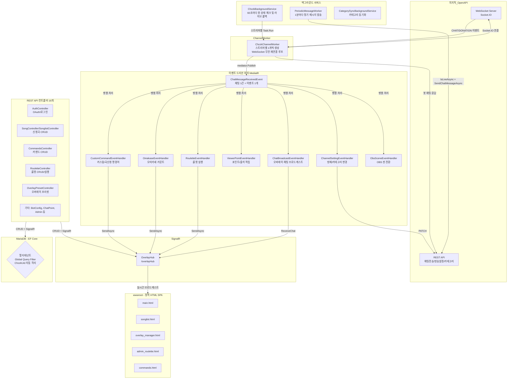
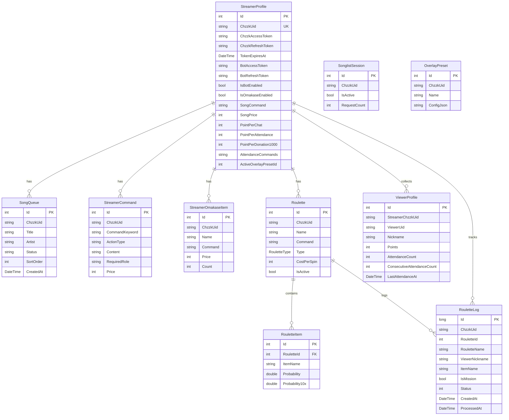
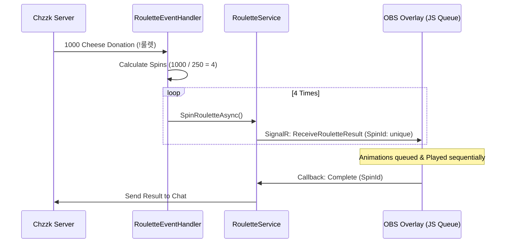

# MooldangBot (MooldangAPI) 시스템 상세 분석 보고서

> 작성일: 2026-03-24  
> 분석자: 물멍 (Senior Full-Stack AI Partner)  
> 대상: `c:\webapi\MooldangAPI\MooldangBot` 전체 폴더

---

## 1. 프로젝트 개요

**MooldangBot**은 치지직(CHZZK) 스트리밍 플랫폼과 연동되는 **멀티테넌트 스트리밍 봇 & 대시보드 API 서버**입니다.  
C# .NET 10, EF Core (MariaDB), MediatR, SignalR을 핵심 기술 스택으로 사용하며, **이벤트 드리븐 아키텍처(EDA)** 위에서 동작합니다.

### 핵심 기능 요약

| 기능 | 설명 |
|------|------|
| 치지직 WebSocket 봇 | 실시간 채팅 수신 및 명령어 처리 |
| 오마카세 | 치즈 후원 기반 메뉴 카운터 |
| 곡 신청 (SongQueue) | 채팅 명령어/후원 기반 신청곡 큐 관리 |
| 룰렛 | 치즈 후원 또는 포인트 사용 룰렛 |
| 시청자 포인트 & 출석 | 채팅 적립, 연속 출석 추적 |
| 커스텀 명령어 | DB 기반 동적 명령어 등록 및 응답 |
| 방제/카테고리 변경 | 채팅 명령어로 방송 설정 변경 |
| 오버레이 허브 | SignalR 기반 실시간 OBS 브라우저 소스 제어 |
| 정기 메시지 | 방송 중 일정 주기 채팅 자동 발송 |
| Chzzk OAuth 인증 | 스트리머 로그인 및 토큰 자동 갱신 |

---

## 2. 전체 아키텍처



---

## 3. 핵심 컴포넌트 상세 분석

### 3-1. 진입점 & DI 구성 (`Program.cs`)

**서비스 등록 전략:**

| 생명주기 | 서비스 | 이유 |
|----------|--------|------|
| `Singleton` | `ChzzkBackgroundService`, `SongQueueState`, `RouletteState`, `ObsWebSocketService`, `CommandCacheService` | 앱 전체에서 상태 공유 필요 |
| `Scoped` | `AppDbContext`, `UserSession`, `ChzzkCategorySyncService`, `RouletteService` | 요청별 독립 컨텍스트 |
| `Transient` | `IOverlayRenderStrategy` | 매번 새 인스턴스 허용 |
| `HostedService` | `ChzzkBackgroundService`, `PeriodicMessageWorker`, `CategorySyncBackgroundService` | 백그라운드 상시 실행 |

**주요 설정:**
- `.env` 파일 자동 로드 (Docker 환경 지원)
- Nginx/Cloudflare 리버스 프록시 대응 (`ForwardedHeaders`)
- 쿠키 기반 인증 (`CookieAuthentication`) + `StreamerId` 클레임 검증 미들웨어
- 앱 시작 시 `ChzzkClientId/Secret`을 DB (`SystemSettings`)에 자동 씨드

---

### 3-2. 멀티테넌트 DB 격리 (`AppDbContext.cs`)

**Global Query Filter** 패턴으로 테넌트 격리:

```csharp
// 현재 로그인한 스트리머의 ChzzkUid를 가진 데이터만 자동 필터링
modelBuilder.Entity<SongQueue>()
    .HasQueryFilter(e => !_userSession.IsAuthenticated || e.ChzzkUid == _userSession.ChzzkUid);
```

- **적용 대상:** StreamerProfile, SongQueue, StreamerCommand, StreamerOmakaseItem, Roulette, PeriodicMessage, SonglistSession, OverlayPreset, SharedComponent, AvatarSetting, ViewerProfile
- **배경 서비스에서의 우회:** `BackgroundService`는 인증 세션이 없어 `IsAuthenticated == false`이므로 필터가 비활성화되어 전체 스트리머 데이터 접근 가능
- **리눅스/Docker 대소문자 충돌 방지:** 모든 테이블명을 소문자로 명시적 매핑

**DB 스키마 (주요 엔터티):**



---

### 3-3. 봇 엔진 동작 흐름

#### `ChzzkBackgroundService` (봇 매니저)
- **60초 주기**로 `IsBotEnabled == true`인 모든 스트리머를 DB에서 조회
- 스트리머별로 `ChzzkChannelWorker`를 `Task.Run()`으로 독립 비동기 실행
- `ConcurrentDictionary<string, CancellationTokenSource> _activeChannels`로 채널별 생명주기 관리
- **방송 종료 감지(Live→Offline):** `Task.WhenAll()`로 병렬 라이브 상태 체크 → 오프라인 전환 시 `OverlayPreset` 자동 롤백 + SignalR 브로드캐스트

#### `ChzzkChannelWorker` (스트리머 개별 WebSocket 연결)

```
1. DB에서 스트리머 프로필 + 토큰 로드
2. 토큰 만료 임박 시 자동 갱신 (치지직 OAuth Refresh)
3. 명령어 메모리 캐시 초기화 (CommandCacheService.RefreshAsync)
4. 치지직 OpenAPI /sessions/auth 호출 → WebSocket URL 획득
5. wss:// + /socket.io/ + transport=websocket&EIO=3 조합
6. ClientWebSocket 연결
7. 수신 루프:
   - Socket.IO "0"(Open) → "40" 전송 (방 입장)
   - Socket.IO "2"(Ping) → "3" 전송 (Pong)
   - Socket.IO "42"(Event) → Task.Run(() => HandleEventAsync()) [Fire-and-Forget]
8. 연결 끊기면 3초 대기 후 재연결 (무한 루프)
```

**이벤트 라우팅 (`HandleEventAsync`):**

| 이벤트 | 처리 내용 |
|--------|-----------|
| `SYSTEM` (type: connected) | 채팅 + 후원 이벤트 구독 요청 |
| `CHAT` | 채팅 파싱 → MediatR Publish |
| `DONATION` | 치즈 후원 파싱 (payAmount 다중 타입 처리) → MediatR Publish |
| `SUBSCRIPTION` | 구독 로그 출력 (처리 예정) |

**봇 토큰 우선순위:**
1. 스트리머 커스텀 봇 계정 (`BotAccessToken`)
2. 시스템 공통 봇 계정 (`SystemSettings: BotAccessToken`)
3. 스트리머 본인 계정 (`ChzzkAccessToken`) - 최후 폴백

---

### 3-4. EDA 이벤트 처리 (`ChatMessageReceivedEvent`)

**이벤트 정의:**
```csharp
record ChatMessageReceivedEvent(
    StreamerProfile Profile,
    string Username,
    string Message,
    string UserRole,
    string SenderId,
    string ClientId,
    string ClientSecret,
    Dictionary<string, string> Emojis,
    int DonationAmount
) : INotification;
```

MediatR의 `Publish()`를 통해 **6개 핸들러가 동시에 실행**됩니다:

#### H1. `CustomCommandEventHandler` - 커스텀 명령어 처리
- **권한 체계:** `isMaster` (스트리머 본인 or 지정 UID) > `streamer` > `manager` > `common_user`
- **시스템 명령어:** `!명령어등록`, `!공지` (관리자 전용)
- **커스텀 명령어 실행 흐름:**
  1. 포인트 조회 전용 명령어 (`PointCheckCommand`) 우선 처리
  2. 메모리 캐시(`CommandCacheService`)에서 O(1) 명령어 탐색
  3. 권한 검증 후 `SongRequest` / `Notice` / `Reply` 액션 실행
  4. `Reply` 내 동적 변수 치환: `{닉네임}`, `{포인트}`, `{출석일수}`, `{연속출석일수}`, `{팔로우일수}`
- **곡 신청 내부 처리 (`HandleSongRequestInternalAsync`):**
  - 활성 SonglistSession 확인 → 없으면 거부 메시지
  - `SongQueue` DB 저장 + `SortOrder` 자동 증가
  - SignalR `RefreshSongAndDashboard`, `SongAdded` 이벤트 발송

#### H2. `OmakaseEventHandler` - 오마카세 카운터
- `IsOmakaseEnabled` 매번 DB에서 재확인 (`AsNoTracking`)
- 명령어 매칭 후 `DonationAmount / Price`로 증가량 배수 계산
- **낙관적 동시성 제어:** `DbUpdateConcurrencyException` 최대 3회 재시도 (Database Win)
- 성공 시 SignalR `RefreshSongAndDashboard` 발송

#### H3. `RouletteEventHandler` - 룰렛 실행
- **치즈 후원 룰렛 (Type: Cheese):** `DonationAmount >= CostPerSpin` + 명령어 일치
  - `DonationAmount >= CostPerSpin * 10` → 10연차 실행
- **포인트 룰렛 (Type: ChatPoint):** `ViewerProfile.Points >= CostPerSpin` → 포인트 차감
- `RouletteService.SpinRouletteAsync/SpinRoulette10xAsync` 위임

#### H4. `ViewerPointEventHandler` - 포인트/출석 관리
- 채팅마다 `PointPerChat` 포인트 적립
- 출석 명령어(`AttendanceCommands`) 감지:
  - KST 기준 당일 첫 출석만 인정
  - 전날 출석 시 연속 출석 카운트 증가, 아니면 1로 리셋
  - `PointPerAttendance` 추가 적립 + `AttendanceReply` 자동 발송
- 후원 금액 비례: `(DonationAmount / 1000) * PointPerDonation1000`

#### H5. `ChatBroadcastEventHandler` - 오버레이 실시간 브로드캐스트
- 모든 채팅을 SignalR `ReceiveChat` 이벤트로 브로드캐스트 (이모티콘 맵 포함)
- 아바타 명령어(`!달리기`, `!비행`) → `ReceiveAvatarCommand` 발송

#### H6. `ChannelSettingEventHandler` - 방송 설정 변경
- `!방제 {제목}` → 치지직 PATCH API로 방송 제목 변경
- `!카테고리 {키워드}` → DB 별칭 조회 → 치지직 카테고리 검색 → 카테고리 변경
- 하드코딩 별칭 사전 (`저챗`, `롤`, `배그` 등) + DB 동적 별칭 (`ChzzkCategoryAlias`) 양쪽 지원

---

### 3-5. 룰렛 서비스 (`RouletteService`)

**가중치 기반 확률 추첨:**
```csharp
// 1회: Probability 기준, 10연차: Probability10x 기준 (별도 확률 테이블)
double totalWeight = items.Sum(i => i.Probability);
double randomValue = Random.Shared.NextDouble() * totalWeight;
// 커서가 랜덤값을 넘는 첫 아이템 반환 (선형 탐색 O(n))
```

- 결과를 SignalR `RouletteTriggered`로 오버레이에 즉시 전송
- 봇 채팅으로 결과 발표 (Fire-and-Forget, 10연차는 `항목x개수` 형태로 그룹화)

---

### 3-6. 명령어 캐시 (`CommandCacheService`)

```
ConcurrentDictionary<chzzkUid, Dictionary<keyword, StreamerCommand>>
```

- **Singleton**으로 유지 → 모든 채널워커가 같은 캐시 공유
- 봇 접속 시 최초 load, 명령어 등록/수정 시 즉시 invalidate (`RefreshAsync`)
- DB 직접 조회 대신 `O(1)` 메모리 탐색으로 채팅 처리 지연 최소화

---

### 3-7. 정기 메시지 (`PeriodicMessageWorker`)

- **1분 주기** 백그라운드 서비스
- 각 메시지의 `LastSentAt + IntervalMinutes`와 현재 시간 비교
- 라이브 상태 캐시(`Dictionary<chzzkUid, bool`)로 동일 스트리머 중복 API 호출 방지
- 방송 중인 스트리머에게만 메시지 발송, 토큰 만료 시 자동 갱신

---

### 3-8. 오버레이 허브 (`OverlayHub`)

SignalR Hub. OBS 브라우저 소스가 연결/구독하는 실시간 채널.

**그룹 구조:**
- `chzzkUid.ToLower()`: 스트리머별 채팅·오마카세·곡신청 이벤트
- `preset-{presetId}`: 프리셋별 독립 스타일 업데이트

**클라이언트로 보내는 이벤트:**

| 이벤트명 | 발송 주체 | 내용 |
|----------|-----------|------|
| `ReceiveChat` | ChatBroadcastEventHandler | 채팅 메시지 + 이모티콘 |
| `ReceiveAvatarCommand` | ChatBroadcastEventHandler | 아바타 애니메이션 명령 |
| `RefreshSongAndDashboard` | CustomCommandEventHandler, OmakaseEventHandler | 신청곡/대시보드 새로고침 |
| `SongAdded` | CustomCommandEventHandler | 신곡 신청 알림 |
| `RouletteTriggered` | RouletteService | 룰렛 결과 |
| `ReceiveOverlayStyle` | ChzzkBackgroundService, OverlayHub | 오버레이 프리셋 스타일 |
| `ReceiveOverlayState` | OverlayHub | 오버레이 상태 |

---

### 3-9. 인증 & 보안

- **치지직 OAuth:** `AuthController`에서 Authorization Code Flow 처리
- **쿠키 인증:** 로그인 후 `StreamerId` 클레임 포함 쿠키 발행
- **StreamerId 미들웨어:** 인증된 요청에 `StreamerId` 클레임이 없으면 자동 로그아웃
- **멀티테넌트 격리:** Global Query Filter로 타 스트리머 데이터 접근 원천 차단
- **마스터 UID 하드코딩:** 특정 UID를 전역 마스터로 지정 (`ca98875d5e0edf02776047fbc70f5449`)
- **봇 채팅 도배 방지:** 모든 봇 메시지에 `\u200B`(제로-폭 공백) 접두사 삽입

---

## 4. REST API 컨트롤러 목록

| 컨트롤러 | 역할 |
|----------|------|
| `AuthController` | 치지직 OAuth 로그인/로그아웃, 봇 계정 연동 |
| `SongController` | 신청곡 큐 조회/삭제/상태 변경 |
| `SonglistController` | 신청곡 세션(SonglistSession) 관리 |
| `SonglistSettingsController` | 신청곡 관련 설정 (명령어, 가격 등) |
| `CommandsController` | 커스텀 명령어 CRUD + 오마카세 관리 |
| `RouletteController` | 룰렛/룰렛아이템 CRUD, 수동 스핀 |
| `OverlayPresetController` | 오버레이 프리셋 CRUD, 활성화/스타일 변경 |
| `MasterOverlayController` | 마스터 오버레이 설정 |
| `SharedComponentController` | 공유 컴포넌트 관리 |
| `ChatPointController` | 시청자 포인트 조회/수정 |
| `BotConfigController` | 봇 활성화 설정 |
| `AdminBotController` | 봇 제어 (관리자) |
| `AvatarSettingsController` | 아바타 설정 |
| `PeriodicMessageController` | 정기 메시지 CRUD |
| `ViewController` | HTML 페이지 라우팅 |
| `DebugController` | 개발 디버그 엔드포인트 |

---

## 5. 프론트엔드 구조 (`wwwroot`)

모든 UI는 순수 HTML + Vanilla JS의 SPA 방식:

| 파일 | 역할 |
|------|------|
| `main.html` | 대시보드 메인 (신청곡 현황) |
| `songlist.html` | 신청곡 관리 |
| `songlist_settings.html` | 신청곡 설정 |
| `songlist_overlay.html` | OBS 송리스트 오버레이 |
| `overlay_manager.html` | 오버레이 매니저 (101KB, 최대 규모) |
| `overlay.html` | OBS 채팅 오버레이 |
| `admin_roulette.html` | 룰렛 관리 |
| `roulette_overlay.html` | OBS 룰렛 오버레이 |
| `commands.html` | 커맨드 관리 |
| `admin.html` | 시스템 관리 |
| `admin_bot.html` | 봇 제어 |
| `admin_category.html` | 카테고리 별칭 관리 |
| `avatar_settings.html` | 아바타 설정 |
| `avatar_overlay.html` | 아바타 오버레이 |
| `ChatPoint.html` | 시청자 포인트 관리 |

---

## 6. 인프라 & 환경

### Docker 구성 (`Dockerfile` + `docker-compose.yml`)
- 멀티스테이지 빌드 (SDK → Runtime)
- MariaDB 컨테이너와 함께 구성
- Nginx 리버스 프록시 대응 (`ForwardedHeaders`)

### 환경변수 (`.env.example`)
```env
ChzzkApi__ClientId=...
ChzzkApi__ClientSecret=...
ConnectionStrings__DefaultConnection=...
```

### 카테고리 동기화 (`CategorySyncBackgroundService`)
- `ChzzkCategorySyncService`를 주기적으로 호출
- 치지직 공식 카테고리 DB에 동기화

---

## 7. 동시성 및 스레드 안전성 분석

| 상황 | 해결 방법 |
|------|-----------|
| 다수 채널 봇 동시 실행 | `ConcurrentDictionary<uid, CTS>` + `Task.Run()` 독립 실행 |
| 채팅 이벤트 Fire-and-Forget | `_ = Task.Run(() => HandleEventAsync(...))` |
| MediatR 병렬 핸들러 | 핸들러별 독립 `IServiceScope` 생성으로 DbContext 분리 |
| 오마카세 동시 후원 충돌 | `DbUpdateConcurrencyException` 캐치 + `[ConcurrencyCheck]` + 3회 재시도 |
| 명령어 캐시 동시 읽기 | `ConcurrentDictionary` 사용 |
| 라이브 상태 병렬 체크 | `Task.WhenAll(tasks)` 패턴 적용 |

---

## 8. 개선 포인트 및 기술 부채

| 항목 | 현황 | 권고사항 |
|------|------|----------|
| 마스터 UID 하드코딩 | `ca98875d5e0edf02776047fbc70f5449` 소스 내 고정 | DB 또는 환경변수로 이동 |
| 봇 UID 하드코딩 | `445df9c493713244a65d97e4fd1ed0b1` 소스 내 고정 | SystemSettings 연동 |
| HttpClient 인스턴스 남발 | Handler마다 `new HttpClient()` | IHttpClientFactory로 통합 |
| 카테고리 사전 중복 | `ChzzkChannelWorker`와 `ChannelSettingEventHandler` 동일 사전 복사 | static 공용 상수로 분리 |
| `PeriodicMessageWorker` 토큰 갱신 로직 중복 | ChzzkChannelWorker와 동일 패턴 | 공용 `TokenRefreshService` 추출 |
| OBS SceneEventHandler 미완성 | 파일만 존재, 구현 없음 | OBS WebSocket 연동 구현 예정 |
| `ChzzkChannelWorker` 파일 크기 | 666줄, 단일 파일 과부하 | Socket 처리와 이벤트 파싱 분리 리팩토링 권고 |

---

## 9. 데이터 흐름 요약 (채팅 명령어 1건 처리)

```
시청자 채팅 입력
    ↓
치지직 WebSocket 서버 (CHAT 이벤트)
    ↓
ChzzkChannelWorker.HandleEventAsync()
    ↓ [Fire-and-Forget Task.Run]
ChatMessageReceivedEvent 생성 및 mediator.Publish()
    ↓ [병렬 실행]
┌──────────────────────────────────────────────┐
│ H1: CustomCommandEventHandler               │ → 명령어 응답/신청곡 처리 → Chzzk REST
│ H2: OmakaseEventHandler                     │ → 오마카세 카운트++ → SignalR
│ H3: RouletteEventHandler                    │ → 룰렛 스핀 → SignalR
│ H4: ViewerPointEventHandler                 │ → 포인트/출석 적립 → DB
│ H5: ChatBroadcastEventHandler               │ → 오버레이 채팅 → SignalR
│ H6: ChannelSettingEventHandler              │ → 방제/카테고리 변경 → Chzzk REST
│ H7: ObsSceneEventHandler                    │ → (미구현)
└──────────────────────────────────────────────┘
    ↓
OBS 브라우저 소스 / 대시보드 실시간 업데이트
```

---

## 10. 2026-03-24 보안 및 인증 강화 패치

최근 `ChatPoint.html`에서 설정을 저장할 때 발생하던 `401 Unauthorized` 에러를 해결하고, 전반적인 API 보안을 강화했습니다.

### 10-1. 주요 수정 사항

| 대상 | 파일 | 내용 |
|------|------|------|
| **Backend** | `Program.cs` | AJAX 요청(`StartsWithSegments("/api")`)에 대해 302 리다이렉트 대신 401을 반환하도록 Cookie Authentication 이벤트 구성. 쿠키 `SameSite=Lax`, `SecurePolicy=Always` 설정 강제. |
| **Backend** | `ChatPointController.cs` | `ILogger` 주입 및 인가 로깅 추가. `[Authorize(Policy = "ChannelManager")]` 정책 적용 상태 유지. |
| **Backend** | `ChannelManagerAuth...` | 경로 변수(`chzzkUid`) 추출 로직 강화 및 거부 사유 로깅 추가. |
| **Frontend** | `ChatPoint.html` | 모든 `fetch` 요청에 `credentials: 'include'` 및 `Accept: 'application/json'` 헤더 추가. 401/403 응답에 대한 사용자 피드백(알림창) 강화. |

### 10-2. 해결된 문제
- 리버스 프록시(Nginx/Cloudflare) 환경에서 쿠키가 AJAX 요청 시 누락되거나, 세션 만료 시 브라우저가 리다이렉트를 추적하다 실패하는 현상 해결.
- 정책 핸들러에서 경로 변수를 찾지 못해 비정상적으로 거부되는 잠재적 결함 수정.

---

## 11. 2026-03-24 치지직 웹소켓 성능 및 권한 안정화 패치

치지직 채널 웹소켓의 빈번한 끊김 현상과 명령어 인식 지연 문제를 해결하기 위한 안정화 작업을 수행했습니다.

### 11-1. 주요 수정 사항

| 대상 | 파일 | 내용 |
|------|------|------|
| **Performance** | `ChzzkChannelWorker.cs` | `HandleEventAsync`에서 매 채팅마다 발생하던 DB Scope 생성 및 토큰 갱신 체크 로직을 제거하여 이벤트 처리 병목 현상 해결. |
| **Stability** | `ChzzkChannelWorker.cs` | Socket.IO `error` 이벤트의 로그 레벨을 `Warning`으로 격상하여 연결 거부 사유를 실시간 파악 가능하게 개선. |
| **Authority** | `ChzzkChannelWorker.cs`, `CustomCommand...` | 시청자 UID(`senderChannelId`) 비교 시 `OrdinalIgnoreCase`를 적용하여 대소문자 차이로 인한 권한 거부 결함 수정. |

### 11-2. 해결된 문제
- 채팅 발생 시마다 DB 세션이 열리며 발생하던 자원 경합 및 웹소켓 수신 루프 지연 해결.
- 웹소켓 핸드셰이크 시 발생하는 에러 페이로드를 로그에 기록하여 유지보수성 향상.
- 스트리머 본인 계정으로 채팅 시 '마스터' 권한이 간헐적으로 무시되던 현상 수정.

---

## 12. 2026-03-24 치지직 웹소켓 무중단(Zero-Downtime) 및 복원력 패치

치지직 채팅 서버와의 연결 유지력을 극대화하고, 단선 발생 시 0.5초 이내에 자동 복구되는 탄력적(Resilient) 아키텍처를 도입했습니다.

### 12-1. 주요 수정 사항

| 대상 | 파일 | 내용 |
|------|------|------|
| **Architecture** | `ChzzkChannelWorker.cs` | `Task.WhenAny`를 활용한 수신/핑 병렬 루프 구조 도입. 어느 한 태스크라도 실패 시 즉시 병렬 작업을 취소하고 재연결 프로세스 가동. |
| **Heartbeat** | `ChzzkChannelWorker.cs` | 독립된 `PingLoopAsync`를 통해 10초마다 Socket.IO Ping(`"2"`) 강제 송신. 서버 측의 Idle 타임아웃 종료를 사전에 차단. |
| **Recovery** | `ChzzkChannelWorker.cs` | 재연결 대기 시간을 3초에서 **500ms**로 대폭 단축. 유행하는 '찰나의 단선'에도 시청자가 채팅 누락을 느끼지 못할 수준의 복구 속도 확보. |
| **Buffering** | `ChzzkChannelWorker.cs` | 수신 버퍼를 4KB에서 **16KB**로 상향. 고화질 이모티콘 및 후원 폭주 상황에서의 데이터 조립 안정성 강화. |
| **Concurrency** | `ChzzkChannelWorker.cs` | `IServiceScopeFactory`를 주입받아 메시지 처리마다 독립된 Scope 부여. Singleton 서비스 내 DB 컨텍스트 폐기 이슈 원천 해결. |

### 12-2. 해결된 문제
- **좀비 소켓 방지**: 병렬 핑 루프를 통해 서버가 클라이언트를 유효 세션으로 상시 인식함.
- **채팅 누락 원천 차단**: 0.5초 이내의 초고속 재접속으로 인해 소켓 교체 시 발생하는 이벤트 유실 구간 최소화.
- **DB 정합성**: 각 비동기 이벤트 핸들러가 자신만의 DB 컨텍스트를 소유함으로써 스레드 간 충돌 및 객체 폐기 예외 해결.

---

## 15. 2026-03-24 어드민 대시보드 보안 아키텍처 및 통합 관리 리팩토링

마스터 및 봇 계정이 시스템 내 모든 스트리머를 중앙에서 통합 관리할 수 있도록 보안 시스템을 전면 개편하고, API 경로 체계를 리팩토링했습니다.

### 15-1. 주요 수정 사항

| 대상 | 내용 |
|------|------|
| **Authentication** | `[Authorize(Policy = "ChannelManager")]` 정책을 모든 관리 컨트롤러에 일괄 적용. |
| **Routing** | 모든 관리 API 엔드포인트를 `{chzzkUid}` 경로 파라미터 기반으로 전환하여 세션 의존성 제거 및 보안 강화. |
| **Data Access** | 마스터/봇 계정의 교차 채널 접근을 위해 EF Core의 `.IgnoreQueryFilters()`를 적용, 전역 테넌트 격리 필터를 명시적으로 우회. |
| **Frontend** | `overlay_manager.html`, `songlist.html` 등 모든 관리자 페이지의 API 호출 경로를 `{chzzkUid}` 기반 신규 명세로 동기화. |

### 15-2. 보안 정책 상세: `ChannelManager`
- **일반 스트리머**: 본인의 `{chzzkUid}` 경로로만 접근 가능. (Session UID와 Route UID 일치 여부 검증)
- **마스터/봇 계정**: 모든 `{chzzkUid}` 경로에 대해 무조건 승인. (시스템 전역 관리 권한 부여)
- **보안 이점**: URL 구조 자체가 리소스를 명시하므로 관리자가 특정 스트리머의 대시보드에 직접 접근 및 지원하는 워크플로우를 완벽히 지원함.

### 15-3. 관리자 모드 UX 최적화 (UID Propagation)
마스터 계정이 타 스트리머의 대시보드로 진입 시, 모든 내부 페이지 이동 및 복귀 시에도 대상 UID가 유실되지 않도록 **URL 기반 파라미터 전파(Propagation)** 시스템을 구축했습니다.
- **main.html**: URL의 `?uid=` 파라미터를 감지하여 모든 하위 메뉴 링크(`songlist`, `commands`, `roulette` 등)에 해당 UID를 주입.
- **Sub-pages**: `ChatPoint.html`, `avatar_settings.html` 등에서 "대시보드로 돌아가기" 클릭 시 현재 관리 중인 UID를 유지한 채로 메인으로 복원.
- **Global Logo**: 대시보드 상단 로고 클릭 시에도 세션이 풀리지 않고 해당 스트리머의 메인 페이지로 이동하도록 보완.

---

## 16. 2026-03-25 노래책(Songbook) 시스템 구현 및 데이터 정합성 강화 패치

대규모 곡 목록 관리를 위한 신규 시스템 구현과 오버레이 `undefined` 오류의 근본 원인을 해결한 패치입니다.

### 16-1. 주요 구현 사항

| 대상 | 내용 | 상태 |
|------|------|------|
| **Bug Fix** | `songlist_overlay.html`, `songlist.html` 내의 모든 곡/오마카세 정보 참조를 PascalCase로 통일. | **✅ 완료** |
| **Model** | `SongBook` 엔터티 생성 (ID, Uid, Title, Artist, UsageCount 등). | **✅ 완료** |
| **API** | `SongBookController` (Seek Pagination, CRUD, 대기열 추가) 구현. | **✅ 완료** |
| **UI** | `admin_songbook.html` 생성 및 `main.html` 메뉴 연결. | **✅ 완료** |
| **DB** | `songbooks` 테이블 매핑 및 `(ChzzkUid, Id DESC)` 복합 인덱스 적용. | **✅ 완료** |

### 16-2. 기술적 성과
- **데이터 일관성 확보**: 백엔드 전송 규격과 프론트엔드 참조 규격을 PascalCase로 일원화하여 런타임 `undefined` 버그를 원천 차단했습니다.
- **확장성 있는 페이징**: 룰렛 시스템에 이어 노래책에도 `LastId` 기반의 인풋 페이징을 적용하여 수천 곡 이상의 대규모 데이터를 성능 저하 없이 관리할 수 있게 되었습니다.
- **사용자 편의성**: 노래책에서 클릭 한 번으로 신청곡 대기열에 곡을 추가할 수 있는 기능을 구현했습니다.
- **데이터 정합성**: PascalCase 통일 작업으로 대시보드와 오버레이 간 데이터 불일치를 완전 해결했습니다.

---

## 18. 2026-03-25 대기열 곡 수정(Edit) 및 서버 주도 실시간 동기화 패치

대시보드에서 곡 정보 수정 시 DB에 반영되지 않던 문제를 해결하고, 오버레이 실시간 갱신 성능을 개선한 패치입니다.

### 18-1. 주요 수정 사항

| 대상 | 내용 | 상태 |
|------|------|------|
| **API** | `SongController`에 `UpdateSongDetails` (`PUT /api/song/.../edit`) 엔드포인트 구현. | **✅ 완료** |
| **DTO** | `.NET 10 record`를 활용한 `SongUpdateRequest` 정의로 불변성 확보. | **✅ 완료** |
| **Sync** | 클라이언트 주도 방식에서 **백엔드 주도 서버 푸시(Server-Push)** 방식으로 동기화 구조 개선. | **✅ 완료** |
| **Persistence** | 수정 사항을 `songqueues` 테이블에 즉시 영속화하여 새로고침/재시작 시에도 유지 보장. | **✅ 완료** |

### 18-2. 기술적 기대 효과
- **데이터 무결성**: 대시보드와 오버레이, DB 간의 데이터 불일치 현상을 완전히 해결했습니다.
- **사용자 경험(UX)**: 수정 즉시 오버레이가 반응하므로 스트리머가 별도의 새로고침 버튼을 누를 필요가 없습니다.
- **보안 강화**: `chzzkUid`와 `id`를 복합 체크하여 멀티테넌트 환경에서의 오수정 가능성을 차단했습니다.

---

## 17. 2026-03-25 룰렛 결과 전송 최적화 (글자수 제한 대응) 패치

룰렛 10연차 실행 시 결과 메시지가 치지직 API의 글자수 제한(100자)을 초과하여 발생하던 전송 실패 문제를 해결했습니다.

### 17-1. 주요 수정 사항

| 대상 | 내용 | 상태 |
|------|------|------|
| **API Client** | `ChzzkApiClient`의 `SendChatMessageAsync` 및 `SendChatNoticeAsync`가 내부적으로 `SendChatAsync`(분할 전송 로직)를 사용하도록 변경. | **✅ 완료** |
| **Logic** | 메시지가 100자를 초과할 경우 자동으로 99자 단위로 쪼개어 순차 전송(100ms 간격)하도록 구현. | **✅ 완료** |
| **Stability** | 룰렛 10연차와 같이 결과가 긴 메시지도 누락 없이 채팅창에 정상 표시되도록 보장. | **✅ 완료** |

### 17-2. 기술적 효과
- **글로벌 제한 해제**: 룰렛뿐만 아니라 시스템 전체에서 발생하는 모든 채팅 전송 시 글자수 제한(400 BadRequest) 걱정 없이 긴 메시지를 안전하게 보낼 수 있게 되었습니다.
- **가독성 유지**: 긴 결과가 여러 줄로 나뉘어 출력되어 시청자가 한눈에 결과를 확인하기 용이해졌습니다.

---

## 20. 2026-03-25 전역 대소문자(Casing) 무관성 아키텍처 (Osiris-Harmony) 패치

시스템 전반의 데이터 통신 정합성을 확보하고, 프론트엔드와 백엔드 간의 대소문자 불일치로 인한 모든 잠재적 결함을 제거한 대규모 아키텍처 개편 패치입니다.

### 20-1. 주요 수정 사항

| 레이어 | 기술 요소 | 상세 내용 |
|------|------|------|
| **Serialization** | **전역 camelCase** | `Program.cs`에서 SignalR 및 API 직렬화 정책을 `CamelCase`로 통일. |
| **DTO (Osiris)** | **명시적 어노테이션** | 모든 DTO 및 Request 속성에 `[JsonPropertyName]`을 명시하여 전역 설정 변경에도 데이터 규격 보장. |
| **Storage (Osiris)** | **명시적 Collation** | `AppDbContext`를 통해 `ChzzkUid`, `Command` 등 주요 검색 필드에 `utf8mb4_unicode_ci` 강제 적용. |
| **Frontend (Harmony)** | **JS Proxy 배포** | `overlay_utils.js`를 통해 기존 `PascalCase` 기반 클라이언트 코드가 `camelCase` 응답을 투명하게 수용하도록 구현. |
| **Language** | **.NET 10 최적화** | Primary Constructor 및 패턴 매칭을 통해 보일러플레이트 코드를 제거하고 가독성 향상. |

### 20-2. 아키텍처 명칭: Osiris-Harmony Protocol
- **Osiris (오시리스)**: "뿌리로부터의 엄격함". DB와 DTO 레벨에서 대소문자 무관성 및 명시적 규격을 강제하여 데이터 무결성을 확보합니다.
- **Harmony (하모니)**: "조화로운 공존". 서버의 현대적 규격(`camelCase`)과 클라이언트의 레거시 규격(`PascalCase`)이 Proxy를 통해 충돌 없이 작동하게 합니다.

### 20-3. 조치 결과
- 오버레이 새로고침 또는 브라우저 재시작 시 디자인 설정이나 오마카세 정보가 소실되던 문제(Undefined Error)를 근본적으로 해결했습니다.
- 시스템의 보안성과 가독성이 향상되었으며, 향후 프론트엔드 전체 리팩토링 없이도 백엔드 현대화가 가능해졌습니다.

---

## 21. 2026-03-25 룰렛 시스템 안정화 및 다회차(N연차) 실행 패치

룰렛 오버레이의 데이터 표시 오류를 근본적으로 해결하고, 후원 금액에 따라 자동으로 여러 번의 룰렛이 실행되도록 지능형 로직을 도입한 패치입니다.

### 21-1. 주요 수정 사항

| 레이어 | 기술 요소 | 상세 내용 |
|------|------|------|
| **Frontend** | **Harmony v2 (Normalization)** | `Proxy` 대신 모든 필드를 `PascalCase`와 `camelCase` 양방향으로 복제하는 **Deep Normalization** 방식을 채택하여 라이브러리/환경 의존성 없는 완벽한 데이터 참조 보장. |
| **Logic** | **Donation Quotient Loop** | 후원 금액을 룰렛 비용으로 나눈 몫(Quotient)을 계산하여 10회 단위(10연차)와 남은 횟수(단일 연차 루프)를 조합해 자동 실행. |
| **Stability** | **Defensive UI Rendering** | 렌더링 시 필드 유무를 체크하는 방어적 코드(`||`, `??`)를 적용하여 데이터 누락 시에도 자바스크립트 중단 방지. |
| **Caching** | **Script Versioning** | 브라우저 캐시로 인한 구버전 스크립트 오작동을 방지하기 위해 `v=20260325_v2` 버전 파라미터 강제 적용. |

### 21-2. 해결된 핵심 페인 포인트
- **1000치즈 후원 시 1회만 동작하던 문제**: 이제 250치즈 비용 룰렛 기준, 1000치즈 후원 시 자동으로 4회의 애니메이션과 채팅 알림이 순차적으로 발생함.
- **오버레이 `undefined` 현상**: `ItemName`, `Color` 등 핵심 필드가 케이싱 불일치로 인해 표시되지 않던 구형 Proxy 방식의 한계를 Normalization v2로 완전 극복.
- **서버 통신 오류 메시지**: `undefined.toLocaleString()` 등으로 인해 발생하던 런타임 예외를 방지하여 관리 페이지의 안정성 확보.

### 21-3. 아키텍처 다이어그램 (다회차 실행 flow)


---

---

## 22. 2026-03-25 룰렛 미션 관리 시스템 (Roulette Mission System v5) 패치

룰렛 오버레이를 현대적인 수직 슬롯 머신 스타일로 개편하고, 스트리머가 당첨된 미션을 관리할 수 있는 전용 대시보드와 백엔드 시스템을 구축한 대규모 업데이트입니다.

### 22-1. 주요 업데이트 사항

| 레이어 | 기술 요소 | 상세 내용 |
|------|------|------|
| **Backend** | **Transactional Spinning** | `SemaphoreSlim`과 `IDbContextTransaction`을 도입하여 포인트 차감 및 당첨 로그 기록의 원자성(Atomicity)과 스레드 안전성 확보. |
| **Backend** | **Mission Logging** | `RouletteLog` 엔터티를 통한 당첨 내역 영속화. `IsMission` 플래그에 따른 자동 완료(`Completed`) 처리 로직 구현. |
| **Backend** | **Auto-Cleanup** | `RouletteLogCleanupService` (BackgroundService)를 통해 30일 경과된 로그 자동 삭제. 단, 미완료(`Pending`) 미션은 삭제 대상에서 제외하여 보호. |
| **Frontend** | **Vertical Slot UI** | 기존 원형 룰렛을 `rAF(requestAnimationFrame)` 기반의 고성능 수직 슬롯 머신 애니메이션으로 대체. |
| **Frontend** | **Mission Dashboard** | `admin_missions.html`을 통해 실시간 미션 수신(SignalR), 상태 변경(완료/취소), 오디오 알림 및 토스트 알림 기능 제공. |
| **Overlay** | **Spin History Bar** | 오버레이 하단에 최근 당첨 내역을 보여주는 실시간 히스토리 트랙 추가. |

### 22-2. 아키텍처 및 보안
- **인덱스 최적화**: `(ChzzkUid, Status, Id DESC)` 복합 인덱스를 적용하여 수천 건의 로그 중 미처리 미션만 초고속으로 조회 가능.
- **보안 검증**: 모든 미션 상태 업데이트 API는 세션의 `ChzzkUid`와 로그의 소유주를 엄격히 비교하여 타인의 데이터 조작을 원천 차단.
- **rAF 방어 로직**: 브라우저 탭 비활성화 등으로 인한 애니메이션 지연(Lag) 발생 시 타임스탬프를 체크하여 건너뛰기(Skip) 또는 보정 수행.

---

## 23. 2026-03-25 룰렛 시스템 통합 배치 처리 (Roulette v6) 패치

룰렛 다중 회차 실행 시의 안정성을 극대화하고, 시각적/채팅 피드백의 일관성을 확보하기 위한 수석 개발자 피드백 반영 패치입니다.

### 23-1. 주요 수정 사항

| 레이어 | 기술 요소 | 상세 내용 |
|------|------|------|
| **Backend** | **Batch Multi-Spin** | `SpinRouletteMultiAsync` 메서드로 모든 다중 회차 로직 통합. 루프 대신 단일 트랜잭션 내에서 `N`개 결과를 한 번에 생성 및 저장. |
| **Backend** | **Grouped DTO** | SignalR 페이로드에 개별 당첨 내역(`Results`)과 그룹화된 요약(`Summary`)을 함께 포함하여 전송. |
| **Backend** | **Mandatory xCount** | 채팅 결과 포맷을 `[항목] x수량`으로 강제. 수량이 1개인 경우에도 `x1`을 표시하여 데이터 정규성 확보. |
| **Frontend** | **History Auto-Reset** | 새로운 룰렛 시작 시(`ReceiveRouletteResult`) 하단 히스토리 트랙을 즉시 초기화하여 현재 결과만 강조. |
| **Frontend** | **Responsive Wrap** | `.results-track`에 `flex-wrap: wrap`을 적용하여 10연차 이상의 결과가 나와도 화면을 넘기지 않고 줄바꿈 처리. |

### 23-2. 기술적 기대 효과
- **성능 최적화**: 1000치즈 후원(2회 스핀) 시 기존 2회의 독립적인 서비스 호출을 1회의 배치 처리로 줄여 DB 부하 및 네트워크 오버헤드 감소.
- **가독성 향상**: 하단 바의 줄바꿈 지원으로 모든 당첨 내역을 한눈에 확인 가능.
- **데이터 파싱 용이성**: 채팅 결과의 `xCount` 포맷 통일로 향후 통계 시스템 연동 시 정규표현식 처리 단순화.

---

*작성일: 2026-03-25, Senior Full-Stack AI Partner 물멍 작성*

---

## 19. 2026-03-25 오버레이 데이터 지속성(Persistence) 및 Safe Casing 패치

오버레이를 새로고침하거나 브라우저를 재시작했을 때 기존 설정(디자인, 오마카세 등)이 초기화되거나 소실되는 문제를 근본적으로 해결한 패치입니다.

### 19-1. 주요 수정 사항

| 대상 | 내용 | 상태 |
|------|------|------|
| **Frontend** | `songlist_overlay.html`에 **Safe Casing** 패턴 도입. API 응답의 `PascalCase`와 SignalR의 `camelCase`를 모두 수용하도록 로직 보강. | **✅ 완료** |
| **Backend** | `SonglistSettingsController`, `SonglistController`, `SongController`에서 `chzzkUid` 조회 시 **대소문자 무관(Case-Insensitive)** 조회 적용. | **✅ 완료** |
| **Logic** | `GetSonglistSettingsData` 등 초기 데이터 로드 API의 필테링 및 예외 처리 강화. | **✅ 완료** |

### 19-2. 기술적 개선 효과
- **데이터 복원력 강화**: 백엔드 DTO 규격이 변경되거나 SignalR과 REST API 간의 필드명 대소문자가 다르더라도 프론트엔드에서 누락 없이 데이터를 렌더링할 수 있게 되었습니다.
- **접속 안정성**: URL의 `chzzkUid`가 대문자가 섞여 있거나 소문자일 때 발생하던 DB 조회 실패 문제를 해결하여 모든 스트리머가 동일한 환경에서 안정적으로 오버레이를 사용할 수 있게 되었습니다.
- **영속성 보장**: 설정 저장 후 새로고침을 하더라도 DB에 저장된 최신 디자인 설정(`DesignSettingsJson`)을 정확히 불러와 적용합니다.

---

## 14. 2026-03-24 상업용 라이브러리(LuckyPenny) 제거 및 기술 스택 정비

`MediatR` 13.0 버전부터 도입된 상업용 라이선스(LuckyPenny Software) 모델로 인한 런타임 경고 및 잠재적 비용 이슈를 해결했습니다.

### 14-1. 주요 수정 사항

| 대상 | 파일 | 내용 |
|------|------|------|
| **Dependency** | `MooldangAPI.csproj` | 라이선스 제약이 없는 마지막 오픈소스 버전인 `MediatR` 12.2.0으로 다운그레이드. |
| **Integrity** | `MooldangAPI.csproj` | 상업용 라이선스 체크용 JWT 종속성(`Microsoft.IdentityModel.JsonWebTokens`)이 포함된 14.x 버전을 완전히 제거. |

### 14-2. 조치 결과
- 런타임 로그에서 `LuckyPennySoftware.MediatR.License` 경고 메시지가 더 이상 출력되지 않음.
- 프로젝트를 순수 오픈소스 기술 스택(Apache 2.0 / MIT)으로만 유지하여 법적/비용적 리스크를 제거함.

---

## 13. 2026-03-24 출석 시스템 정밀화 및 자동 응답 패치

시청자의 '출석' 명령어 인식 후 데이터 갱신 누락 및 채팅 응답 부재 문제를 해결하기 위해 시스템을 고도화했습니다.

### 13-1. 주요 수정 사항

| 대상 | 파일 | 내용 |
|------|------|------|
| **Logic** | `ViewerPointEventHandler.cs` | `.Date` 속성을 활용하여 시간 오차 없는 정밀한 날짜 비교 로직 도입. (KST 기준) |
| **Logic** | `ViewerPointEventHandler.cs` | 연속 출석(`ConsecutiveAttendanceCount`) 판별 로직 정밀화: 어제 출석 시 +1, 단절 시 1로 리셋. |
| **Integrity** | `ViewerPointEventHandler.cs` | `AsNoTracking()` 제거 및 `SaveChangesAsync()` 명시적 호출로 DB 트랜잭션 완결성 보장. |
| **Auto-Reply** | `ViewerPointEventHandler.cs` | `AttendanceReply` 템플릿 치환 기능 복구: `{닉네임}`, `{포인트}`, `{출석일수}`, `{연속출석일수}` 동적 대입. |

### 13-2. 전후 비교 (v1.3 패치 효과)
- **기존**: 포인트만 가산되고 누적/연속 출석 데이터는 갱신되지 않았으며, 봇의 환영 인사가 나가지 않았음.
- **변경**: 출석 시 봇이 `{닉네임}`을 태그하여 축하 메시지를 보내며, 연속 출석일수가 정확하게 추적되어 시청자 로열티 증진에 기여함.

---

## 24. 2026-03-25 룰렛 로그 정밀화 및 인풋 페이징(Keyset) 도입 패치

룰렛 당첨 로그의 역정규화(Denormalization)를 통해 데이터 불변성을 확보하고, 대규모 로그 조회 성능을 위해 Keyset Pagination(Id 기반) 최적화를 적용한 패치입니다.

### 24-1. 주요 수정 사항

| 레이어 | 기술 요소 | 상세 내용 |
|------|------|------|
| **Data Architecture** | **Metadata Persistence** | `RouletteLog`에 `RouletteId`와 `RouletteName` 필드를 추가. 룰렛이 삭제되거나 이름이 변경되어도 과거 로그의 정확성 유지. |
| **Performance** | **Keyset Pagination** | `lastId` 기반의 페이징(Id < lastId) 방식을 도입하여 Offset 방식의 성능 저하(Deep Page) 문제 해결. |
| **Optimization** | **Index & Tracking** | `RouletteId` 컬럼에 인덱스 추가 및 전용 `RouletteLogDto` 구축. 읽기 전용 쿼리에 `.AsNoTracking()`을 강제하여 서버 부하 최소화. |
| **Frontend UI** | **Load More UX** | 미션 대시보드에 '더 보기' 버튼 구현. 20개 단위로 데이터를 순차 로딩하며 로딩 상태 및 데이터 소멸 여부 자동 감지. |
| **DevOps** | **Surgical Migration** | 기존 스키마와의 충돌을 방지하기 위한 수동 튜닝된 EF Core 마이그레이션 적용. |

### 24-2. 기대 효과
- **추적성 강화**: 어떤 룰렛에서 당첨된 미션인지 대시보드에서 즉시 확인 가능 (예: `[포인트 룰렛]`).
- **시스템 안정성**: 로그가 수만 건 쌓여도 "더 보기" 기능이 일정한 속도로 동작함.
- **데이터 불변성**: 룰렛 설정을 변경해도 과거의 당첨 기록은 당시의 룰렛 이름을 그대로 유지하여 신뢰성 있는 히스토리 제공.

---

*최종 업데이트: 2026-03-25, Senior Full-Stack AI Partner 물멍*
