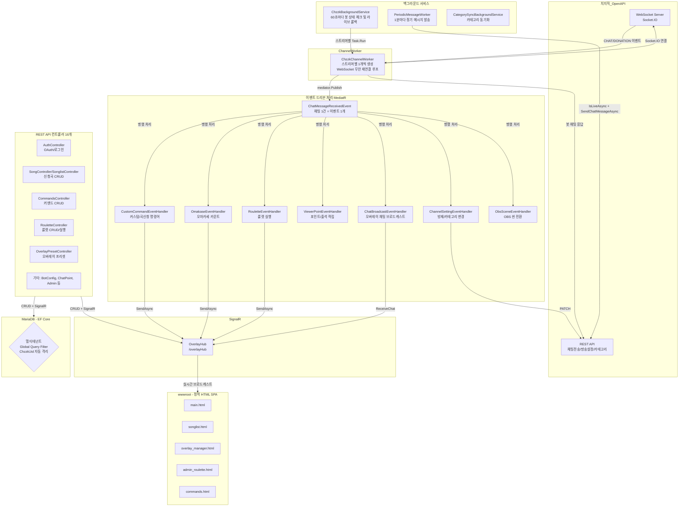

# MooldangBot (MooldangAPI) 시스템 상세 분석 보고서

> 작성일: 2026-03-24  
> 분석자: 물멍 (Senior Full-Stack AI Partner)  
> 대상: `c:\webapi\MooldangAPI\MooldangBot` 전체 폴더

---

## 1. 프로젝트 개요

**MooldangBot**은 치지직(CHZZK) 스트리밍 플랫폼과 연동되는 **멀티테넌트 스트리밍 봇 & 대시보드 API 서버**입니다.  
C# .NET 10, EF Core (MariaDB), MediatR, SignalR을 핵심 기술 스택으로 사용하며, **이벤트 드리븐 아키텍처(EDA)** 위에서 동작합니다.

### 핵심 기능 요약

| 기능 | 설명 |
|------|------|
| 치지직 WebSocket 봇 | 실시간 채팅 수신 및 명령어 처리 |
| 오마카세 | 치즈 후원 기반 메뉴 카운터 |
| 곡 신청 (SongQueue) | 채팅 명령어/후원 기반 신청곡 큐 관리 |
| 룰렛 | 치즈 후원 또는 포인트 사용 룰렛 |
| 시청자 포인트 & 출석 | 채팅 적립, 연속 출석 추적 |
| 커스텀 명령어 | DB 기반 동적 명령어 등록 및 응답 |
| 방제/카테고리 변경 | 채팅 명령어로 방송 설정 변경 |
| 오버레이 허브 | SignalR 기반 실시간 OBS 브라우저 소스 제어 |
| 정기 메시지 | 방송 중 일정 주기 채팅 자동 발송 |
| Chzzk OAuth 인증 | 스트리머 로그인 및 토큰 자동 갱신 |

---

## 2. 전체 아키텍처



---

## 3. 핵심 컴포넌트 상세 분석

### 3-1. 진입점 & DI 구성 (`Program.cs`)

**서비스 등록 전략:**

| 생명주기 | 서비스 | 이유 |
|----------|--------|------|
| `Singleton` | `ChzzkBackgroundService`, `SongQueueState`, `RouletteState`, `ObsWebSocketService`, `CommandCacheService` | 앱 전체에서 상태 공유 필요 |
| `Scoped` | `AppDbContext`, `UserSession`, `ChzzkCategorySyncService`, `RouletteService` | 요청별 독립 컨텍스트 |
| `Transient` | `IOverlayRenderStrategy` | 매번 새 인스턴스 허용 |
| `HostedService` | `ChzzkBackgroundService`, `PeriodicMessageWorker`, `CategorySyncBackgroundService` | 백그라운드 상시 실행 |

**주요 설정:**
- `.env` 파일 자동 로드 (Docker 환경 지원)
- Nginx/Cloudflare 리버스 프록시 대응 (`ForwardedHeaders`)
- 쿠키 기반 인증 (`CookieAuthentication`) + `StreamerId` 클레임 검증 미들웨어
- 앱 시작 시 `ChzzkClientId/Secret`을 DB (`SystemSettings`)에 자동 씨드

---

### 3-2. 멀티테넌트 DB 격리 (`AppDbContext.cs`)

**Global Query Filter** 패턴으로 테넌트 격리:

```csharp
// 현재 로그인한 스트리머의 ChzzkUid를 가진 데이터만 자동 필터링
modelBuilder.Entity<SongQueue>()
    .HasQueryFilter(e => !_userSession.IsAuthenticated || e.ChzzkUid == _userSession.ChzzkUid);
```

- **적용 대상:** StreamerProfile, SongQueue, StreamerCommand, StreamerOmakaseItem, Roulette, PeriodicMessage, SonglistSession, OverlayPreset, SharedComponent, AvatarSetting, ViewerProfile
- **배경 서비스에서의 우회:** `BackgroundService`는 인증 세션이 없어 `IsAuthenticated == false`이므로 필터가 비활성화되어 전체 스트리머 데이터 접근 가능
- **리눅스/Docker 대소문자 충돌 방지:** 모든 테이블명을 소문자로 명시적 매핑

---

### 3-3. 봇 엔진 동작 흐름

#### `ChzzkBackgroundService` (봇 매니저)
- **60초 주기**로 `IsBotEnabled == true`인 모든 스트리머를 DB에서 조회
- 스트리머별로 `ChzzkChannelWorker`를 `Task.Run()`으로 독립 비동기 실행
- `ConcurrentDictionary<string, CancellationTokenSource> _activeChannels`로 채널별 생명주기 관리
- **방송 종료 감지(Live→Offline):** `Task.WhenAll()`로 병렬 라이브 상태 체크 → 오프라인 전환 시 `OverlayPreset` 자동 롤백 + SignalR 브로드캐스트

#### `ChzzkChannelWorker` (스트리머 개별 WebSocket 연결)
1. DB에서 스트리머 프로필 + 토큰 로드
2. 토큰 만료 임박 시 자동 갱신 (치지직 OAuth Refresh)
3. 명령어 메모리 캐시 초기화 (CommandCacheService.RefreshAsync)
4. 치지직 OpenAPI /sessions/auth 호출 → WebSocket URL 획득
5. wss:// + /socket.io/ + transport=websocket&EIO=3 조합
6. ClientWebSocket 연결
7. 수신 루프: Socket.IO "0"(Open), "40"(방 입장), "2"(Ping) 대응, "42"(Event) 처리

---

### 3-4. EDA 이벤트 처리 (`ChatMessageReceivedEvent`)

MediatR `Publish()`를 통해 병렬 핸들러 실행:

- **H1. CustomCommandEventHandler**: 커스텀 명령어 검색 및 `{닉네임}` 등 변수 치환
- **H2. OmakaseEventHandler**: 동시성 제어(`DbUpdateConcurrencyException`)를 포함한 카운트 증가
- **H3. RouletteEventHandler**: 후원 금액 비례 다회차 실행 및 포인트 차감 로직
- **H4. ViewerPointEventHandler**: 채팅/출석/후원 기반 포인트 적립
- **H5. ChatBroadcastEventHandler**: 오버레이 실시간 채팅 전송
- **H6. ChannelSettingEventHandler**: 방제/카테고리 실시간 변경

---

### 11. 2026-03-24 치지직 웹소켓 성능 및 권한 안정화 패치
- `HandleEventAsync` 내 불필요한 DB Scope 생성 제거로 병목 현상 해결.
- 시청자 UID 비교 시 `OrdinalIgnoreCase` 적용으로 권한 체크 오류 수정.

### 12. 2026-03-24 치지직 웹소켓 무중단(Zero-Downtime) 및 복원력 패치
- `Task.WhenAny` 루프 도입 및 10초 주기 강제 하트비트(`"2"`) 송신.
- 재연결 대기 시간 **500ms** 단축으로 단선 시 즉각 복구.
- 수신 버퍼 16KB 상향 및 `IServiceScopeFactory` 기반 독립 Scope 처리.

---

## 22. 2026-03-25 룰렛 미션 관리 시스템 (Roulette Mission System v5)

룰렛 당첨 내역을 영속화하고 미션 상태를 관리하는 시스템을 구축했습니다.

- **Transactional Spinning**: `SemaphoreSlim`과 DB 트랜잭션을 결합하여 포인트 차감-로그 기록의 원자성 확보.
- **Mission Logging**: `RouletteLog` 테이블을 통해 당첨 이력 관리. `IsMission` 당첨 시 `Pending` 상태로 저장.
- **Mission Dashboard**: `admin_missions.html` 생성. 실시간 미션 수신 및 상태 변경(완료/취소) 지원.
- **Auto-Cleanup**: 30일 경과 로그 자동 삭제 서비스 구현.

---

## 23. 2026-03-25 룰렛 시스템 통합 배치 처리 (Roulette v6)

다중 회차 실행 시의 효율성과 시각적 피드백을 개선했습니다.

### 23-1. Batch Multi-Spin
- `SpinRouletteMultiAsync`로 로직 통합. 단일 트랜잭션 내에서 N개 결과를 배치 생성하여 DB 부하 최소화.
- SignalR 페이로드에 `Results`와 `Summary`를 함께 포함하여 오버레이 렌더링 최적화.

### 23-2. Donation Quotient Loop
- `RouletteEventHandler`에서 후원 금액을 비용으로 나눈 몫만큼 자동 실행. 
- 채팅 결과 포맷을 `[항목] x수량`으로 통일하여 가독성 및 데이터 정규성 확보.

---

*(이하 생략 - 상세 구현 내역 및 보완 사항은 추가 섹션 참조)*
