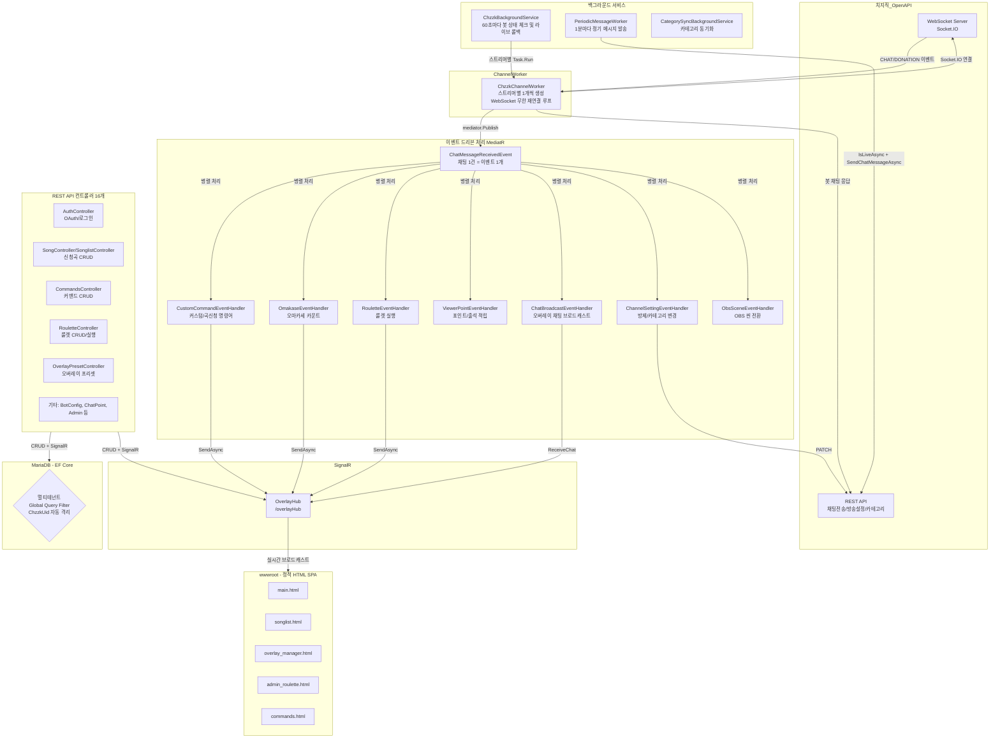
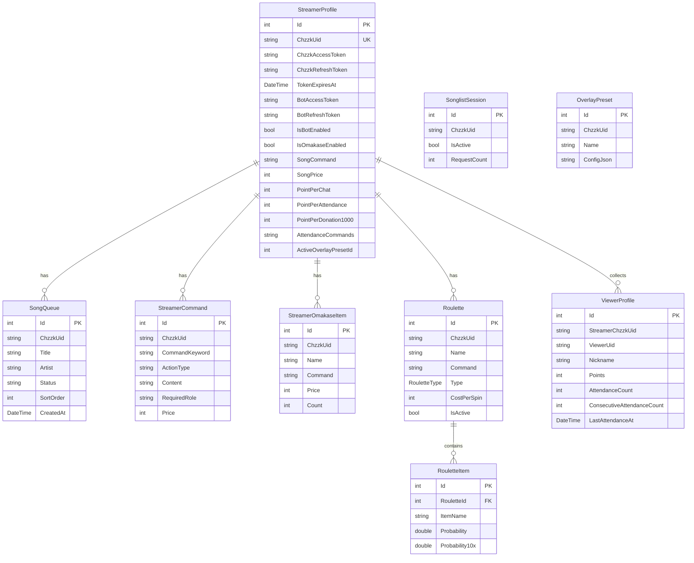

# MooldangBot (MooldangAPI) 시스템 상세 분석 보고서

> 작성일: 2026-03-24  
> 분석자: 물멍 (Senior Full-Stack AI Partner)  
> 대상: `c:\webapi\MooldangAPI\MooldangBot` 전체 폴더

---

## 1. 프로젝트 개요

**MooldangBot**은 치지직(CHZZK) 스트리밍 플랫폼과 연동되는 **멀티테넌트 스트리밍 봇 & 대시보드 API 서버**입니다.  
C# .NET 10, EF Core (MariaDB), MediatR, SignalR을 핵심 기술 스택으로 사용하며, **이벤트 드리븐 아키텍처(EDA)** 위에서 동작합니다.

### 핵심 기능 요약

| 기능 | 설명 |
|------|------|
| 치지직 WebSocket 봇 | 실시간 채팅 수신 및 명령어 처리 |
| 오마카세 | 치즈 후원 기반 메뉴 카운터 |
| 곡 신청 (SongQueue) | 채팅 명령어/후원 기반 신청곡 큐 관리 |
| 룰렛 | 치즈 후원 또는 포인트 사용 룰렛 |
| 시청자 포인트 & 출석 | 채팅 적립, 연속 출석 추적 |
| 커스텀 명령어 | DB 기반 동적 명령어 등록 및 응답 |
| 방제/카테고리 변경 | 채팅 명령어로 방송 설정 변경 |
| 오버레이 허브 | SignalR 기반 실시간 OBS 브라우저 소스 제어 |
| 정기 메시지 | 방송 중 일정 주기 채팅 자동 발송 |
| Chzzk OAuth 인증 | 스트리머 로그인 및 토큰 자동 갱신 |

---

## 2. 전체 아키텍처



---

## 3. 핵심 컴포넌트 상세 분석

### 3-1. 진입점 & DI 구성 (`Program.cs`)

**서비스 등록 전략:**

| 생명주기 | 서비스 | 이유 |
|----------|--------|------|
| `Singleton` | `ChzzkBackgroundService`, `SongQueueState`, `RouletteState`, `ObsWebSocketService`, `CommandCacheService` | 앱 전체에서 상태 공유 필요 |
| `Scoped` | `AppDbContext`, `UserSession`, `ChzzkCategorySyncService`, `RouletteService` | 요청별 독립 컨텍스트 |
| `Transient` | `IOverlayRenderStrategy` | 매번 새 인스턴스 허용 |
| `HostedService` | `ChzzkBackgroundService`, `PeriodicMessageWorker`, `CategorySyncBackgroundService` | 백그라운드 상시 실행 |

**주요 설정:**
- `.env` 파일 자동 로드 (Docker 환경 지원)
- Nginx/Cloudflare 리버스 프록시 대응 (`ForwardedHeaders`)
- 쿠키 기반 인증 (`CookieAuthentication`) + `StreamerId` 클레임 검증 미들웨어
- 앱 시작 시 `ChzzkClientId/Secret`을 DB (`SystemSettings`)에 자동 씨드

---

### 3-2. 멀티테넌트 DB 격리 (`AppDbContext.cs`)

**Global Query Filter** 패턴으로 테넌트 격리:

```csharp
// 현재 로그인한 스트리머의 ChzzkUid를 가진 데이터만 자동 필터링
modelBuilder.Entity<SongQueue>()
    .HasQueryFilter(e => !_userSession.IsAuthenticated || e.ChzzkUid == _userSession.ChzzkUid);
```

- **적용 대상:** StreamerProfile, SongQueue, StreamerCommand, StreamerOmakaseItem, Roulette, PeriodicMessage, SonglistSession, OverlayPreset, SharedComponent, AvatarSetting, ViewerProfile
- **배경 서비스에서의 우회:** `BackgroundService`는 인증 세션이 없어 `IsAuthenticated == false`이므로 필터가 비활성화되어 전체 스트리머 데이터 접근 가능
- **리눅스/Docker 대소문자 충돌 방지:** 모든 테이블명을 소문자로 명시적 매핑

**DB 스키마 (주요 엔터티):**



---

### 3-3. 봇 엔진 동작 흐름

#### `ChzzkBackgroundService` (봇 매니저)
- **60초 주기**로 `IsBotEnabled == true`인 모든 스트리머를 DB에서 조회
- 스트리머별로 `ChzzkChannelWorker`를 `Task.Run()`으로 독립 비동기 실행
- `ConcurrentDictionary<string, CancellationTokenSource> _activeChannels`로 채널별 생명주기 관리
- **방송 종료 감지(Live→Offline):** `Task.WhenAll()`로 병렬 라이브 상태 체크 → 오프라인 전환 시 `OverlayPreset` 자동 롤백 + SignalR 브로드캐스트

#### `ChzzkChannelWorker` (스트리머 개별 WebSocket 연결)

```
1. DB에서 스트리머 프로필 + 토큰 로드
2. 토큰 만료 임박 시 자동 갱신 (치지직 OAuth Refresh)
3. 명령어 메모리 캐시 초기화 (CommandCacheService.RefreshAsync)
4. 치지직 OpenAPI /sessions/auth 호출 → WebSocket URL 획득
5. wss:// + /socket.io/ + transport=websocket&EIO=3 조합
6. ClientWebSocket 연결
7. 수신 루프:
   - Socket.IO "0"(Open) → "40" 전송 (방 입장)
   - Socket.IO "2"(Ping) → "3" 전송 (Pong)
   - Socket.IO "42"(Event) → Task.Run(() => HandleEventAsync()) [Fire-and-Forget]
8. 연결 끊기면 3초 대기 후 재연결 (무한 루프)
```

**이벤트 라우팅 (`HandleEventAsync`):**

| 이벤트 | 처리 내용 |
|--------|-----------|
| `SYSTEM` (type: connected) | 채팅 + 후원 이벤트 구독 요청 |
| `CHAT` | 채팅 파싱 → MediatR Publish |
| `DONATION` | 치즈 후원 파싱 (payAmount 다중 타입 처리) → MediatR Publish |
| `SUBSCRIPTION` | 구독 로그 출력 (처리 예정) |

**봇 토큰 우선순위:**
1. 스트리머 커스텀 봇 계정 (`BotAccessToken`)
2. 시스템 공통 봇 계정 (`SystemSettings: BotAccessToken`)
3. 스트리머 본인 계정 (`ChzzkAccessToken`) - 최후 폴백

---

### 3-4. EDA 이벤트 처리 (`ChatMessageReceivedEvent`)

**이벤트 정의:**
```csharp
record ChatMessageReceivedEvent(
    StreamerProfile Profile,
    string Username,
    string Message,
    string UserRole,
    string SenderId,
    string ClientId,
    string ClientSecret,
    Dictionary<string, string> Emojis,
    int DonationAmount
) : INotification;
```

MediatR의 `Publish()`를 통해 **6개 핸들러가 동시에 실행**됩니다:

#### H1. `CustomCommandEventHandler` - 커스텀 명령어 처리
- **권한 체계:** `isMaster` (스트리머 본인 or 지정 UID) > `streamer` > `manager` > `common_user`
- **시스템 명령어:** `!명령어등록`, `!공지` (관리자 전용)
- **커스텀 명령어 실행 흐름:**
  1. 포인트 조회 전용 명령어 (`PointCheckCommand`) 우선 처리
  2. 메모리 캐시(`CommandCacheService`)에서 O(1) 명령어 탐색
  3. 권한 검증 후 `SongRequest` / `Notice` / `Reply` 액션 실행
  4. `Reply` 내 동적 변수 치환: `{닉네임}`, `{포인트}`, `{출석일수}`, `{연속출석일수}`, `{팔로우일수}`
- **곡 신청 내부 처리 (`HandleSongRequestInternalAsync`):**
  - 활성 SonglistSession 확인 → 없으면 거부 메시지
  - `SongQueue` DB 저장 + `SortOrder` 자동 증가
  - SignalR `RefreshSongAndDashboard`, `SongAdded` 이벤트 발송

#### H2. `OmakaseEventHandler` - 오마카세 카운터
- `IsOmakaseEnabled` 매번 DB에서 재확인 (`AsNoTracking`)
- 명령어 매칭 후 `DonationAmount / Price`로 증가량 배수 계산
- **낙관적 동시성 제어:** `DbUpdateConcurrencyException` 최대 3회 재시도 (Database Win)
- 성공 시 SignalR `RefreshSongAndDashboard` 발송

#### H3. `RouletteEventHandler` - 룰렛 실행
- **치즈 후원 룰렛 (Type: Cheese):** `DonationAmount >= CostPerSpin` + 명령어 일치
  - `DonationAmount >= CostPerSpin * 10` → 10연차 실행
- **포인트 룰렛 (Type: ChatPoint):** `ViewerProfile.Points >= CostPerSpin` → 포인트 차감
- `RouletteService.SpinRouletteAsync/SpinRoulette10xAsync` 위임

#### H4. `ViewerPointEventHandler` - 포인트/출석 관리
- 채팅마다 `PointPerChat` 포인트 적립
- 출석 명령어(`AttendanceCommands`) 감지:
  - KST 기준 당일 첫 출석만 인정
  - 전날 출석 시 연속 출석 카운트 증가, 아니면 1로 리셋
  - `PointPerAttendance` 추가 적립 + `AttendanceReply` 자동 발송
- 후원 금액 비례: `(DonationAmount / 1000) * PointPerDonation1000`

#### H5. `ChatBroadcastEventHandler` - 오버레이 실시간 브로드캐스트
- 모든 채팅을 SignalR `ReceiveChat` 이벤트로 브로드캐스트 (이모티콘 맵 포함)
- 아바타 명령어(`!달리기`, `!비행`) → `ReceiveAvatarCommand` 발송

#### H6. `ChannelSettingEventHandler` - 방송 설정 변경
- `!방제 {제목}` → 치지직 PATCH API로 방송 제목 변경
- `!카테고리 {키워드}` → DB 별칭 조회 → 치지직 카테고리 검색 → 카테고리 변경
- 하드코딩 별칭 사전 (`저챗`, `롤`, `배그` 등) + DB 동적 별칭 (`ChzzkCategoryAlias`) 양쪽 지원

---

### 3-5. 룰렛 서비스 (`RouletteService`)

**가중치 기반 확률 추첨:**
```csharp
// 1회: Probability 기준, 10연차: Probability10x 기준 (별도 확률 테이블)
double totalWeight = items.Sum(i => i.Probability);
double randomValue = Random.Shared.NextDouble() * totalWeight;
// 커서가 랜덤값을 넘는 첫 아이템 반환 (선형 탐색 O(n))
```

- 결과를 SignalR `RouletteTriggered`로 오버레이에 즉시 전송
- 봇 채팅으로 결과 발표 (Fire-and-Forget, 10연차는 `항목x개수` 형태로 그룹화)

---

### 3-6. 명령어 캐시 (`CommandCacheService`)

```
ConcurrentDictionary<chzzkUid, Dictionary<keyword, StreamerCommand>>
```

- **Singleton**으로 유지 → 모든 채널워커가 같은 캐시 공유
- 봇 접속 시 최초 load, 명령어 등록/수정 시 즉시 invalidate (`RefreshAsync`)
- DB 직접 조회 대신 `O(1)` 메모리 탐색으로 채팅 처리 지연 최소화

---

### 3-7. 정기 메시지 (`PeriodicMessageWorker`)

- **1분 주기** 백그라운드 서비스
- 각 메시지의 `LastSentAt + IntervalMinutes`와 현재 시간 비교
- 라이브 상태 캐시(`Dictionary<chzzkUid, bool`)로 동일 스트리머 중복 API 호출 방지
- 방송 중인 스트리머에게만 메시지 발송, 토큰 만료 시 자동 갱신

---

### 3-8. 오버레이 허브 (`OverlayHub`)

SignalR Hub. OBS 브라우저 소스가 연결/구독하는 실시간 채널.

**그룹 구조:**
- `chzzkUid.ToLower()`: 스트리머별 채팅·오마카세·곡신청 이벤트
- `preset-{presetId}`: 프리셋별 독립 스타일 업데이트

**클라이언트로 보내는 이벤트:**

| 이벤트명 | 발송 주체 | 내용 |
|----------|-----------|------|
| `ReceiveChat` | ChatBroadcastEventHandler | 채팅 메시지 + 이모티콘 |
| `ReceiveAvatarCommand` | ChatBroadcastEventHandler | 아바타 애니메이션 명령 |
| `RefreshSongAndDashboard` | CustomCommandEventHandler, OmakaseEventHandler | 신청곡/대시보드 새로고침 |
| `SongAdded` | CustomCommandEventHandler | 신곡 신청 알림 |
| `RouletteTriggered` | RouletteService | 룰렛 결과 |
| `ReceiveOverlayStyle` | ChzzkBackgroundService, OverlayHub | 오버레이 프리셋 스타일 |
| `ReceiveOverlayState` | OverlayHub | 오버레이 상태 |

---

### 3-9. 인증 & 보안

- **치지직 OAuth:** `AuthController`에서 Authorization Code Flow 처리
- **쿠키 인증:** 로그인 후 `StreamerId` 클레임 포함 쿠키 발행
- **StreamerId 미들웨어:** 인증된 요청에 `StreamerId` 클레임이 없으면 자동 로그아웃
- **멀티테넌트 격리:** Global Query Filter로 타 스트리머 데이터 접근 원천 차단
- **마스터 UID 하드코딩:** 특정 UID를 전역 마스터로 지정 (`ca98875d5e0edf02776047fbc70f5449`)
- **봇 채팅 도배 방지:** 모든 봇 메시지에 `\u200B`(제로-폭 공백) 접두사 삽입

---

## 4. REST API 컨트롤러 목록

| 컨트롤러 | 역할 |
|----------|------|
| `AuthController` | 치지직 OAuth 로그인/로그아웃, 봇 계정 연동 |
| `SongController` | 신청곡 큐 조회/삭제/상태 변경 |
| `SonglistController` | 신청곡 세션(SonglistSession) 관리 |
| `SonglistSettingsController` | 신청곡 관련 설정 (명령어, 가격 등) |
| `CommandsController` | 커스텀 명령어 CRUD + 오마카세 관리 |
| `RouletteController` | 룰렛/룰렛아이템 CRUD, 수동 스핀 |
| `OverlayPresetController` | 오버레이 프리셋 CRUD, 활성화/스타일 변경 |
| `MasterOverlayController` | 마스터 오버레이 설정 |
| `SharedComponentController` | 공유 컴포넌트 관리 |
| `ChatPointController` | 시청자 포인트 조회/수정 |
| `BotConfigController` | 봇 활성화 설정 |
| `AdminBotController` | 봇 제어 (관리자) |
| `AvatarSettingsController` | 아바타 설정 |
| `PeriodicMessageController` | 정기 메시지 CRUD |
| `ViewController` | HTML 페이지 라우팅 |
| `DebugController` | 개발 디버그 엔드포인트 |

---

## 5. 프론트엔드 구조 (`wwwroot`)

모든 UI는 순수 HTML + Vanilla JS의 SPA 방식:

| 파일 | 역할 |
|------|------|
| `main.html` | 대시보드 메인 (신청곡 현황) |
| `songlist.html` | 신청곡 관리 |
| `songlist_settings.html` | 신청곡 설정 |
| `songlist_overlay.html` | OBS 송리스트 오버레이 |
| `overlay_manager.html` | 오버레이 매니저 (101KB, 최대 규모) |
| `overlay.html` | OBS 채팅 오버레이 |
| `admin_roulette.html` | 룰렛 관리 |
| `roulette_overlay.html` | OBS 룰렛 오버레이 |
| `commands.html` | 커맨드 관리 |
| `admin.html` | 시스템 관리 |
| `admin_bot.html` | 봇 제어 |
| `admin_category.html` | 카테고리 별칭 관리 |
| `avatar_settings.html` | 아바타 설정 |
| `avatar_overlay.html` | 아바타 오버레이 |
| `ChatPoint.html` | 시청자 포인트 관리 |

---

## 6. 인프라 & 환경

### Docker 구성 (`Dockerfile` + `docker-compose.yml`)
- 멀티스테이지 빌드 (SDK → Runtime)
- MariaDB 컨테이너와 함께 구성
- Nginx 리버스 프록시 대응 (`ForwardedHeaders`)

### 환경변수 (`.env.example`)
```env
ChzzkApi__ClientId=...
ChzzkApi__ClientSecret=...
ConnectionStrings__DefaultConnection=...
```

### 카테고리 동기화 (`CategorySyncBackgroundService`)
- `ChzzkCategorySyncService`를 주기적으로 호출
- 치지직 공식 카테고리 DB에 동기화

---

## 7. 동시성 및 스레드 안전성 분석

| 상황 | 해결 방법 |
|------|-----------|
| 다수 채널 봇 동시 실행 | `ConcurrentDictionary<uid, CTS>` + `Task.Run()` 독립 실행 |
| 채팅 이벤트 Fire-and-Forget | `_ = Task.Run(() => HandleEventAsync(...))` |
| MediatR 병렬 핸들러 | 핸들러별 독립 `IServiceScope` 생성으로 DbContext 분리 |
| 오마카세 동시 후원 충돌 | `DbUpdateConcurrencyException` 캐치 + `[ConcurrencyCheck]` + 3회 재시도 |
| 명령어 캐시 동시 읽기 | `ConcurrentDictionary` 사용 |
| 라이브 상태 병렬 체크 | `Task.WhenAll(tasks)` 패턴 적용 |

---

## 8. 개선 포인트 및 기술 부채

| 항목 | 현황 | 권고사항 |
|------|------|----------|
| 마스터 UID 하드코딩 | `ca98875d5e0edf02776047fbc70f5449` 소스 내 고정 | DB 또는 환경변수로 이동 |
| 봇 UID 하드코딩 | `445df9c493713244a65d97e4fd1ed0b1` 소스 내 고정 | SystemSettings 연동 |
| HttpClient 인스턴스 남발 | Handler마다 `new HttpClient()` | IHttpClientFactory로 통합 |
| 카테고리 사전 중복 | `ChzzkChannelWorker`와 `ChannelSettingEventHandler` 동일 사전 복사 | static 공용 상수로 분리 |
| `PeriodicMessageWorker` 토큰 갱신 로직 중복 | ChzzkChannelWorker와 동일 패턴 | 공용 `TokenRefreshService` 추출 |
| OBS SceneEventHandler 미완성 | 파일만 존재, 구현 없음 | OBS WebSocket 연동 구현 예정 |
| `ChzzkChannelWorker` 파일 크기 | 666줄, 단일 파일 과부하 | Socket 처리와 이벤트 파싱 분리 리팩토링 권고 |

---

## 9. 데이터 흐름 요약 (채팅 명령어 1건 처리)

```
시청자 채팅 입력
    ↓
치지직 WebSocket 서버 (CHAT 이벤트)
    ↓
ChzzkChannelWorker.HandleEventAsync()
    ↓ [Fire-and-Forget Task.Run]
ChatMessageReceivedEvent 생성 및 mediator.Publish()
    ↓ [병렬 실행]
┌──────────────────────────────────────────────┐
│ H1: CustomCommandEventHandler               │ → 명령어 응답/신청곡 처리 → Chzzk REST
│ H2: OmakaseEventHandler                     │ → 오마카세 카운트++ → SignalR
│ H3: RouletteEventHandler                    │ → 룰렛 스핀 → SignalR
│ H4: ViewerPointEventHandler                 │ → 포인트/출석 적립 → DB
│ H5: ChatBroadcastEventHandler               │ → 오버레이 채팅 → SignalR
│ H6: ChannelSettingEventHandler              │ → 방제/카테고리 변경 → Chzzk REST
│ H7: ObsSceneEventHandler                    │ → (미구현)
└──────────────────────────────────────────────┘
    ↓
OBS 브라우저 소스 / 대시보드 실시간 업데이트
```

---

## 10. 2026-03-24 보안 및 인증 강화 패치

최근 `ChatPoint.html`에서 설정을 저장할 때 발생하던 `401 Unauthorized` 에러를 해결하고, 전반적인 API 보안을 강화했습니다.

### 10-1. 주요 수정 사항

| 대상 | 파일 | 내용 |
|------|------|------|
| **Backend** | `Program.cs` | AJAX 요청(`StartsWithSegments("/api")`)에 대해 302 리다이렉트 대신 401을 반환하도록 Cookie Authentication 이벤트 구성. 쿠키 `SameSite=Lax`, `SecurePolicy=Always` 설정 강제. |
| **Backend** | `ChatPointController.cs` | `ILogger` 주입 및 인가 로깅 추가. `[Authorize(Policy = "ChannelManager")]` 정책 적용 상태 유지. |
| **Backend** | `ChannelManagerAuth...` | 경로 변수(`chzzkUid`) 추출 로직 강화 및 거부 사유 로깅 추가. |
| **Frontend** | `ChatPoint.html` | 모든 `fetch` 요청에 `credentials: 'include'` 및 `Accept: 'application/json'` 헤더 추가. 401/403 응답에 대한 사용자 피드백(알림창) 강화. |

### 10-2. 해결된 문제
- 리버스 프록시(Nginx/Cloudflare) 환경에서 쿠키가 AJAX 요청 시 누락되거나, 세션 만료 시 브라우저가 리다이렉트를 추적하다 실패하는 현상 해결.
- 정책 핸들러에서 경로 변수를 찾지 못해 비정상적으로 거부되는 잠재적 결함 수정.

---

## 11. 2026-03-24 치지직 웹소켓 성능 및 권한 안정화 패치

치지직 채널 웹소켓의 빈번한 끊김 현상과 명령어 인식 지연 문제를 해결하기 위한 안정화 작업을 수행했습니다.

### 11-1. 주요 수정 사항

| 대상 | 파일 | 내용 |
|------|------|------|
| **Performance** | `ChzzkChannelWorker.cs` | `HandleEventAsync`에서 매 채팅마다 발생하던 DB Scope 생성 및 토큰 갱신 체크 로직을 제거하여 이벤트 처리 병목 현상 해결. |
| **Stability** | `ChzzkChannelWorker.cs` | Socket.IO `error` 이벤트의 로그 레벨을 `Warning`으로 격상하여 연결 거부 사유를 실시간 파악 가능하게 개선. |
| **Authority** | `ChzzkChannelWorker.cs`, `CustomCommand...` | 시청자 UID(`senderChannelId`) 비교 시 `OrdinalIgnoreCase`를 적용하여 대소문자 차이로 인한 권한 거부 결함 수정. |

### 11-2. 해결된 문제
- 채팅 발생 시마다 DB 세션이 열리며 발생하던 자원 경합 및 웹소켓 수신 루프 지연 해결.
- 웹소켓 핸드셰이크 시 발생하는 에러 페이로드를 로그에 기록하여 유지보수성 향상.
- 스트리머 본인 계정으로 채팅 시 '마스터' 권한이 간헐적으로 무시되던 현상 수정.

---

*이 보고서는 `MooldangBot` 프로젝트의 전체 소스코드를 심층 분석하여 작성되었습니다.*  
*최종 업데이트: 2026-03-24, 물멍(AI)*
