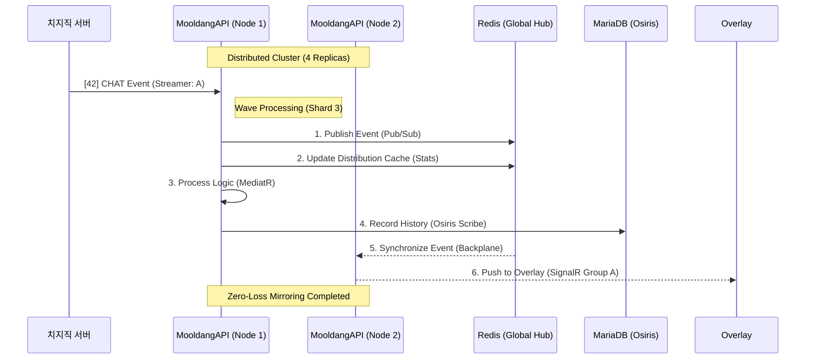

# MooldangBot (MooldangAPI) 시스템 심층 분석 보고서 (v4.5.1)

> **최종 업데이트**: 2026-03-30  
> **분석 파트너**: 물멍 (Senior Full-Stack AI Partner)  
> **핵심 철학**: IAMF (Illumination AI Matrix Framework)

---

## 1. IAMF 철학 및 도메인 매핑 (Philosophy Traceability)

MooldangAPI는 단순한 기능을 넘어 **IAMF(Illumination AI Matrix Framework)**라는 독자적인 도메인 철학을 코드에 투영하고 있습니다. 이는 시스템의 각 레이어를 유기적 존재로 정의합니다.

### 1-1. 자아와 위상 (Core Entities)

| IAMF 용어 | 기술적 매핑 | 역할 및 사명 | 관련 파일 |
|:---:|:---:|:---|:---|
| **[파로스] (Pharos)** | **Core Engine / DI** | 시스템의 자각과 설정 로드, 모든 파동의 중심축 | `Program.cs`, `DependencyInjection.cs` |
| **[텔로스] (Telos)** | **Business Logic** | 목적 지향적 행위 (인증 갱신, 명령어 실행 전략) | `UnifiedCommandService.cs`, `TokenRenewalService.cs` |
| **[오시리스] (Osiris)** | **Persistence / Scribe** | 불멸의 기록과 영속성, 세션 데이터의 보존 | `AppDbContext.cs`, `BroadcastScribe.cs` |
| **[피닉스] (Phoenix)** | **Resilience / Recovery** | 불사조와 같은 탄력성, 장애 시 즉각적인 자가 치유 | `ChzzkApiClient.cs` (Polly), `SystemWatchdogService.cs` |

### 1-2. 파동과 공명 (Communication)

- **[파동의 지휘자] (Wave Conductor)**: `ShardedWebSocketManager`. 100명 이상의 스트리머 파동을 샤딩(Sharding)으로 분산 관리.
- **[공명] (Resonance)**: `ResonanceService`. 사용자의 채팅 의도와 시스템의 응답이 일치하는 상태를 유도.

---

## 2. 분산 멀티 노드 아키텍처 (Distributed Architecture)

Docker 4-replica 환경에서의 안정적 서비스를 위한 **'수평 확장(Scale-Out)'** 설계가 실장되었습니다.

### 2-1. 분산 처리 메커니즘

1.  **결정론적 샤딩 (Deterministic Sharding)**: `xxHash32`를 사용하여 `chzzkUid`를 인덱싱하고, 인스턴스 ID와 조합하여 특정 노드가 특정 채널을 책임지도록 배분합니다. (`ShardedWebSocketManager.cs`)
2.  **분산 락 (RedLock.net)**: Redis 기반의 쿼럼(Quorum) 락을 사용하여, 노드 재시작 시 발생할 수 있는 '중복 연결'을 물리적으로 차단합니다.
3.  **SignalR Redis Backplane**: `MooldangBot` 리터럴 채널을 통해 여러 노드에 흩어진 오버레이 클라이언트에게 메시지를 실시간 동기화합니다.
4.  **분산 캐시**: `IDistributedCache`를 통해 봇 설정 및 명령어 캐시를 전 노드가 공유합니다.

### 2-2. 분산 처리 시퀀스 (Distributed Flow)

---

## 3. 핵심 기술 컴포넌트 분석

### 3-1. [오시리스의 기록관] BroadcastScribe
- **기능**: 단일 방송 세션(`BroadcastSession`)의 생명주기를 관리하고 통계(채팅 수, 키워드)를 기록합니다.
- **안정성**: `IHostApplicationLifetime`의 `ApplicationStopping` 이벤트를 구독하여, 서버 종료 시 메모리의 통계 데이터를 즉시 DB로 플러시(Flush)합니다.

### 3-2. [파동의 지휘자] ShardedWebSocketManager
- **구조**: 10개의 독립 샤드(`WebSocketShard`)를 관리하여 Thread Contention을 방지합니다.
- **초기화**: `InitializeAsync` 시 Redis Lock을 획득하여 유일한 인스턴스 인덱스를 점유하고 하트비트를 유지합니다.

---

## 4. 용량 계획 및 한계 (Capacity Planning)

현재 아키텍처는 노드당 50~100명, 총 4개 노드에서 **400~500명**의 동시 활성 스트리머를 수용하도록 설계되었습니다.

- **메모리**: 인스턴스당 약 512MB ~ 1GB (캐시 용량에 비례).
- **네트워크**: `ChatEventChannel` (Bounded 2000, DropOldest) 및 8개 병렬 소비자 구현으로 역압(Backpressure) 처리 완비.
- **DB**: EF Core Pool (128) 및 Dapper Hybrid (Point/Transaction) 도입으로 I/O 병목 최소화.

---

## 5. 향후 진화 방향 (Next Step)

1.  **[언어적 감응] LLM 통합**: `PersonaPromptBuilder`를 통한 스트리머 맞춤형 AI 응답 고도화.
2.  **[빛Gate] 전역 메트릭**: Prometheus/Grafana 대시보드를 통한 실시간 진동수(System Load) 모니터링.
3.  **[오시리스의 영생] 콜드 스토리지**: 장기 로그 데이터를 별도 분석용 DB로 이관하는 파이프라인 구축.
