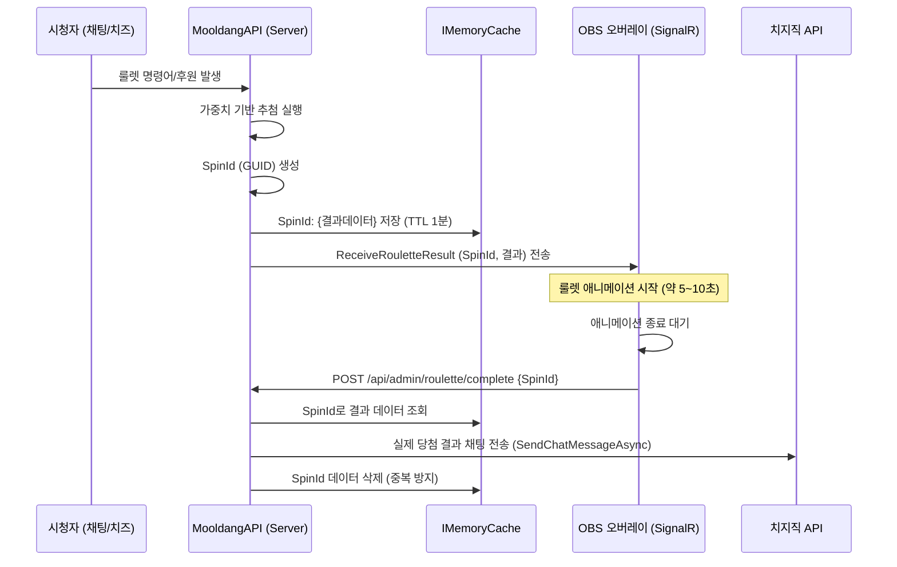

# MooldangBot (MooldangAPI) 시스템 상세 분석 보고서 v3

> 작성일: 2026-03-24  
> 분석자: 물멍 (Senior Full-Stack AI Partner)  
> 기반 문서: `md/Research3.md` + `md/Roulette/Plan1~6` 통합 분석

---

## 1. 프로젝트 개요

**MooldangBot**은 치지직(CHZZK) 스트리밍 플랫폼과 연동되는 **멀티테넌트 스트리밍 봇 & 대시보드 API 서버**입니다.  
C# .NET 10, EF Core (MariaDB), MediatR, SignalR을 핵심 기술 스택으로 사용하며, **이벤트 드리븐 아키텍처(EDA)** 위에서 동작합니다.

### 최신 업데이트 (v3)
- **룰렛 시스템 고도화**: 애니메이션 지연 알림(SpinId), 인풋 페이징(Seek Pagination), PascalCase 전역 통일 완료.

---

## 2. 📁 주요 폴더 구조 및 핵심 파일

- `Services/RouletteService.cs`: 가중치 기반 추첨 및 **SpinId 생성/캐싱** 로직 포함.
- `Controllers/RouletteController.cs`: 룰렛 CRUD 및 **애니메이션 완료 콜백([AllowAnonymous])** 처리.
- `wwwroot/roulette_overlay.html`: SignalR 수신 및 **애니메이션 종료 후 서버 콜백** 수행.
- `Program.cs`: **JSON 및 SignalR의 PascalCase 직렬화** 강제 설정.

---

## 3. 핵심 아키텍처: 룰렛 지연 알림 (Post-Animation Chat)

룰렛 결과가 오버레이 애니메이션 종료 시점에 맞춰 채팅창에 출력되도록 하는 **원자적 콜백 구조**입니다.

---

## 4. 기술적 의사결정 및 최적화

### 4.1. 성능 최적화: 인풋 페이징 (Seek Pagination)
- **문제**: `OFFSET` 방식은 페이지가 뒤로 갈수록 DB 부하가 급증함.
- **해결**: `LastId`를 기준으로 `WHERE Id < LastId` 쿼리를 수행하여 일정한 응답 속도 보장.
- **인덱스**: `(ChzzkUid, Id DESC)` 복합 인덱스를 활용하여 최적의 성능 도출.

### 4.2. 데이터 정합성: PascalCase 단일화
- **설정**: `Program.cs`에서 SignalR과 일반 API의 JSON 정책을 `null`로 설정하여 C# 프로퍼티명 그대로(PascalCase) 사용.
- **효과**: JS에서 `data.Results`, `data.SpinId`와 같이 직관적인 접근 가능, 대소문자 실수로 인한 데이터 누락 원천 차단.

### 4.3. 운영 안정성: [AllowAnonymous] 콜백
- **배경**: OBS 브라우저 소스는 관리자 세션 쿠키를 공유하지 않음.
- **해결**: 완료 콜백 엔드포인트에 `[AllowAnonymous]`를 적용하되, 추측 불가능한 `SpinId`를 토큰으로 활용하여 보안과 편의성 동시 확보.

---

## 5. 데이터 모델 (Roulette 관련)

| 엔터티 | 주요 필드 | 설명 |
|--------|-----------|------|
| **Roulette** | `IsActive`, `Type`, `CostPerSpin` | 룰렛의 기본 상태 및 활성 여부 |
| **RouletteItem** | `IsActive`, `Probability`, `Probability10x` | 항목별 활성 제어 및 확률 설정 |

---

## 6. 향후 과제 (Next Steps)

1. **기타 오버레이 전환**: 송리스트, 채팅 오버레이 등의 데이터 규격을 PascalCase로 점진적 전환.
2. **리팩토링**: `ChzzkChannelWorker`의 비대해진 로직 분리 및 하드코딩된 시스템 UID 관리화.
3. **OBS 연동 확장**: `ObsSceneEventHandler`를 통한 실제 장면 전환 기능 구현.

---
*분석 기준: 2026-03-24, 물멍(AI) v3 작성*
