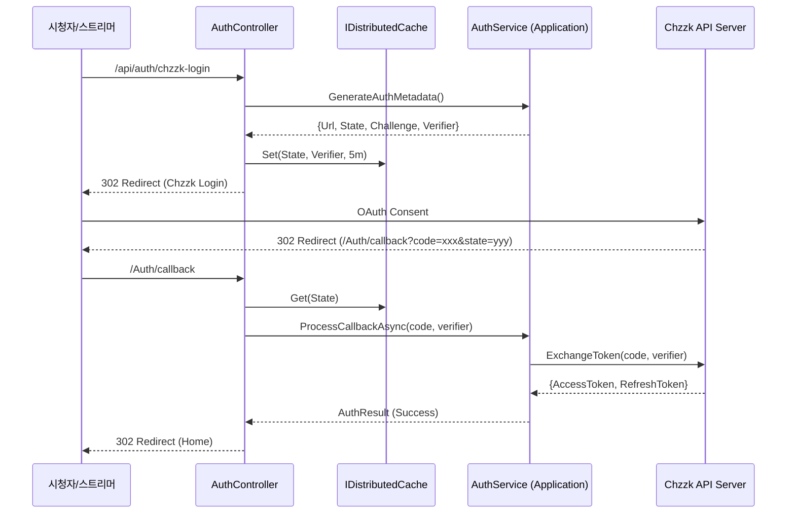

# 🔐 [오시리스의 정무]: 로그인 시스템 정밀 진단 및 개선 로드맵 v1.0

본 문서는 **MooldangBot v6.2 (Genesis)** 프로젝트의 인증 및 권한 관리 시스템에 대한 정밀 진단 결과와 향후 단계별 개선 계획을 담고 있습니다.

---

## 🔍 1. 현재 시스템 진단 (Current Diagnostics)

### ✅ 강점 (Strengths)
- **보안의 기틀**: `DataProtection`을 활용한 토큰 암호화(`EncryptedValueConverter`)가 적용되어 DB 탈취 시에도 민감 정보 유출 위험이 낮음.
- **역할 기반 권한**: 시청자, 스트리머, 매니저, 마스터로 세분화된 RBAC 체계가 구축되어 있음.
- **토큰 자동 갱신**: `TokenRenewalService`를 통해 백그라운드에서 주기적으로 액세스 토큰을 갱신하는 안정적인 구조 확보.

### ⚠️ 보안 취약점 및 개선점 (Gap Analysis)
- **CSRF 위험**: OAuth `state` 값이 전송은 되나, 콜백 단계에서 세션이나 서명 기반의 엄격한 검증이 부족하여 위조 요청에 노출될 가능성 존재.
- **인증 코드 보호**: 최신 권고 방식인 PKCE(Proof Key for Code Exchange)가 미도입되어, 퍼블릭 클라이언트 환경에서의 코드 탈취 가능성 상존.
- **결합도(Coupling)**: `AuthController`가 OAuth 상세 로직과 프레젠테이션 로직을 모두 담당하고 있어 유지보수 및 테스트가 어려움.
- **확장성 제한**: 현재 쿠키 전용 인증 방식으로 인해 오버레이, 모바일 등 외부 API 연동 시 기술적 제약 발생.

---

## 🛠️ 2. 개선 로드맵 (Proposed Roadmap)

### 🔴 Phase 1: 보안 강화 (Security Hardening) - [최고 우선순위]
- [ ] **State 검증 정밀화**: 서버 측 세션 혹은 서명된 쿠키를 활용하여 `state` 파라미터 무결성 체크.
- [ ] **PKCE 연동**: `CodeChallenge` 및 `CodeVerifier` 로직을 추가하여 치지직 API와의 인증 코드 교환 보안 강화.

### 🟠 Phase 2: 아키텍처 현대화 (Architecture Modernization)
- [ ] **AuthService 분리**: `AuthController`의 비즈니스 로직을 `Application` 레이어의 `AuthService`로 이관.
- [ ] **JWT 서포트**: 쿠키 인증과 JWT(Access/Refresh Token) 인증을 병행하는 하이브리드 인증 모델 구축.

### 🟡 Phase 3: 토큰 거버넌스 (Token Governance)
- [ ] **Refresh Token Rotation**: 토큰 신규 발행 시 기존 리프레시 토큰 폐기 및 신규 발급 로직 적용.
- [ ] **중복 로그인 제어**: 동일 계정의 다중 세션 실시간 관리 및 제어 기능.

---

## 🛠️ 2. 기술 통합 설계 (Phase 1 & 2) - [Step 2]

### 🏗️ 아키텍처 다이어그램 (Concept)


### 💻 핵심 기술 스니펫 (.NET 10)

#### 1) AuthService (Primary Constructor)
```csharp
public class AuthService(
    IAppDbContext _db, 
    IChzzkApiClient _chzzkApi, 
    IConfiguration _config,
    ILogger<AuthService> _logger) : IAuthService
{
    // [v10.0] Primary Constructor를 통한 의존성 주입 최적화
    public async Task<AuthResult> ProcessTokenExchangeAsync(string code, string verifier)
    {
        // PKCE Verifier를 포함한 토큰 교환 로직
        var tokenRes = await _chzzkApi.ExchangeTokenWithPkceAsync(code, verifier);
        // ... (이하 생략)
    }
}
```

#### 2) CryptoHelper (PKCE)
```csharp
public static class CryptoHelper 
{
    public static string GenerateVerifier() => Guid.NewGuid().ToString("N"); // 간소화된 예시
    public static string GenerateChallenge(string verifier) 
    {
        using var sha256 = System.Security.Cryptography.SHA256.Create();
        var bytes = sha256.ComputeHash(System.Text.Encoding.UTF8.GetBytes(verifier));
        return Microsoft.AspNetCore.WebUtilities.WebEncoders.Base64UrlEncode(bytes);
    }
}
```

---

## 📅 진단 일자 및 총평
- **일시**: 2026-04-03
- **총평**: 기존의 안정적인 뼈대 위에 **'유형의 무결성'**과 **'현대적 보안 프로토콜'**만 덧입힌다면, 치지직 인프라 내에서 가장 강력하고 안전한 봇 시스템이 될 것입니다.

**물멍(Senior Partner)** 🐾✨
