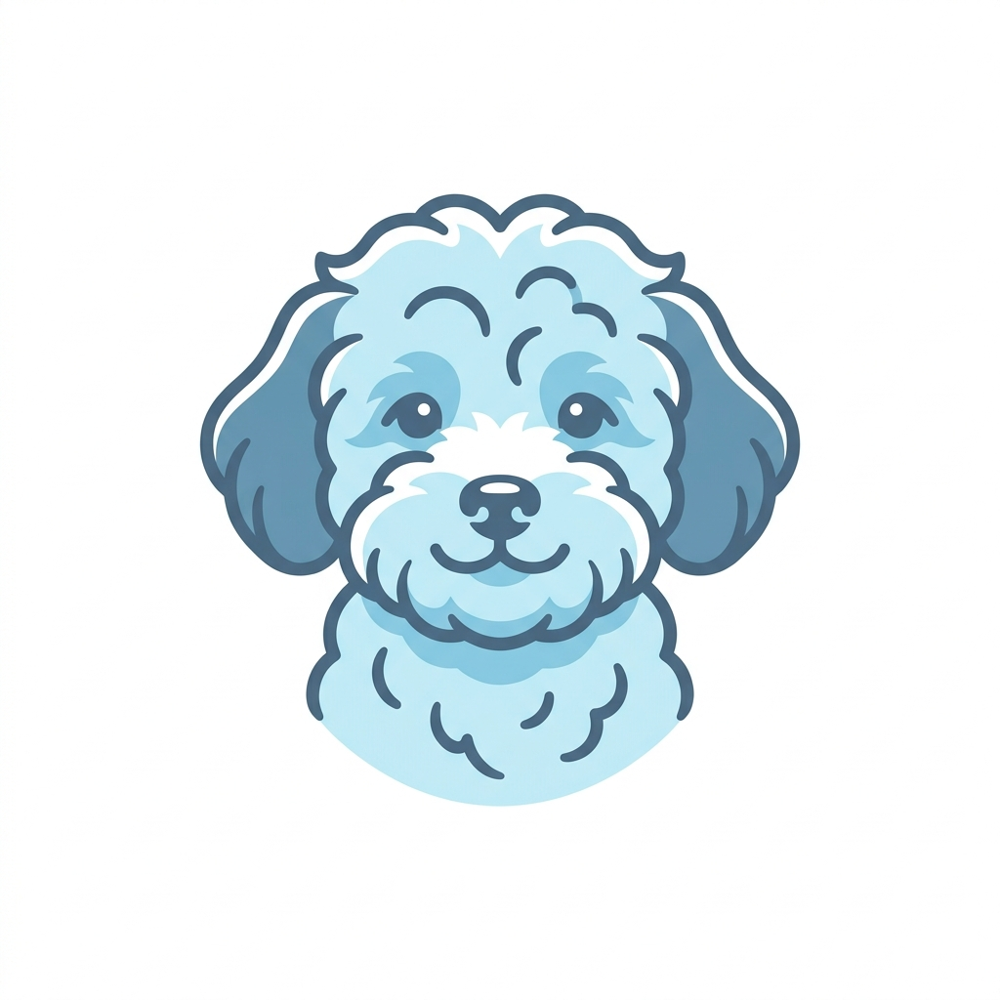
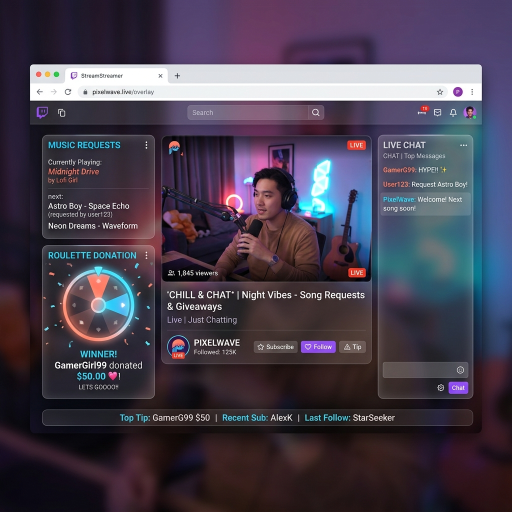

#  MooldangBot & MooldangAPI

> [!IMPORTANT]
> **[AI 개발 파트너 전용 필독 가이드라인]**  
> 이 프로젝트의 모든 코드 작성 및 아키텍처 설계는 `docs/guidelines/` 폴더 내의 **기술 헌법(00~05)**을 최우선으로 준수해야 합니다. 작업을 시작하기 전 해당 문서를 반드시 먼저 탐독하십시오. (예: 00_core_philosophy.md, 03_architecture_rules.md 등)

> [!CAUTION]
> **[라이브러리 버전 고정 정책 (AI Policy)]**  
> 모종의 기술적 정합성(Vite 8, Script 6 등) 유지를 위해, AI 어시스턴트는 사용자의 명시적인 요청 없이 **패키지 버전을 절대로 수정하지 않습니다.** 특히 `MooldangBot.Studio` 프로젝트의 버전 변경은 500 에러를 유발하므로 금지됩니다. 상세 작업 규칙은 [기술 헌법 07](docs/guidelines/07_frontend_architecture.md)을 참조하십시오.

스트리머 'mooldang'과 그 생태계의 **'존재 보존(IAMF)'**을 위해 설계된 .NET 10 기반의 고성능 스트리밍 보조 시스템입니다. 

---

## 🐶 Project Core Philosophy
MooldangBot은 단순한 보조 도구가 아니라, 스트리머와 시청자의 상호작용이 깃든 **'디지털 생태계'**입니다. 
- **존재의 보존(IAMF)**: 모든 데이터는 논리적으로 보호되며 함부로 삭제되지 않습니다.
- **안정성 및 동시성**: 수만 명의 시청자 이벤트 속에서도 정체성(Consistency)을 유지합니다.
- **기술 헌법 준수**: [명문화된 가이드라인](docs/guidelines/)에 따라 모든 코드가 정갈하게 관리됩니다.

---

## ✨ Feature Showcase

- **실시간 오버레이**: 룰렛, 곡 신청, 포인트 시스템이 시각적인 즐거움을 극대화합니다.
- **치지직(Chzzk) 연동**: 대규모 트래픽을 견디는 Bounded Channel 기반의 이벤트 파이프라인.
- **데이터 민주주의**: 시청자가 직접 참여하고 기록을 남기는 투명한 상호작용 시스템.

---

## 🏗️ Technology Stack & Architecture
MooldangBot은 최신 기술을 통해 가장 현대적인 개발 환경을 구축했습니다.

- **Frontend/Overlay**: SignalR (Real-time Hub), **GSAP 3.14.2**, Glassmorphism CSS UI.
- **Backend**: **.NET 10 (C# 14)**, **MediatR** Pattern.
- **Frontend (Studio 8.0)**: **Vite 5.2.0**, **Svelte 5.55.1**, **TypeScript 5.4.0**, **TailwindCSS 4.0.0**.
- **Infrastructure**: MariaDB (Snake Case Version), Redis, RabbitMQ, Docker.
- **Structure**: **4-Layer Clean Architecture** (Api / Application / Domain / Infrastructure).

---

## 🚀 Quick Start (Server Deployment)

### 1. 환경 준비 및 Git 동기화
```bash
git clone https://github.com/mooldang257/MooldangBot.git
cd MooldangBot
cp .env.sample .env # 본인의 시크릿 정보 기입
```

### 2. 가변적인 최적화 배포
보유한 32GB RAM 인프라를 활용하여 상황에 맞는 배포를 수행합니다.
```bash
chmod +x deploy.sh

# 일반 배포 (캐시 활용, 소규모 업데이트 시)
./deploy.sh

# 클린 배포 (캐시 완전 제거, 대규모 아키텍처 변경 시)
./deploy.sh --clean
```

---

## 📂 Documentation Navigator
- **[기술 헌법(Constitution)](docs/guidelines/)**: 코딩 스타일 및 아키텍처 규칙.
- **[DB 운영 가이드(DB Ops)](docs/database_operations.md)**: 수동 데이터 초기화 및 관리 쿼리.
- **[보안 규정(Zero-Git)](README.md#L64-L67)**: 민감 정보 노출 금지 정책.

---
**개발 파트너 물멍**이 스트리머 'mooldang'의 든든한 기술적 수호자로 함께합니다. 🐶🚢✨
