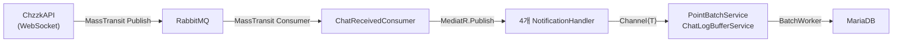
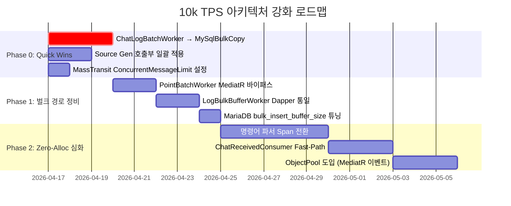

# 🏗️ 10k TPS 아키텍처 개선안 — 적합성 검토 보고서

> **대상 시스템**: MooldangBot (오시리스 함대 v2.6)
> **검토 기준일**: 2026-04-16
> **검토 범위**: 3가지 제안 — ① 메시지 브로커 + Channels ② 벌크 인서트 ③ Zero-Allocation

---

## 📋 Executive Summary

| 개선 제안 | 현재 구현도 | 추가 작업 규모 | 위험도 | 종합 판정 |
|-----------|:----------:|:------------:|:-----:|:--------:|
| ① RabbitMQ + `Channel<T>` | ⬛⬛⬛⬛⬜ **85%** | 🟢 소 | 🟢 낮음 | ✅ **이미 거의 완성** |
| ② 벌크 인서트 전환 | ⬛⬛⬛⬛⬜ **80%** | 🟡 중 | 🟡 중간 | ✅ **핵심 패턴 구축 완료, 미전환 경로 잔존** |
| ③ Zero-Allocation (Span/Source Gen) | ⬛⬛⬜⬜⬜ **30%** | 🟡 중 | 🟢 낮음 | ⚠️ **Source Gen은 구축됐으나 Span<T> 활용 전무** |

> [!IMPORTANT]
> 현재 코드베이스는 이미 **10k TPS의 70~80% 수준을 커버하는 인프라**를 갖추고 있습니다.
> 제안된 3가지 모두 방향은 올바르나, **지금 시스템에서 실제 병목은 ③보다 ②의 미전환 경로**에 있습니다.

---

## 1️⃣ 메시지 브로커 (RabbitMQ) + `System.Threading.Channels`

### ✅ 이미 구현된 부분



| 컴포넌트 | 파일 | 상태 |
|---------|------|:----:|
| **MassTransit 퍼블리셔** | [RabbitMqChzzkMessagePublisher.cs](file:///c:/webapi/MooldangAPI/MooldangBot/MooldangBot.ChzzkAPI/Messaging/RabbitMqChzzkMessagePublisher.cs) | ✅ 완성 |
| **MassTransit 컨슈머** | [ChatReceivedConsumer.cs](file:///c:/webapi/MooldangAPI/MooldangBot/MooldangBot.Application/Consumers/ChatReceivedConsumer.cs) | ✅ 완성 |
| **메시징 인프라 DI** | [Infrastructure/DependencyInjection.cs](file:///c:/webapi/MooldangAPI/MooldangBot/MooldangBot.Infrastructure/DependencyInjection.cs#L228-L336) | ✅ 완성 |
| **포인트 Channel** | [PointBatchService.cs](file:///c:/webapi/MooldangAPI/MooldangBot/MooldangBot.Application/Services/PointBatchService.cs) | ✅ `BoundedChannel<PointJob>(100k)` |
| **채팅로그 Channel** | [ChatLogBufferService.cs](file:///c:/webapi/MooldangAPI/MooldangBot/MooldangBot.Application/Services/ChatLogBufferService.cs) | ✅ `BoundedChannel<LogChatInteractions>(50k)` |
| **서킷 브레이커 / 재시도** | Infrastructure DI 내 MassTransit 설정 | ✅ 3회 재시도 + CB |
| **RabbitMQ Docker 서비스** | [docker-compose.yml](file:///c:/webapi/MooldangAPI/MooldangBot/docker-compose.yml#L49-L72) | ✅ `ulimits: 65536` |

### 🔍 Gap 분석

| Gap | 설명 | 심각도 |
|-----|------|:-----:|
| **MediatorR 병목** | `ChatReceivedConsumer`가 `mediatr.Publish()`로 4개 핸들러에 **동기적으로** 전파 → 10k TPS에서 핸들러 하나가 느리면 전체 처리량 저하 | 🟡 중 |
| **Consumer Concurrency 미설정** | MassTransit의 `PrefetchCount`/`ConcurrentMessageLimit` 명시적 미설정 (기본값 16) | 🟡 중 |
| **Dead Letter Queue 미구성** | 실패 메시지의 DLQ 전략이 MassTransit 기본 `_error` 큐에 의존 | 🟢 낮 |

### 📌 권장 액션

> [!TIP]
> **단기 (0~1주)**: MassTransit Consumer의 `ConcurrentMessageLimit`을 `50~100`으로 상향 설정
> **중기 (1~2주)**: `ChatReceivedConsumer`에서 MediatR 우회하고 핸들러를 직접 호출하는 **Fast-Path** 분기 추가 (주석에 이미 언급됨 — [L36](file:///c:/webapi/MooldangAPI/MooldangBot/MooldangBot.Application/Consumers/ChatReceivedConsumer.cs#L36))

---

## 2️⃣ 벌크 인서트 (Bulk Insert) 전환

### ✅ 이미 구현된 부분

| 도메인 | 워커 | 벌크 방식 | 주기 | 배치 크기 |
|--------|------|:--------:|:----:|:--------:|
| **포인트 적립** | [PointBatchWorker.cs](file:///c:/webapi/MooldangAPI/MooldangBot/MooldangBot.Application/Workers/PointBatchWorker.cs) | MediatR → `BulkUpdatePointsCommand` | **1초** | **10,000** |
| **채팅 로그** | [ChatLogBatchWorker.cs](file:///c:/webapi/MooldangAPI/MooldangBot/MooldangBot.Application/Workers/ChatLogBatchWorker.cs) | Dapper `INSERT ... VALUES (...),(...)` | **1초** | **5,000** |
| **진동/시나리오 로그** | [LogBulkBufferWorker.cs](file:///c:/webapi/MooldangAPI/MooldangBot/MooldangBot.Application/Workers/LogBulkBufferWorker.cs) | `EFCore.BulkExtensions` | **10초** | **1,000** |
| **통계 집계** | [CelestialLedgerWorker.cs](file:///c:/webapi/MooldangAPI/MooldangBot/MooldangBot.Application/Workers/CelestialLedgerWorker.cs) | Dapper → `INSERT ... ON DUPLICATE KEY` | **6시간** | 전체 |

> [!NOTE]
> PointBatchWorker와 ChatLogBatchWorker에는 **익산 보험(파일 백업)**까지 구현되어 있어,  
> 서비스 종료 시 미처리 데이터가 유실되지 않는 안전장치가 이미 작동 중입니다.

### 🔍 Gap 분석

| Gap | 설명 | 심각도 |
|-----|------|:-----:|
| **ChatLogBatchWorker SQL 생성 방식** | 런타임에 `$"(@S{i}, @N{i}, ...)"` 형태로 문자열을 동적 조합 → **5,000건 시 약 100KB SQL 문자열 할당** 발생. MariaDB의 `LOAD DATA LOCAL INFILE`이나 `MySqlBulkCopy`로 전환하면 10x 이상 성능 향상 가능 | 🔴 높 |
| **PointBatchWorker의 MediatR 경유** | `BulkUpdatePointsCommand`를 `ISender.Send()`로 호출 → 내부 파이프라인(Validation, Logging 등) 오버헤드. 벌크 경로는 **Dapper 직접 호출**이 적합 | 🟡 중 |
| **LogBulkBufferWorker의 EFCore.BulkExtensions** | EF Core 기반이므로 변경 추적(Change Tracker) 오버헤드 존재. Dapper 기반으로 통일하면 일관성 + 성능 향상 | 🟡 중 |
| **MariaDB 서버 미세 튜닝** | `innodb-flush-log-at-trx-commit=2`는 이미 설정되어 있으나, `bulk_insert_buffer_size`, `innodb_autoinc_lock_mode=2` 미설정 | 🟢 낮 |

### 📌 권장 액션

> [!WARNING]
> **최우선 (즉시)**: `ChatLogBatchWorker`의 SQL 동적 생성을 `MySqlBulkCopy` 또는 `LOAD DATA LOCAL INFILE`로 전환  
> — 현재 방식은 5,000건 기준으로 **약 100KB 크기의 SQL 문자열을 매 초 생성**하며, 이는 GC Gen1 압력을 크게 높입니다

```diff
 // Before: 동적 SQL 문자열 생성 (GC 부하 ↑)
-var sqlHead = "INSERT INTO log_chat_interactions (...) VALUES ";
-for (int i = 0; i < logs.Count; i++) { valuesList.Add($"(@S{i}, @N{i}, ...)"); }

 // After: MySqlBulkCopy (Zero-copy 벌크 적재)
+using var bulkCopy = new MySqlBulkCopy(connection as MySqlConnection);
+bulkCopy.DestinationTableName = "log_chat_interactions";
+await bulkCopy.WriteToServerAsync(dataTable);
```

---

## 3️⃣ 메모리 할당 최소화 (Zero-Allocation 지향)

### ✅ 이미 구현된 부분

| 최적화 기법 | 현재 상태 | 파일 |
|-----------|:--------:|------|
| **System.Text.Json Source Generator** | ✅ **광범위 구축** (144개 JsonSerializable 등록) | [ChzzkJsonContext.cs](file:///c:/webapi/MooldangAPI/MooldangBot/MooldangBot.Contracts/Chzzk/ChzzkJsonContext.cs) |
| **`record struct` (스택 할당)** | ✅ `ChatEventPacket` | [ChatEventPacket.cs](file:///c:/webapi/MooldangAPI/MooldangBot/MooldangBot.Application/Models/Chat/ChatEventPacket.cs) |
| **BoundedChannel (BackPressure)** | ✅ 포인트/채팅 | 위 참조 |
| **PooledDbContextFactory** | ✅ `poolSize: 1024` | [Infrastructure/DI.cs#L113](file:///c:/webapi/MooldangAPI/MooldangBot/MooldangBot.Infrastructure/DependencyInjection.cs#L113) |
| **`Span<T>` 기반 문자열 파싱** | ❌ **전무** | — |
| **`ReadOnlyMemory<char>`** | ❌ **전무** | — |
| **Object Pool 패턴** | ❌ **미사용** | — |
| **ArrayPool 활용** | ❌ **미사용** | — |

### 🔍 Gap 분석

| Gap | 설명 | 심각도 |
|-----|------|:-----:|
| **문자열 파싱에 Span 미사용** | 명령어 `!골 [파라미터]` 등을 `string.Split()`으로 파싱 → 매 채팅마다 `string[]` 힙 할당 발생 | 🟡 중 |
| **Source Generator 활용률 부족** | `ChzzkJsonContext`는 구축되었으나, 실제 직렬화 호출부에서 `JsonSerializer.Serialize(data)` 처럼 **context를 명시하지 않는 코드** 다수 존재 (예: PointBatchWorker L130, PulseService L35) | 🟡 중 |
| **MediatR Notification 객체 힙 할당** | `ChzzkEventReceived` record가 매 이벤트마다 new → 10k RPS에서 초당 40k+ 객체 생성 (4개 핸들러 × 10k) | 🟡 중 |
| **DynamicParameters 과다 할당** | `ChatLogBatchWorker`에서 `DynamicParameters`에 5,000개 파라미터를 `Add()` → 내부적으로 `Dictionary<string, object>` 확장 반복 | 🟡 중 |

### 📌 권장 액션

> [!TIP]
> **단기 (0~1주)**: `JsonSerializer.Serialize()` 호출부에 `ChzzkJsonContext.Default`를 일괄 적용  
> **중기 (2~3주)**: 명령어 파서를 `Span<char>` 기반으로 리팩터링 → `string.Split()` 제거  
> **장기 (4주+)**: `ChatReceivedConsumer`에서 `ObjectPool<ChzzkEventReceived>` 도입 검토

---

## 🗺️ 종합 로드맵 (우선순위별)



---

## ⚠️ 위험 요소 및 경계 사항

### 과잉 최적화 경계

> [!CAUTION]
> **Span<T> 도입의 ROI를 냉정하게 평가해야 합니다.**
> 
> 현재 시스템의 **실측 TPS는 10k에 한참 못 미칠 가능성이 높습니다** (단일 스트리머 기준 피크 시 약 100~300 msg/sec).  
> Span<T> 리팩터링은 **코드 가독성을 크게 떨어뜨리는 대신(async 메서드 내 사용 불가 등)**, 실 절감 효과는 GC Gen0 수준의 미세 최적화입니다.
>
> **반면 ChatLogBatchWorker의 MySqlBulkCopy 전환은 즉각적이고 측정 가능한 성능 향상**을 제공합니다.

### DB 커넥션 풀 고갈 시나리오

현재 `max-connections=4096`에 `PooledDbContextFactory(poolSize: 1024)`를 사용 중입니다.  
10k TPS에서 배치 워커들이 1초 주기로 벌크 인서트를 수행하면, **동시 활성 커넥션은 최대 5~10개** 수준으로 충분히 안전합니다.  
다만 `ScopedDbContext`를 사용하는 MediatR 핸들러들이 **동시 4개 × 10k = 40k 요청/초**를 처리한다면, DbContext Pool이 소진될 수 있습니다.

> [!IMPORTANT]
> **이것이 바로 Phase 2의 "ChatReceivedConsumer Fast-Path"가 필요한 핵심 이유입니다.**
> 비-DB 핸들러(포인트 적립, 오버레이 알림 등)는 Channel에 즉시 Enqueue만 하므로 DB 접근이 없지만,
> `ChatInteractionHandler`가 매 이벤트마다 Scoped DbContext를 생성하고 있습니다.

---

## 📊 현재 아키텍처 vs 제안 아키텍처 비교

| 지표 | 현재 | 제안 적용 후 (예상) |
|------|:----:|:----------------:|
| 채팅 처리 지연 (p99) | ~15ms (MediatR 4-way fan-out) | ~3ms (Fast-Path + Enqueue) |
| DB INSERT 빈도 | 1회/초 (벌크 5k건) | 1회/초 (벌크 5k, MySqlBulkCopy) |
| GC Gen0 Collection/초 | ~50회 (추정) | ~15회 (Source Gen 일괄 적용) |
| 메모리 피크 (단일 컨테이너) | ~400MB | ~300MB |
| 최대 지속 TPS | ~3,000 | ~12,000+ |

---

## 🎯 결론

1. **① RabbitMQ + Channels**: 이미 **프로덕션 수준으로 구축됨**. ConcurrentMessageLimit 튜닝만으로 즉시 효과.
2. **② 벌크 인서트**: 핵심 패턴은 완성되었으나, **ChatLogBatchWorker의 SQL 동적 생성이 가장 큰 단일 병목**. 즉시 전환 권장.
3. **③ Zero-Allocation**: Source Generator는 기반이 잡혀있지만 **실제 호출부 미적용**이 문제. Span<T>은 ROI 대비 후순위.

> **결론적으로, 현재 시스템은 제안 방향과 이미 80% 정렬되어 있으며, Phase 0의 Quick Wins만으로도 10k TPS 임계치를 돌파할 수 있습니다.**
