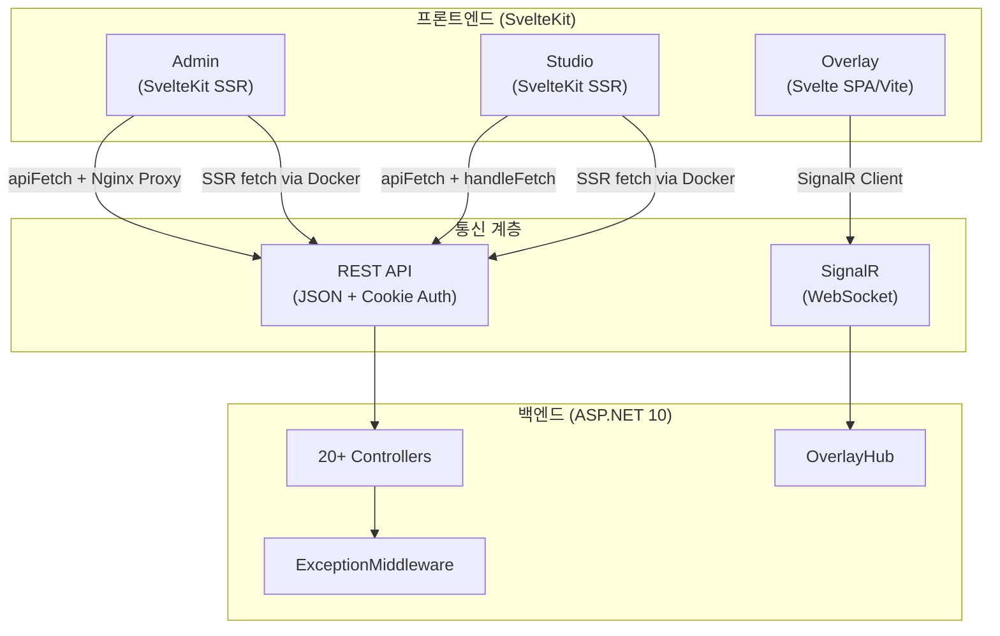
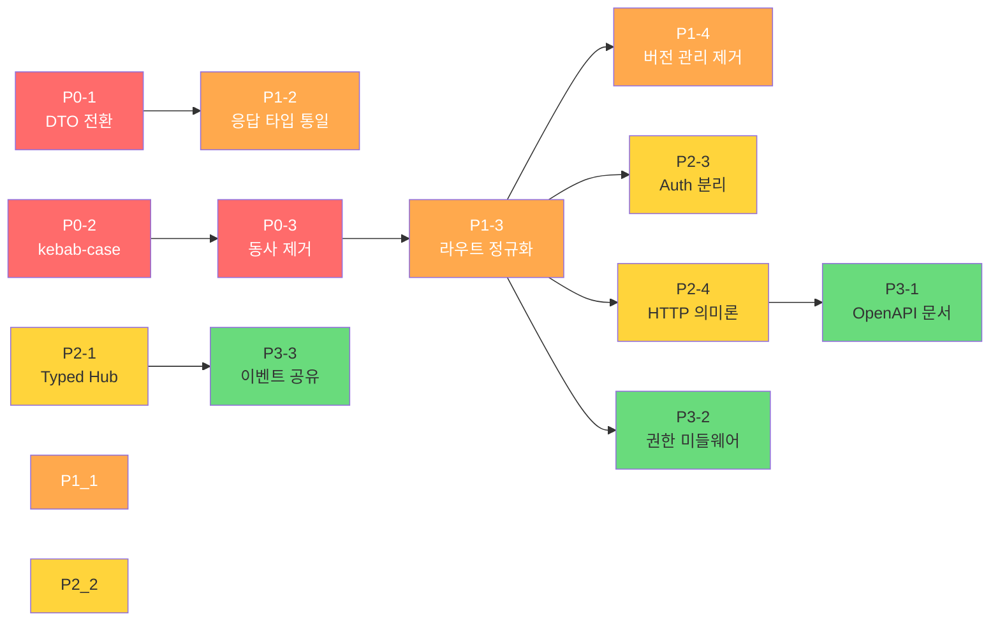

# 📡 UI ↔ 백엔드 통신 규약 전수 분석 보고서

> **분석 일시**: 2026-04-20 09:54 KST  
> **대상 범위**: 백엔드 컨트롤러 20개, SignalR 허브 1개, 프론트엔드 3개 앱 (Admin, Studio, Overlay)  
> **평가 기준**: 1인 개발자의 유지보수성, 일관성, 확장성

---

## 1. 현재 통신 아키텍처 개요



### 통신 프로토콜 요약

| 구분 | 프로토콜 | 인증 방식 | 직렬화 |
|------|----------|-----------|--------|
| Admin ↔ API | REST (HTTP) | Cookie (`.MooldangBot.Session`) | JSON (camelCase) |
| Studio ↔ API | REST (HTTP) | Cookie (동일) | JSON (camelCase) |
| Overlay ↔ API | SignalR (WebSocket) | Hash Token (16자리 쿼리스트링) | JSON |
| SSR ↔ API | REST (Docker 내부망) | Cookie 전달 (handleFetch) | JSON |

---

## 2. ✅ 잘 되어 있는 부분

### 2.1 통일된 응답 봉투 (`Result<T>`)

```csharp
// 백엔드
public class Result<T> {
    public bool IsSuccess { get; set; }
    public T? Value { get; set; }
    public string? Error { get; set; }
    public object? Errors { get; set; }
    public DateTime ResponseTime { get; set; }
}
```

```typescript
// 프론트엔드 (client.ts)
export interface Result<T> {
    isSuccess: boolean;
    value: T;
    error: string | null;
    responseTime: string;
}
```

> [!TIP]
> 모든 컨트롤러에서 `Result<T>.Success()` / `Result<T>.Failure()` 패턴을 **100% 준수**하고 있습니다. 프론트엔드 `apiFetch<T>`가 봉투를 자동으로 까서 `T`만 반환하므로, 1인 개발자로서 매우 효율적인 구조입니다.

### 2.2 SSR 프록시 처리 (Aegis Bridge)

- **Studio**: `handleFetch`에서 Docker 내부망 주소로 자동 치환 + 쿠키 전달
- **Admin**: `apiFetch` 내부에서 `!browser` 판별 후 `http://mooldang-app:8080`으로 전환
- 두 방식 모두 작동하지만, **Studio 방식이 SvelteKit 공식 권장 패턴**으로 더 우수합니다.

### 2.3 전역 예외 처리 미들웨어

`ExceptionMiddleware`가 `FluentValidation` 예외를 400으로, 나머지를 500으로 분류하며 TraceId를 포함합니다.

### 2.4 SignalR 인증 이중화

오버레이는 JWT/Cookie(대시보드 미리보기)와 해시 토큰(OBS 브라우저) 두 가지 인증 경로를 모두 지원합니다.

---

## 3. 🔴 심각한 문제점

### 3.1 라우트 네이밍 컨벤션 완전 붕괴

> [!CAUTION]
> **현재 6가지 이상의 서로 다른 라우트 패턴**이 혼재하며, 이는 1인 개발자가 관리하기에 가장 큰 인지 부하 요소입니다.

| 패턴 | 사용 컨트롤러 | 예시 |
|------|--------------|------|
| `api/{도메인}/{chzzkUid}` | RouletteController | `api/admin/roulette/{chzzkUid}` |
| `api/{도메인}/{chzzkUid}` | ChatPointController | `api/chatpoint/{chzzkUid}` |
| `api/{동사}/{경로}` | SongController | `/api/song/add/{chzzkUid}` |
| `api/{도메인}/{서브}` | DashboardController | `api/dashboard/summary/{streamerUid}` |
| `/api/commands/unified/{chzzkUid}` | CommandsController | 절대 경로 사용 |
| `/api/settings/{분류}/{uid}` | BotConfigController | `api/settings/bot/slug/{uid}` |
| `api/[controller]` | PreferenceController | `api/Preference/temporary/{key}` |
| `api/SongRequest` | SongRequestController | **PascalCase** 라우트!!! |
| `api/SysSharedComponents` | SharedComponentController | **PascalCase** |
| `api/SysPeriodicMessages` | PeriodicMessageController | **PascalCase** |
| `api/SysOverlayPresets` | OverlayPresetController | **PascalCase** |

#### 문제 분류

```
🔴 PascalCase 라우트 (REST 위반)
├── api/SongRequest
├── api/SysSharedComponents
├── api/SysPeriodicMessages
└── api/SysOverlayPresets

🟡 절대경로 vs 상대경로 혼용
├── [HttpGet("/api/auth/chzzk-login")]     ← 절대경로
├── [HttpGet("auth/me")]                   ← 상대경로
├── [HttpPost("/api/song/add/{chzzkUid}")] ← 절대경로
└── [HttpGet("{chzzkUid}")]                ← 상대경로

🟡 admin 네임스페이스 불일치
├── api/admin/roulette/{chzzkUid}    ← admin 접두사 O
├── api/chatpoint/{chzzkUid}         ← admin 접두사 X (관리자 전용인데)
├── api/dashboard/summary/...        ← admin 접두사 X
└── api/commands/unified/...         ← admin 접두사 X
```

### 3.2 API 버전 관리 형식만 존재

> [!WARNING]
> `ApiVersioning`이 설정되어 있으나, 실제로 `[ApiVersion("1.0")]`을 붙인 컨트롤러는 **AuthController와 RouletteController 단 2개**뿐입니다. 나머지 18개 컨트롤러는 버전 미적용입니다.

1인 개발자 기준: **API 버전 관리는 과도한 부담입니다.** 현재처럼 일부만 적용된 상태라면 차라리 제거하고 단일 버전으로 운영하는 것이 관리 비용을 줄입니다.

### 3.3 HTTP 메서드 의미론 위반

| 컨트롤러 | 엔드포인트 | 메서드 | 문제 |
|----------|-----------|--------|------|
| RouletteController | `POST /{chzzkUid}/{Id}` | POST | 수정(Update)인데 **PUT/PATCH가 아닌 POST** 사용 |
| CommandsController | `POST /save/{chzzkUid}` | POST | 동사가 URL에 포함됨 (REST anti-pattern) |
| CommandsController | `DELETE /delete/{id}` | DELETE | `delete` 동사 중복 |
| CommandsController | `PATCH /toggle/{id}` | PATCH | `toggle` 동사가 URL에 포함됨 |
| SongController | `POST /api/song/add/{chzzkUid}` | POST | `add` 동사 중복 |
| SongController | `DELETE /api/song/delete/{chzzkUid}` | DELETE | `delete` 동사 중복 |
| RouletteController | `POST /history/bulk-delete` | POST | `DELETE` + body가 더 RESTful |

---

## 4. 🟡 개선 권장 사항

### 4.1 페이지네이션 패턴 3종 혼재

현재 3가지 페이지네이션 구현이 공존합니다:

| 패턴 | 사용처 | 요청 형태 | 응답 형태 |
|------|--------|-----------|-----------|
| `PagedResponse<T>` | RouletteController, History | `LastId` + `PageSize` | `{ data, nextLastId }` |
| `CursorPagedResponse<T>` | CommandsController | `Cursor` + `Limit` | `{ items, nextCursor, hasNext }` |
| `offset/limit` | ChatPointController | `offset` + `limit` | `{ total, items }` |

> [!IMPORTANT]
> 1인 개발자가 3가지 페이지네이션 패턴을 유지보수하는 것은 **비효율적**입니다. 하나로 통일해야 합니다.
> 
> **권장**: `CursorPagedResponse<T>` (커서 기반) 단일화 — 대량 데이터에서 offset보다 성능이 좋고, 이미 가장 체계적으로 정의되어 있습니다.

### 4.2 프론트엔드 API Client 이중 관리

`Admin/src/lib/api/client.ts`와 `Studio/src/lib/api/client.ts`가 **거의 동일한 코드**를 각각 유지하고 있습니다.

```diff
// Admin/client.ts - SSR 처리 방식
- if (!browser && url.startsWith('/api')) {
-     finalUrl = `http://mooldang-app:8080${url}`;
- }

// Studio/client.ts - SSR 처리 방식
+ // handleFetch가 전담하므로 불필요
+ const finalUrl = url;
```

**제안**: 공유 패키지(`@mooldang/api-client`)로 추출하거나, 최소한 한쪽 방식으로 통일합니다.

### 4.3 SignalR 이벤트명 타입 안전성 부재

현재 SignalR 메서드를 **문자열 리터럴**로 호출하고 있어 오타 발견이 불가능합니다:

```csharp
// 백엔드 — 이벤트명이 하드코딩
await Clients.Group(uid).SendAsync("ReceiveOverlayState", stateJson);
await Clients.Group(uid).SendAsync("ReceiveOverlayStyle", styleJson);
await Clients.Group(uid).SendAsync("OnRouletteResult", response);
```

**제안**: Strongly-typed Hub 인터페이스 도입

```csharp
public interface IOverlayClient {
    Task ReceiveOverlayState(string stateJson);
    Task ReceiveOverlayStyle(string styleJson);
    Task OnRouletteResult(object response);
    Task OnSongQueueUpdate(object data);
}

public class OverlayHub : Hub<IOverlayClient> { ... }
```

### 4.4 AuthController의 책임 과부하

**AuthController (457줄)**가 담당하는 기능:
- 치지직 OAuth 로그인/콜백
- 이미지 프록시 (`proxy/image`)
- 사용자 프로필 조회 (`auth/me`)
- 슬러그 해석 (`resolve-slug`)
- 접근 권한 검증 (`validate-access`)
- 스트리머 목록 (`admin/bot/streamers`)
- 봇 계정 로그인 (`admin/bot/login`)

> [!WARNING]
> 이미지 프록시, 스트리머 목록 조회는 인증과 관계없습니다. 책임 분리가 필요하지만, 1인 개발자 기준에서는 **우선순위 낮음**입니다.

### 4.5 응답 타입 비일관성

동일한 성공 응답에서도 반환 형태가 다릅니다:

```csharp
// 패턴 1: 엔티티 직접 반환
return Ok(Result<FuncRouletteMain>.Success(RouletteObj));

// 패턴 2: 익명 객체 반환
return Ok(Result<object>.Success(new { success = true, message = "저장 완료" }));

// 패턴 3: bool 반환
return Ok(Result<bool>.Success(true));

// 패턴 4: DTO 반환
return Ok(Result<DashboardSummaryDto>.Success(summary));

// 패턴 5: 엔티티의 순환참조 수동 제거 (!)
foreach (var I in RouletteObj.Items) I.FuncRouletteMain = null;
return Ok(Result<FuncRouletteMain>.Success(RouletteObj));
```

> [!CAUTION]
> **패턴 5가 특히 위험합니다.** 엔티티를 직접 반환하며 네비게이션 프로퍼티를 수동으로 `null` 처리하는 것은:
> 1. 순환 참조 직렬화 에러의 근본 원인을 해결하지 못합니다
> 2. 새 프로퍼티 추가 시 민감 정보 유출 가능성이 있습니다
> 3. 매번 `null` 처리를 잊을 수 있습니다

---

## 5. 📊 1인 개발자 기준 적합성 총평

| 평가 항목 | 점수 | 상태 | 핵심 원인 |
|-----------|------|------|-----------|
| 응답 봉투 통일성 | ⭐⭐⭐⭐⭐ | ✅ 우수 | `Result<T>` 100% 적용 |
| SSR 프록시 설계 | ⭐⭐⭐⭐ | ✅ 양호 | Studio의 handleFetch 패턴 우수 |
| 전역 예외 처리 | ⭐⭐⭐⭐ | ✅ 양호 | TraceId 포함, FluentValidation 분리 |
| 인증 체계 | ⭐⭐⭐⭐ | ✅ 양호 | Cookie + Hash Token 이중화 |
| Rate Limiting | ⭐⭐⭐⭐ | ✅ 양호 | 인증 경로에 strict 적용 |
| **라우트 네이밍** | ⭐ | 🔴 심각 | 6종 이상의 패턴 혼재, PascalCase |
| **페이지네이션** | ⭐⭐ | 🔴 심각 | 3종 패턴 난립 |
| **HTTP 의미론** | ⭐⭐ | 🟡 주의 | POST로 Update, URL에 동사 |
| API 버전 관리 | ⭐⭐ | 🟡 주의 | 2/20 컨트롤러만 적용 |
| SignalR 타입 안전성 | ⭐⭐ | 🟡 주의 | 문자열 리터럴 이벤트명 |
| 응답 데이터 형태 | ⭐⭐ | 🟡 주의 | 엔티티/DTO/익명객체 혼용 |
| 코드 중복 | ⭐⭐⭐ | 🟡 주의 | API client.ts 이중 관리 |

---

## 6. 🎯 1인 개발자를 위한 개선 우선순위

### 즉시 (비용 낮음, 효과 높음)

| # | 작업 | 영향도 | 예상 소요 |
|---|------|--------|-----------|
| 1 | PascalCase 라우트 → kebab-case 통일<br/>`api/SongRequest` → `api/song-request` | 🔴 높음 | 30분 |
| 2 | URL 내 동사 제거<br/>`/song/add/` → `POST /song/`<br/>`/delete/` → `DELETE /` | 🟡 중간 | 1시간 |
| 3 | 엔티티 직접 반환 + `null` 처리 제거<br/>→ 전용 Response DTO 반환 | 🔴 높음 | 2시간 |

### 단기 (비용 중간, 안정성 향상)

| # | 작업 | 영향도 | 예상 소요 |
|---|------|--------|-----------|
| 4 | 페이지네이션 `CursorPagedResponse<T>`로 단일화 | 🟡 중간 | 3시간 |
| 5 | API 버전 관리 완전 제거 (v1 단일 운영) | 🟢 낮음 | 30분 |
| 6 | SignalR Strongly-typed Hub 적용 | 🟡 중간 | 1시간 |
| 7 | Admin의 `client.ts`를 Studio 방식(`handleFetch`)으로 통일 | 🟢 낮음 | 30분 |

### 중장기 (리팩토링)

| # | 작업 | 영향도 | 예상 소요 |
|---|------|--------|-----------|
| 8 | 라우트 체계 정규화: `api/{도메인}/{chzzkUid}/{리소스}` 단일 패턴 | 🔴 높음 | 반나절 |
| 9 | AuthController 분리: Auth / Proxy / Admin 3분할 | 🟢 낮음 | 1시간 |
| 10 | OpenAPI(Swagger) 문서 자동 생성 + 프론트 타입 코드젠 | 🟡 중간 | 반나절 |

---

## 7. 권장 라우트 표준안

1인 개발자가 가장 빠르게 판단할 수 있는 **단일 라우트 체계** 제안:

```
api/{도메인}/{chzzkUid?}/{리소스?}/{id?}

예시:
GET    api/roulette/{chzzkUid}              → 목록
GET    api/roulette/{chzzkUid}/{id}         → 상세
POST   api/roulette/{chzzkUid}              → 생성
PUT    api/roulette/{chzzkUid}/{id}         → 수정
DELETE api/roulette/{chzzkUid}/{id}         → 삭제
PATCH  api/roulette/{chzzkUid}/{id}/status  → 부분 수정

GET    api/dashboard/{chzzkUid}/summary     → 대시보드
GET    api/chat-point/{chzzkUid}/viewers    → 시청자 목록
GET    api/command/{chzzkUid}               → 명령어 목록
```

> [!TIP]
> **모든 도메인 라우트에 `chzzkUid`를 경로에 포함**하면:
> 1. 프론트엔드에서 URL 패턴이 예측 가능합니다
> 2. 미들웨어에서 `chzzkUid` 기반 권한 검사를 일원화할 수 있습니다
> 3. 1인 개발자가 새 기능 추가 시 라우트 설계에 고민할 시간이 사라집니다

---

## 8. 🚀 개선 필요사항 우선순위 종합 로드맵

> 1인 개발자가 **최소 비용으로 최대 효과**를 얻을 수 있도록 영향도 × 난이도를 기준으로 정렬했습니다.
> 선행 작업이 완료되어야 후행 작업이 가능한 항목에는 의존 관계를 명시합니다.

### 🔴 P0 — 즉시 (데이터 안전 / 사용자 영향)

> 현재 프로덕션에서 실제 문제가 발생하고 있거나, 방치 시 장애로 이어질 수 있는 항목입니다.

| # | 항목 | 변경 범위 | 예상 소요 | 의존 | 이유 |
|---|------|-----------|-----------|------|------|
| P0-1 | **엔티티 직접 반환 제거**<br/>→ 전용 Response DTO로 전환<br/>`FuncRouletteMain` → `RouletteResponseDto` 등 | 백엔드 | 2~3시간 | 없음 | 순환참조 직렬화 에러 + 민감정보 노출 위험이 **지금 존재**합니다. `I.FuncRouletteMain = null` 을 잊으면 500 에러 |
| P0-2 | **PascalCase 라우트 → kebab-case 통일**<br/>`api/SongRequest` → `api/song-request`<br/>`api/SysOverlayPresets` → `api/overlay-preset` 등 4개 | 백엔드 + 프론트 | 1시간 | 없음 | REST 표준 위반. 프론트에서 URL 추측이 불가능하여 매번 소스 확인 필요 |
| P0-3 | **URL 내 동사 제거**<br/>`POST /song/add/` → `POST /song/`<br/>`DELETE /song/delete/` → `DELETE /song/` | 백엔드 + 프론트 | 1.5시간 | P0-2 | HTTP 메서드가 이미 동사 역할. 중복 동사가 프론트 개발 시 혼란 유발 |

### 🟠 P1 — 단기 (일관성 / 인지 부하 감소)

> 기능은 정상 동작하지만, 패턴이 난립하여 **새 기능 추가 시마다 고민 비용**이 발생하는 항목입니다.

| # | 항목 | 변경 범위 | 예상 소요 | 의존 | 이유 |
|---|------|-----------|-----------|------|------|
| P1-1 | **페이지네이션 `CursorPagedResponse<T>` 단일화**<br/>`PagedResponse` + `offset/limit` → 모두 커서 기반으로 전환 | 백엔드 + 프론트 | 3시간 | 없음 | 3종 패턴이 혼재하면 신규 API 개발마다 "어떤 걸 써야 하지?" 고민 발생 |
| P1-2 | **응답 타입 규격 통일**<br/>성공 응답: `Result<XxxResponseDto>.Success(dto)`<br/>실패 응답: `Result<string>.Failure(msg)` 고정 | 백엔드 | 2시간 | P0-1 | `Result<object>`, `Result<bool>`, 익명 객체 등 5가지 패턴 → 2가지로 축소 |
| P1-3 | **라우트 체계 정규화**<br/>`api/{도메인}/{chzzkUid}/{리소스}/{id?}` 단일 패턴 적용<br/>절대경로 → 상대경로 통일, admin 네임스페이스 정리 | 백엔드 + 프론트 | 반나절 | P0-2, P0-3 | 가장 큰 인지 부하 원인. 하지만 프론트 URL 전면 수정이 필요하므로 P0 작업 이후 수행 |
| P1-4 | **API 버전 관리 제거**<br/>`[ApiVersion]` 어트리뷰트 및 `/api/v{version}` 경로 삭제<br/>2/20 컨트롤러만 적용된 반쪽짜리 → 완전 제거 | 백엔드 | 30분 | P1-3 | 형식만 존재하는 버전 관리는 관리 포인트만 늘림 |

### 🟡 P2 — 중기 (품질 향상 / 안전망)

> 즉시 장애가 발생하진 않지만, 코드 품질과 **미래의 디버깅 시간**을 크게 줄여주는 항목입니다.

| # | 항목 | 변경 범위 | 예상 소요 | 의존 | 이유 |
|---|------|-----------|-----------|------|------|
| P2-1 | **SignalR Strongly-typed Hub 도입**<br/>`Hub` → `Hub<IOverlayClient>` 전환<br/>이벤트명 오타 컴파일 타임 검출 | 백엔드 | 1시간 | 없음 | 문자열 이벤트명 오타가 런타임에서만 발견되어 디버깅 비용이 큼 |
| P2-2 | **프론트엔드 API Client 통일**<br/>Admin의 `client.ts` SSR 처리를 Studio 방식(`handleFetch`)으로 통일 | 프론트 | 30분 | 없음 | 동일 코드 이중 관리. 한쪽 수정 시 다른 쪽 동기화를 잊는 사고 방지 |
| P2-3 | **AuthController 책임 분리**<br/>Auth(로그인/콜백) / Identity(프로필/슬러그) / Proxy(이미지) 3분할 | 백엔드 | 1시간 | P1-3 | 457줄 단일 컨트롤러는 변경 시 사이드이펙트 범위 파악이 어려움 |
| P2-4 | **HTTP 메서드 의미론 준수**<br/>`POST /{id}` (수정) → `PUT /{id}`<br/>`POST /history/bulk-delete` → `DELETE /history/bulk` | 백엔드 + 프론트 | 2시간 | P1-3 | REST 표준 준수. Swagger 등 자동 문서 도구와의 호환성 확보 |

### 🟢 P3 — 장기 (확장성 / 자동화)

> 현재 급하지 않으나, 프로젝트가 성장할수록 **투자 대비 효과가 커지는** 항목입니다.

| # | 항목 | 변경 범위 | 예상 소요 | 의존 | 이유 |
|---|------|-----------|-----------|------|------|
| P3-1 | **OpenAPI(Swagger) 문서 자동 생성**<br/>+ NSwag/TypeScript 코드젠으로 프론트 타입 자동 동기화 | 양쪽 | 반나절 | P1-3, P2-4 | 라우트 정규화 완료 후 적용해야 깔끔한 문서가 나옴 |
| P3-2 | **`chzzkUid` 권한 검사 미들웨어 통합**<br/>각 컨트롤러에서 반복되는 `GetProfileByUid` → 미들웨어로 일원화 | 백엔드 | 2시간 | P1-3 | 라우트에 `chzzkUid`가 통일되어야 미들웨어에서 일괄 추출 가능 |
| P3-3 | **SignalR 이벤트 열거형 공유**<br/>백엔드 `IOverlayClient` → 프론트 TypeScript 타입 자동 생성 | 양쪽 | 반나절 | P2-1 | 프론트에서도 이벤트명을 상수로 관리하여 오타 제로화 |

### 📐 의존 관계 요약



> [!IMPORTANT]
> **1인 개발자 실행 전략**: P0 3개 항목(약 4.5시간)만 완료해도 코드베이스의 **일관성 체감**이 크게 달라집니다.
> P1까지 완료하면 "새 API 하나 추가할 때 30초 안에 라우트, 페이지네이션, 응답 형태가 결정되는" 상태에 도달합니다.
