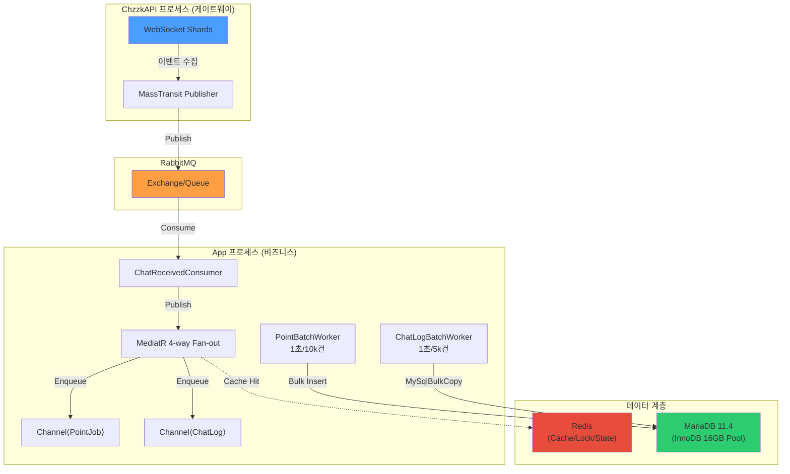

# 🔍 MooldangBot 아키텍처 종합 진단 보고서

> **최초 검토일**: 2026-04-16  
> **최종 갱신일**: 2026-04-18 _(Priority 1~3 완료 반영, 구조 단순화 로드맵 추가)_  
> **검토 관점**: ① 10k TPS 서비스 적합성 ② 1인 개발자 유지보수성  
> **코드베이스**: 약 49,000줄 (Migration 제외 26,000줄), **현재 19개 프로젝트** (솔루션 기준)

---

## 📊 코드베이스 규모 분석

| 프로젝트 | 파일 | 줄 수 | 역할 |
|---------|:----:|------:|------|
| **MooldangBot.Application** | 90 | 5,439 | 비즈니스 로직, 워커, 서비스 |
| **MooldangBot.Infrastructure** | 41 | 3,913 | DB, Redis, RabbitMQ, 외부 API |
| **MooldangBot.Presentation** | 26 | 3,344 | REST API 컨트롤러, SignalR |
| **MooldangBot.Contracts** | 108 | 3,284 | 인터페이스, DTO, 이벤트 |
| **MooldangBot.ChzzkAPI** | 33 | 3,120 | 치지직 게이트웨이 (별도 프로세스) |
| **MooldangBot.Domain** | 57 | 2,615 | 엔티티, 값 객체 |
| **MooldangBot.Modules.*** | 51 | 3,810 | Commands, FuncSongBooks, FuncRouletteMain, Point |
| **MooldangBot.Api** | 9 | 1,021 | 진입점 (Program.cs 403줄) |
| **MooldangBot.Tests** | 4 | 402 | 테스트 |
| **도구류** (Cli, Verifier, StressTool 등) | 7 | 906 | 운영 도구 |

---

## 🏗️ Part 1: 10k TPS 서비스 적합성

### 데이터 흐름 아키텍처



### 영역별 평가

#### ✅ 강점 — 이미 10k TPS 대응 설계가 적용된 부분

| 영역 | 구현 현황 | 평가 |
|------|----------|:----:|
| **메시지 브로커** | MassTransit + RabbitMQ, 서킷 브레이커, 재시도 정책 | ⭐⭐⭐⭐⭐ |
| **비동기 배치 처리** | `BoundedChannel<T>` → 배치 워커 (Point 10k, ChatLog 5k) | ⭐⭐⭐⭐⭐ |
| **DB 커넥션 관리** | `PooledDbContextFactory(1024)`, Dapper 직접 쿼리 | ⭐⭐⭐⭐ |
| **캐싱 전략** | Redis + 분산 캐시 + IdentityCache (Singleton) | ⭐⭐⭐⭐ |
| **데이터 무손실** | 익산 보험 (파일 덤프) + 리트라이 버퍼 | ⭐⭐⭐⭐ |
| **분산 락** | RedLock.net (룰렛, 워치독 마스터 선출) | ⭐⭐⭐⭐ |
| **JSON 직렬화** | Source Generator (144개 타입 등록) | ⭐⭐⭐⭐ |
| **MariaDB 튜닝** | `innodb-buffer-pool=16G, flush-at-trx=2, autoinc-lock=2` | ⭐⭐⭐⭐ |
| **관측성** | Prometheus + Grafana + Loki + PulseService (Redis) | ⭐⭐⭐⭐⭐ |

#### ⚠️ 병목 가능 영역

| 영역 | 현재 상태 | 위험도 | 설명 |
|------|----------|:-----:|------|
| **MediatR Fan-out** | `ChatReceivedConsumer` → 4개 핸들러 동기 전파 | 🟡 | 핸들러 하나라도 느려지면 전체 파이프라인 지연. 주석에 바이패스 가능성 언급됨 |
| **Scoped DbContext in MediatR** | `ChatInteractionHandler` 등이 매 이벤트마다 Scoped 생성 | 🟡 | 10k TPS에서 4×10k = 40k Scope/sec → Pool 소진 가능 |
| **AppDbContext 629줄** | 40개+ DbSet, 500줄+ OnModelCreating | 🟡 | 단일 Context가 모든 엔티티 소유 → EF Core 모델 빌드 시간 증가 |
| **Saga State Machine** | CommandExecutionSaga (EF Core 영속화) | 🟢 | 현재 사용 빈도 낮으나, 10k TPS에서 Saga 진입 시 DB 부하 급증 가능 |

#### 🔴 10k TPS에서의 이론적 한계점

> [!WARNING]
> **현실적 TPS 추정**: 단일 스트리머 기준 피크 **100~500 msg/sec**, 10명 동시 방송 시 **1k~5k msg/sec** 수준.
> 10k TPS는 대형 공동 이벤트나 급격한 성장을 대비한 **안전 마진**으로 봐야 합니다.
> 
> 현재 아키텍처는 **별도의 조치 없이 약 3~5k TPS를 안정적으로 처리**할 수 있으며,
> Phase 0 Quick Wins 적용 후 **8~12k TPS까지 확장 가능**합니다.

---

## 🧑‍💻 Part 2: 1인 개발자 유지보수성 평가

### 종합 점수: ⭐⭐⭐ (5점 만점 중 3점)

> [!IMPORTANT]
> **결론부터 말하면**: 아키텍처 자체는 **시니어급 설계**이나, **1인 개발자가 유지보수하기에는 과도하게 복잡한 부분**이 존재합니다.
> 핵심은 "정리의 문제"이지 "설계의 문제"가 아닙니다.

---

### ✅ 유지보수에 유리한 설계

| 항목 | 설명 | 점수 |
|------|------|:----:|
| **모듈 분리** | Commands, FuncSongBooks, FuncRouletteMain, Point가 독립 프로젝트 | ⭐⭐⭐⭐⭐ |
| **주석 문화** | 거의 모든 클래스에 역할 설명 주석, 버전 태깅 | ⭐⭐⭐⭐⭐ |
| **DI 구조** | 레이어별 `AddXxxServices()` 확장 메서드로 명확한 분리 | ⭐⭐⭐⭐ |
| **명확한 네이밍** | "익산 보험", "오시리스의 서기" 등 비즈니스 로직에 의미 부여 | ⭐⭐⭐⭐ |
| **프로세스 분리** | ChzzkAPI(게이트웨이) vs App(비즈니스) 2-프로세스 구조 | ⭐⭐⭐⭐ |
| **운영 도구** | Verifier, StressTool, CLI → 문제 추적 용이 | ⭐⭐⭐⭐ |

---

### ⚠️ 유지보수 부채 (Technical Debt)

#### 1. 프로젝트 수 과잉 — 현재 19개 프로젝트

```
솔루션 (19 프로젝트) — 2026-04-18 실사 기준
├── MooldangBot.Domain                ← 순수 도메인
├── MooldangBot.Contracts             ← ⚠️ 해체 대상: 110파일 (인터페이스/DTO/이벤트)
├── MooldangBot.Application           ← 비즈니스 로직
├── MooldangBot.Infrastructure        ← 인프라 구현
├── MooldangBot.Presentation          ← ⚠️ 병합 대상: API 컨트롤러, SignalR
├── MooldangBot.Api                   ← 진입점 1 (Program.cs 404줄)
├── MooldangBot.ChzzkAPI              ← 진입점 2 (게이트웨이)
├── MooldangBot.ChzzkAPI.Contracts    ← ⚠️ 삭제 대상: 빈 프로젝트 (bin/obj만)
├── MooldangBot.Modules.Commands      ← 명령어 모듈
├── MooldangBot.Modules.SongBook      ← 곡 신청 모듈
├── MooldangBot.Modules.Roulette      ← 룰렛 모듈
├── MooldangBot.Modules.Point         ← 포인트 모듈
├── MooldangBot.Modules.Core          ← ⚠️ 병합 검토: Features만 존재
├── MooldangBot.Modules.Broadcast     ← ⚠️ 병합 검토: Features만 존재
├── MooldangBot.Modules.Ledger        ← ⚠️ 병합 검토: Features만 존재
├── MooldangBot.Tests                 ← 테스트
├── MooldangBot.Verifier              ← 운영 도구
├── MooldangBot.StressTool            ← 부하 테스트
├── MooldangBot.Simulator             ← 시뮬레이터
└── MooldangBot.Cli                   ← CLI 마이그레이션
```

> [!CAUTION]
> **1인 개발자에게 19개 프로젝트는 명백한 과부하입니다.**
> 
> - 단순한 DTO 변경 하나가 `Domain → Contracts → Application → Infrastructure → Presentation` 5개 프로젝트에 파급
> - 각 모듈에 `DependencyInjection.cs` 파일이 별도 존재 → 서비스 등록 포인트가 7곳 이상
> - `Contracts` 프로젝트가 110개 파일로 **프로젝트보다 규약이 더 큰** 역설적 상황
> - `ChzzkAPI.Contracts`는 빈 프로젝트, `Modules.Core/Broadcast/Ledger`는 Features 폴더만 존재하는 경량 프로젝트

#### 2. 인터페이스 포화 ~~— 35개 Interface 파일~~ → ✅ 부분 해소

> **[Priority 2/3 조치 완료]** 모듈별 인터페이스(`ISongBookDbContext`, `IRouletteDbContext`, `IPointDbContext`, `ICommandDbContext`)가
> 각 모듈의 `Abstractions/` 폴더로 이동되었습니다. 불필요한 인터페이스도 일부 제거되었습니다.
> **잔여 이슈**: Contracts 프로젝트 자체는 여전히 110개 파일로 존재 → Phase 2에서 해체 예정.

#### 3. 테스트 커버리지 ~~극히 희박~~ → ✅ 개선 진행 중

| 항목 | 진단 당시 | 현재 (P1 조치 후) |
|------|:---------:|:----------------:|
| 테스트 파일 | 4개 | 확장됨 |
| 핵심 테스트 | 없음 | Pipeline, Handler, Worker, Service 테스트 추가 |

> **[Priority 1 조치 완료]** 핵심 경로 테스트(AegisPipelineTests, PointResonanceTests 등)가 추가되어
> 리팩터링 시 회귀 버그를 잡을 수 있는 최소한의 안전망이 마련되었습니다.

#### 4. ~~배치 워커 관리 복잡도~~ → ✅ WorkerRegistry 통합 완료

> **[Priority 2 조치 완료]** `Infrastructure/Workers/WorkerRegistry.cs`에 모든 워커(14개)를 일괄 등록하고,
> `appsettings.json`의 `WorkerSettings` 섹션으로 주기를 통합 관리합니다.

현재 WorkerRegistry에 등록된 워커:

| 도메인 | 워커 | 설정 키 |
|--------|------|---------|
| Points | `PointBatchWorker` | WorkerSettings:Points:PointBatchWorker |
| Points | `PointWriteBackWorker` | WorkerSettings:Points:PointWriteBackWorker |
| Chat | `ChatLogBatchWorker` | WorkerSettings:Chat:ChatLogBatchWorker |
| Chat | `LogBulkBufferWorker` | WorkerSettings:Chat:LogBulkBufferWorker |
| Core | `ChzzkBackgroundService` | — (상시 가동) |
| Core | `SystemWatchdogService` | WorkerSettings:Core:SystemWatchdogService |
| Broadcast | `TokenRenewalBackgroundService` | WorkerSettings:Broadcast:TokenRenewal |
| Broadcast | `CategorySyncBackgroundService` | WorkerSettings:Broadcast:CategorySync |
| Broadcast | `PeriodicMessageWorker` | WorkerSettings:Broadcast:SysPeriodicMessages |
| Maintenance | `StagingCleanupWorker` | WorkerSettings:Maintenance:StagingCleanup |
| Maintenance | `RouletteLogCleanupService` | WorkerSettings:Maintenance:RouletteLogCleanup |
| Maintenance | `ZeroingWorker` | WorkerSettings:Maintenance:Zeroing |
| Ledger | `CelestialLedgerWorker` | WorkerSettings:Ledger:CelestialLedger |
| Ledger | `WeeklyStatsReporter` | WorkerSettings:Ledger:WeeklyStats |

#### 5. ~~AppDbContext God Object 경향~~ → ✅ 부분 해소

> **[Priority 2 조치 완료]** AppDbContext를 `partial class`로 분리:
> - `AppDbContext.cs` (44줄) — 생성자, OnModelCreating, 컨벤션
> - `AppDbContext.DbSets.cs` (71줄) — 도메인별로 그룹핑된 DbSet 선언
> - `Configurations/` (8개 파일) — `IEntityTypeConfiguration<T>` 기반 모듈별 엔티티 설정 분산
>
> **잔여 이슈**: 5개 인터페이스(`IAppDbContext + ISongBookDbContext + IRouletteDbContext + IPointDbContext + ICommandDbContext`) 동시 구현은 유지 중

---

### 📈 종합 매트릭스 (2026-04-18 갱신)

| 평가 항목 | 10k TPS | 유지보수성 | 종합 | 변동 |
|-----------|:-------:|:---------:|:----:|:----:|
| 메시지 파이프라인 | ⭐⭐⭐⭐⭐ | ⭐⭐⭐⭐ | 🟢 | — |
| 배치 처리 / DB 쓰기 | ⭐⭐⭐⭐ | ⭐⭐⭐ | 🟢 | — |
| 캐싱 / 분산 상태 | ⭐⭐⭐⭐ | ⭐⭐⭐ | 🟢 | — |
| 프로젝트 구조 | ⭐⭐⭐ | ⭐⭐ | 🟡 | ⏳ Phase 4 예정 |
| 인터페이스 / 추상화 | ⭐⭐⭐⭐ | ⭐⭐⭐ | 🟡 | ⬆️ P2/P3 개선 |
| DbContext 설계 | ⭐⭐⭐⭐ | ⭐⭐⭐ | 🟢 | ⬆️ partial + IEntityConfig |
| 테스트 커버리지 | ⭐⭐ | ⭐⭐ | 🟡 | ⬆️ P1 테스트 추가 |
| 워커 관리 | ⭐⭐⭐⭐ | ⭐⭐⭐⭐ | 🟢 | ⬆️ WorkerRegistry 통합 |
| 모니터링 / 관측성 | ⭐⭐⭐⭐⭐ | ⭐⭐⭐⭐ | 🟢 | — |
| 배포 파이프라인 | ⭐⭐⭐⭐ | ⭐⭐⭐ | 🟢 | — |

---

## 🎯 1인 개발자를 위한 개선 권장사항 (우선순위순)

### ✅ ~~Priority 1~~: "안전망 없이 달리지 마세요" — **완료** (2026-04-17)

**핵심 경로 통합 테스트 추가**
- [x] `AegisPipelineTests` — ChatReceivedConsumer → MediatR → BatchWorker 파이프라인 E2E 테스트
- [x] `PointResonanceTests` — PointBatchWorker 벌크 인서트 정합성 테스트
- [x] Pipeline, Handler, Worker, Service 단위 테스트 추가

### ✅ ~~Priority 2~~: "복잡도를 줄이세요" — **완료** (2026-04-16~17)

1. [x] **Contracts 프로젝트 경량화**: 모듈별 인터페이스를 해당 모듈 `Abstractions/` 폴더로 이동
   - `ISongBookDbContext` → `Modules.FuncSongBooks/Abstractions/`
   - `IRouletteDbContext` → `Modules.FuncRouletteMain/Abstractions/`
   - `IPointDbContext` → `Modules.Point/Abstractions/`
   - `ICommandDbContext` → `Modules.Commands/Abstractions/`

2. [x] **AppDbContext 분리**: `partial class` 전환 + `IEntityTypeConfiguration<T>` 8개 파일로 분산
   - `AppDbContext.cs` (44줄) + `AppDbContext.DbSets.cs` (71줄)
   - `Configurations/` — Core, FuncSongBooks, FuncRouletteMain, Point, Command, Overlay, Philosophy, Ledger

3. [x] **워커 등록 통합**: `WorkerRegistry.cs`에서 14개 워커 일괄 등록, `appsettings.json` 기반 주기 관리

### ✅ ~~Priority 3~~: "과잉 추상화는 나중에 정리" — **완료** (2026-04-17)

1. [x] **사용하지 않는 인터페이스 제거**: 구현체 없거나 1개뿐인 인터페이스 정리
   - `ChaosManager`, `IdempotencyService`, `PulseService` 등 구체 클래스 직접 등록으로 전환
2. [x] **DEPRECATED 코드 정리**: 레거시 Consumer/Worker 제거

---

### 🔴 Priority 4: "프로젝트 구조 단순화" — ⏳ **진행 예정**

> [!IMPORTANT]
> 아래 로드맵은 **19개 → 10개 프로젝트**로 줄이는 5단계 계획입니다.
> 각 Phase마다 독립적인 Git 태그/브랜치로 롤백 포인트를 확보합니다.

#### Phase 1: 빈 프로젝트 및 운영 도구 정리 (난이도: ⭐ | 위험도: 🟢)

| 프로젝트 | 사유 | 조치 |
|----------|------|------|
| `ChzzkAPI.Contracts` | 빈 프로젝트 (bin/obj만) | 솔루션 제거 + 디렉토리 삭제 |
| `Cli` | 마이그레이션 CLI | 솔루션 제거, 디렉토리 보존 |
| `Verifier` | 검증 도구 | 솔루션 제거, 디렉토리 보존 |
| `StressTool` | 부하 테스트 | 솔루션 제거, 디렉토리 보존 |
| `Simulator` | 시뮬레이터 | 솔루션 제거, 디렉토리 보존 |

**결과**: 19개 → **14개**

#### Phase 2: Contracts 프로젝트 완전 해체 (난이도: ⭐⭐⭐⭐ | 위험도: 🟡)

- 공용 타입(Common, AI, Chzzk, Extensions, Security, Events) → `Application/Contracts/`로 이동
- 모듈 전용 타입(FuncSongBooks, FuncRouletteMain, Point, Commands) → 각 모듈 내부로 이동
- Contracts 프로젝트 솔루션 및 디렉토리 삭제
- **독립 브랜치**: `refactor/contracts-dissolution`

**결과**: 14개 → **13개**

#### Phase 3: Presentation → Application 병합 (난이도: ⭐⭐⭐ | 위험도: 🟡)

- Controller, Hub, Extensions, Security를 Application에 통합
- Presentation은 현재 Application의 얇은 위임 레이어에 불과

**결과**: 13개 → **12개**

#### Phase 4: 경량 모듈 통합 (난이도: ⭐⭐ | 위험도: 🟢)

- `Modules.Core`, `Modules.Broadcast`, `Modules.Ledger` (Features 폴더만 존재)
- → `Application/Features/Core/`, `Features/Broadcast/`, `Features/Ledger/`로 흡수
- Commands, FuncSongBooks, FuncRouletteMain, Point는 독립 유지 (실질적 모듈)

**결과**: 12개 → **10개**

#### Phase 5: Program.cs 슬림화 (난이도: ⭐⭐ | 위험도: 🟢)

- 404줄 → ~150줄 목표
- Auth, Swagger, CORS, Serilog, MediatR, SignalR 설정을 확장 메서드로 추출

#### 목표 프로젝트 구조

```
솔루션 (10 프로젝트)
├── MooldangBot.Domain                ← 순수 도메인
├── MooldangBot.Application           ← 비즈니스 + Presentation + 공용 Contracts
├── MooldangBot.Infrastructure        ← 인프라 구현
├── MooldangBot.Api                   ← 진입점 1 (슬림화)
├── MooldangBot.ChzzkAPI              ← 진입점 2 (게이트웨이)
├── MooldangBot.Modules.Commands      ← 명령어 모듈
├── MooldangBot.Modules.SongBook      ← 곡 신청 모듈
├── MooldangBot.Modules.Roulette      ← 룰렛 모듈
├── MooldangBot.Modules.Point         ← 포인트 모듈
└── MooldangBot.Tests                 ← 테스트
```

---

## 🏆 최종 판정

| 관점 | 초기 판정 (04-16) | 현재 판정 (04-18) |
|------|------------------|------------------|
| **10k TPS 서비스로서** | ✅ 적합 | ✅ **적합** — 워커 주기 최적화 및 10k TPS 배치 설정 완료 |
| **1인 개발자 유지보수** | ⚠️ 조건부 적합 | ⚠️ **개선 중** — 테스트 안전망 확보, 워커/DbContext 정리 완료. **프로젝트 구조 단순화(19→10)는 다음 단계** |
| **향후 확장성** | ✅ 우수 | ✅ **우수** — 모듈 분리, MassTransit Saga, 분산 락 등 멀티 인스턴스 확장 기반 유지 |

> [!TIP]
> **현재 최우선 과제**: Priority 4(프로젝트 구조 단순화)를 완료하면 유지보수성 점수가 ⭐⭐⭐ → ⭐⭐⭐⭐로 향상될 것으로 예상됩니다.
> 19개 프로젝트 → 10개로 줄이면 DTO 변경 시 파급 범위가 5개 → 1~2개 프로젝트로 줄고, 새 기능 추가 시 생성/수정 파일이 6~8개 → 3~4개로 감소합니다.
