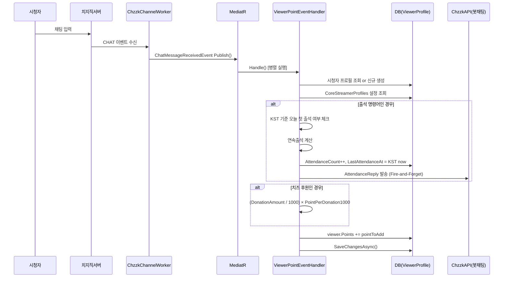

# 🪙 채팅포인트 시스템 상세 분석 보고서

> 작성일: 2026-03-24  
> 분석자: 물멍 (Senior Full-Stack AI Partner)

---

## 1. 시스템 개요

채팅포인트는 **시청자가 방송에 참여하는 행동에 따라 자동으로 적립**되고, 룰렛 등 특정 기능을 사용할 때 **소비**되는 가상 화폐 시스템입니다.

**포인트 생명주기:**

```
적립 (시청자 행동)          저장 (DB)              소비 (기능 사용)
────────────────         ──────────────         ────────────────
채팅 1회          ──▶    ViewerProfile    ──▶   포인트 룰렛
출석 명령어        ──▶    .Points (int)    ──▶   (향후 확장 가능)
치즈 후원         ──▶
```

---

## 2. 관련 파일 목록

| 파일 | 역할 |
|------|------|
| `Features/Viewers/Handlers/ViewerPointEventHandler.cs` | **핵심** — 포인트 적립 & 출석 처리 로직 |
| `Controllers/ChatPointController.cs` | REST API — 설정 저장/조회, 시청자 랭킹 반환 |
| `Models/ViewerProfile.cs` | DB 엔터티 — 시청자 포인트/출석 데이터 |
| `Models/CoreStreamerProfiles.cs` | DB 엔터티 — 스트리머별 포인트 설정값 |
| `Features/FuncRouletteMain/Handlers/RouletteEventHandler.cs` | 포인트 **소비** — ChatPoint 룰렛 |
| `Features/Commands/Handlers/CustomCommandEventHandler.cs` | 포인트 **조회** 명령어 처리 |
| `wwwroot/ChatPoint.html` | 프론트엔드 — 설정 UI + 시청자 랭킹 테이블 |

---

## 3. 데이터 모델

### 3-1. `ViewerProfile` (시청자 데이터)

```csharp
[Index(nameof(StreamerChzzkUid), nameof(ViewerUid), IsUnique = true)]
public class ViewerProfile
{
    public int     Id { get; set; }
    public string  StreamerChzzkUid { get; set; }         // 스트리머 식별자 (FK)
    public string  ViewerUid { get; set; }                // 시청자 치지직 고유 ID
    public string  Nickname { get; set; }                 // 닉네임 (채팅마다 최신화)
    public int     Points { get; set; } = 0;              // 현재 보유 포인트
    public int     AttendanceCount { get; set; } = 0;     // 누적 출석 횟수
    public int     ConsecutiveAttendanceCount { get; set; } = 0;  // 연속 출석 일수
    public DateTime? LastAttendanceAt { get; set; }       // 마지막 출석 일시 (KST)
}
```

> **⚠️ 중요:** `(StreamerChzzkUid, ViewerUid)`에 **유니크 복합 인덱스** 존재  
> → 동일 시청자가 여러 스트리머 채널에 각각 독립적 포인트/출석 이력 보유 가능

### 3-2. `CoreStreamerProfiles` — 포인트 관련 설정 필드

```csharp
public int    PointPerChat { get; set; } = 1;             // 채팅 1회당 포인트 (기본 1)
public int    PointPerDonation1000 { get; set; } = 10;    // 1,000원 후원당 포인트 (기본 10)
public int    PointPerAttendance { get; set; } = 10;      // 출석 성공시 보너스 (기본 10)

public string AttendanceCommands { get; set; } = "출석,물하,댕하";
// 출석으로 인정할 채팅 키워드 목록 (쉼표 구분)

public string AttendanceReply { get; set; } = "{닉네임}님 출석 고마워요!";
// 출석 성공시 봇이 치는 채팅 메시지 포맷

public string PointCheckCommand { get; set; } = "!내정보,!포인트";
// 시청자가 본인 포인트를 조회하는 명령어 (쉼표 구분)

public string PointCheckReply { get; set; } = "🪙 {닉네임}님의 보유 포인트는 {포인트}점입니다! (누적 출석: {출석일수}일)";
// 포인트 조회 응답 포맷
```

---

## 4. 포인트 적립 시스템

### 4-1. 전체 흐름도



---

### 4-2. 포인트 계산 공식

채팅 1건당 `pointToAdd`는 다음과 같이 계산됩니다:

```
pointToAdd = PointPerChat                              ← 기본 채팅 포인트 (항상 적용)

[출석 명령어에 해당할 경우]
if (오늘 첫 출석) {
    pointToAdd += PointPerAttendance                   ← 출석 보너스 추가
}

[치즈 후원이 있을 경우]
donationPoints = (DonationAmount / 1000) × PointPerDonation1000
pointToAdd += donationPoints                           ← 후원 포인트 추가

viewer.Points += pointToAdd                            ← 최종 합산하여 DB 저장
```

**예시:**
| 상황 | 계산식 | 적립 포인트 |
|------|--------|------------|
| 일반 채팅 | `1` | **1점** |
| 5,000원 후원 + 채팅 | `1 + (5000/1000 × 10)` | **51점** |
| `출석` 채팅 (오늘 첫번째) | `1 + 10` | **11점** |
| `출석` 채팅 (오늘 두번째) | `1` | **1점** (출석 보너스 없음) |
| 3,000원 후원 + 출석 | `1 + 10 + (3000/1000 × 10)` | **41점** |

---

### 4-3. `ViewerPointEventHandler` 코드 상세 분석

```csharp
public async Task Handle(ChatMessageReceivedEvent notification, CancellationToken cancellationToken)
{
    // ① 시청자 프로필 조회 or 최초 자동 생성
    var viewer = await db.ViewerProfiles
        .FirstOrDefaultAsync(v => v.StreamerChzzkUid == streamerUid && v.ViewerUid == viewerUid);

    if (viewer == null)
    {
        // 최초 채팅 시 자동 등록 (포인트 0, 출석 0)
        viewer = new ViewerProfile { ... };
        db.ViewerProfiles.Add(viewer);
    }
    else
    {
        // 닉네임 변경 시 자동 최신화
        if (viewer.Nickname != nickname) viewer.Nickname = nickname;
    }

    // ② 기본 채팅 포인트 설정
    int pointToAdd = streamer.PointPerChat;  // 기본값 1

    // ③ 출석 명령어 매칭 (대소문자 무시, 완전 일치)
    if (attCmds.Contains(msgLower))
    {
        var koreaTime = TimeZoneInfo.ConvertTimeBySystemTimeZoneId(DateTime.UtcNow, "Korea Standard Time");

        // 오늘 KST 날짜 기준으로 첫 출석인지 확인
        if (!viewer.LastAttendanceAt.HasValue || viewer.LastAttendanceAt.Value.Date < koreaTime.Date)
        {
            // 연속 출석 판정: 어제 날짜와 비교
            if (prevLastAtt.HasValue && prevLastAtt.Value.Date == koreaTime.Date.AddDays(-1))
                viewer.ConsecutiveAttendanceCount++;   // 연속 출석
            else
                viewer.ConsecutiveAttendanceCount = 1; // 연속 끊김, 리셋

            viewer.AttendanceCount++;
            viewer.LastAttendanceAt = koreaTime;       // KST로 저장!
            pointToAdd += streamer.PointPerAttendance; // 출석 보너스 합산

            // 출석 응답 메시지 Fire-and-Forget 발송
            _ = SendChatReplyAsync(accessToken, clientId, clientSecret, replyMsg);
        }
    }

    // ④ 치즈 후원 포인트 합산
    if (notification.DonationAmount > 0)
        pointToAdd += (notification.DonationAmount / 1000) * streamer.PointPerDonation1000;

    // ⑤ 최종 DB 저장
    viewer.Points += pointToAdd;
    await db.SaveChangesAsync(cancellationToken);
}
```

---

## 5. 출석 시스템 상세

### 5-1. 출석 인정 조건

| 조건 | 설명 |
|------|------|
| 완전 일치 | 채팅 메시지 전체가 출석 키워드와 **정확히 일치**해야 함 (`.Contains(msgLower)`) |
| 하루 1회 | KST 기준 날짜가 달라야만 재인정 (같은 날 두 번 치면 일반 채팅 처리) |
| 대소문자 무시 | `.ToLower()` 비교로 대소문자 구분 없음 |

### 5-2. 연속 출석 계산 로직

```
오늘 KST 날짜: 2026-03-24
마지막 출석일: 2026-03-23  →  어제! → ConsecutiveAttendanceCount++  ✅ 연속 유지
마지막 출석일: 2026-03-22  →  이틀 전! → ConsecutiveAttendanceCount = 1  ❌ 연속 리셋
마지막 출석일: null        →  첫 출석! → ConsecutiveAttendanceCount = 1
```

### 5-3. 출석 응답 메시지 변수

| 변수 | 치환 내용 | 예시 결과 |
|------|-----------|-----------|
| `{닉네임}` | 시청자 닉네임 | 물댕팬 |
| `{연속출석일수}` | 현재 연속 출석일 | 5 |
| `{누적출석일수}` | 총 출석 횟수 | 42 |
| `{마지막출석일}` | 이전 출석일 (`yyyy.MM.dd`) | 2026.03.23 |

**설정 예시:**
```
{닉네임}님 {연속출석일수}일 연속 출석! 총 {누적출석일수}회째입니다 🎉
→ "물댕팬님 5일 연속 출석! 총 42회째입니다 🎉"
```

> ⚠️ **주의:** `{마지막출석일}`은 *이전* 출석일을 보여줍니다 (현재 출석 처리 전의 값).

---

## 6. 포인트 조회 명령어

### 6-1. 처리 위치

`CustomCommandEventHandler.cs` 에서 커스텀 명령어보다 **우선 처리**됩니다.

```csharp
// PointCheckCommand 우선 처리 (커스텀 명령어보다 먼저!)
var pointCmds = streamerProfile.PointCheckCommand
    .Split(',', StringSplitOptions.RemoveEmptyEntries)
    .Select(c => c.Trim().ToLower());

// 완전 일치 OR 첫 단어 일치 모두 허용
if (pointCmds.Contains(fullMessage.ToLower()) || pointCmds.Contains(firstWord.ToLower()))
{
    // ViewerProfile에서 조회 후 응답
    string replyText = streamerProfile.PointCheckReply;
    // 변수 치환 후 봇 채팅 발송
}
```

### 6-2. 포인트 조회 응답 변수

| 변수 | 치환 내용 | 데이터 소스 |
|------|-----------|------------|
| `{닉네임}` | 시청자 닉네임 | 이벤트 페이로드 |
| `{포인트}` | 현재 보유 포인트 | `ViewerProfile.Points` |
| `{출석일수}` | 누적 출석 횟수 | `ViewerProfile.AttendanceCount` |
| `{연속출석일수}` | 연속 출석 일수 | `ViewerProfile.ConsecutiveAttendanceCount` |
| `{팔로우일수}` | 팔로우 경과 일수 | **치지직 API 실시간 호출** (`ChzzkApiClient.GetViewerFollowDateAsync`) |

> ⚠️ **`{팔로우일수}` 주의사항:**  
> 해당 변수가 포함된 경우 치지직 OpenAPI를 **매 조회마다 실시간 호출**합니다. API 속도 제한에 주의하세요.

### 6-3. 매칭 방식 비교

| 방식 | 예시 | 결과 |
|------|------|------|
| 완전 일치 | 채팅: `!포인트` / 설정: `!포인트` | ✅ 매칭 |
| 첫 단어 일치 | 채팅: `!포인트 알려줘` / 설정: `!포인트` | ✅ 매칭 |
| 불일치 | 채팅: `지금포인트` / 설정: `!포인트` | ❌ 미매칭 |

---

## 7. 포인트 소비 시스템

### 7-1. 포인트 룰렛 (현재 구현된 유일한 소비 경로)

`RouletteEventHandler.cs` — `RouletteType.ChatPoint` 처리:

```csharp
// 포인트 룰렛은 일반 채팅 명령어로만 트리거
string firstWord = msg.Split(' ')[0];
if (firstWord == roulette.Command)
{
    var viewer = await db.ViewerProfiles.FirstOrDefaultAsync(...);

    // 포인트 부족: 조용히 무시 (시청자에게 별도 안내 없음)
    if (viewer == null || viewer.Points < roulette.CostPerSpin)
    {
        _logger.LogWarning("포인트 부족");
        continue;
    }

    // 포인트 차감 후 룰렛 실행
    viewer.Points -= roulette.CostPerSpin;
    await db.SaveChangesAsync();
    await rouletteService.SpinRouletteAsync(chzzkUid, roulette.Id, ...);
}
```

**소비 흐름:**
```
시청자 채팅: "!룰렛"
    ↓
RouletteEventHandler
    ↓ ViewerProfile.Points 확인
    ↓ Points >= CostPerSpin 이면 Points -= CostPerSpin → SaveChanges()
    ↓ SpinRouletteAsync() → SignalR RouletteTriggered → 오버레이 애니메이션
    ↓ 봇 채팅으로 결과 발표
```

> ⚠️ **현재 한계:** 포인트가 부족해도 **시청자에게 알림 없음** (로그만 남김)

### 7-2. 소비 경로 현황

| 경로 | 구현 상태 | 비고 |
|------|-----------|------|
| 포인트 룰렛 (`ChatPoint` 타입) | ✅ 완성 | `CostPerSpin` 만큼 차감 |
| 포인트 기반 곡 신청 | ❌ 미구현 | `SongRequest`는 치즈 후원(DonationAmount)만 지원 |
| 포인트 교환 아이템 | ❌ 미구현 | 향후 확장 여지 있음 |

---

## 8. REST API

### `ChatPointController` — `/api/chatpoint`

#### `GET /api/chatpoint/{chzzkUid}` — 설정 조회

**응답 예시:**
```json
{
  "pointPerChat": 1,
  "pointPerDonation1000": 10,
  "pointPerAttendance": 10,
  "attendanceCommands": "출석,물하,댕하",
  "attendanceReply": "{닉네임}님 출석 고마워요!",
  "pointCheckCommand": "!내정보,!포인트",
  "pointCheckReply": "🪙 {닉네임}님의 보유 포인트는 {포인트}점입니다!"
}
```

> ⚠️ **보안 허점:** `chzzkUid`를 URL로 받으며 **인증 검사가 없습니다.**  
> Global Query Filter도 `IgnoreQueryFilters()` 없이 직접 `chzzkUid`로 조회하므로 다른 스트리머 설정도 조회 가능합니다.

#### `POST /api/chatpoint/{chzzkUid}` — 설정 저장

**요청 바디 (`ChatPointSettingsDto`):**
```json
{
  "pointPerChat": 2,
  "pointPerDonation1000": 15,
  "pointPerAttendance": 20,
  "attendanceCommands": "출석,물하,댕하,안녕",
  "attendanceReply": "{닉네임}님 {연속출석일수}일 연속 출석!",
  "pointCheckCommand": "!포인트,!내점수",
  "pointCheckReply": "🪙 {닉네임}님 현재 {포인트}점! 출석 {출석일수}회"
}
```

#### `GET /api/chatpoint/{chzzkUid}/viewers` — 시청자 랭킹 조회

```json
[
  { "nickname": "물댕팬1", "points": 5420, "attendanceCount": 42, "lastAttendanceAt": "2026-03-24T..." },
  { "nickname": "물댕팬2", "points": 3100, "attendanceCount": 31, "lastAttendanceAt": "2026-03-24T..." }
]
```
- **정렬:** `Points` 내림차순 (포인트 높은 순)
- **포함 필드:** 닉네임, 포인트, 출석 횟수, 마지막 출석일

---

## 9. 프론트엔드 (`ChatPoint.html`)

### 화면 구성

```
[← 대시보드로 돌아가기]

[ 시청자 포인트 관리 ]

┌─ 설정 패널 ─────────────────────────────┐
│ 채팅 1회당 포인트          [  1  ]      │
│ 후원 1,000개당 포인트      [ 10  ]      │
│ 출석 리액션 단어           [출석,물하,댕하]│
│ 출석 성공 특별 포인트      [ 10  ]      │
│ 출석 봇 응답 메시지        [......]     │
│ ─────────────────────────────────────── │
│ 내 포인트 확인 명령어      [!내정보,...] │
│ 포인트 확인 봇 응답        [......]     │
│                                         │
│         [ 설정 저장하기 ]               │
└─────────────────────────────────────────┘

┌─ 시청자 포인트 랭킹 ────────────────────┐
│ 순위 │ 닉네임   │ 누적 포인트 │ 출석 │ 최근출석│
│ 🥇1위│ 물댕팬1  │   5,420 점  │  42회│ 2026-03-24│
│ 🥈2위│ 물댕팬2  │   3,100 점  │  31회│ ...  │
└─────────────────────────────────────────┘
```

### JS 동작

1. **페이지 로드:** URL `?uid=` 파라미터에서 스트리머 UID 추출
2. **설정 불러오기:** `GET /api/chatpoint/{uid}` 호출 후 폼 자동 채움
3. **저장:** `POST /api/chatpoint/{uid}` 호출
4. **랭킹 로드:** `GET /api/chatpoint/{uid}/viewers` 호출 후 테이블 렌더링
   - 1~3위는 🥇🥈🥉 메달 표시

---

## 10. 동시성 & 주의사항

### 10-1. 포인트 적립 동시성

`ViewerPointEventHandler`는 MediatR의 `Publish()`로 **다른 5개 핸들러와 병렬 실행**됩니다.  
각 핸들러는 독립적인 `IServiceScope`(= 독립적인 `DbContext`)를 사용하므로 **같은 ViewerProfile에 대한 동시 업데이트 충돌 가능성**이 있습니다.

| 상황 | 위험 | 현재 대응 |
|------|------|-----------|
| 동일 시청자가 동시에 여러 채팅 | ViewerProfile Row 동시 UPDATE 경합 | ❌ 없음 (낙관적 동시성 미적용) |
| 출석+룰렛 동시 처리 | Points 동시 차감/적립 | ❌ 없음 |

> ⚠️ **개선 권고:** `ViewerProfile`에 `[Timestamp]` 또는 `[ConcurrencyCheck]` 속성 추가 권고

### 10-2. 시간대 처리

- 출석 시간 비교: **KST (Korea Standard Time) 기준**
- `LastAttendanceAt` DB 저장값: KST
- 프론트엔드 날짜 표시: `new Date(v.lastAttendanceAt)` — UTC로 받아 로컬 렌더링

```csharp
// 서버 코드
var koreaTime = TimeZoneInfo.ConvertTimeBySystemTimeZoneId(DateTime.UtcNow, "Korea Standard Time");
viewer.LastAttendanceAt = koreaTime; // KST로 DB에 저장
```

---

## 11. 설정별 기본값 요약

| 설정 키 | DB 컬럼 | 기본값 | 비고 |
|---------|---------|--------|------|
| 채팅 포인트 | `PointPerChat` | `1` | 채팅 1건 = 1점 |
| 후원 포인트 | `PointPerDonation1000` | `10` | 1000원당 10점 |
| 출석 보너스 | `PointPerAttendance` | `10` | 하루 1회 |
| 출석 키워드 | `AttendanceCommands` | `"출석,물하,댕하"` | 쉼표 구분 |
| 출석 응답 | `AttendanceReply` | `"{닉네임}님 출석 고마워요!"` | 비워두면 봇 침묵 |
| 조회 명령어 | `PointCheckCommand` | `"!내정보,!포인트"` | 쉼표 구분 |
| 조회 응답 | `PointCheckReply` | `"🪙 {닉네임}님의 보유 포인트는 {포인트}점입니다! (누적 출석: {출석일수}일)"` | |

---

## 12. 현재 한계 & 개선 제안

| # | 항목 | 현황 | 제안 |
|---|------|------|------|
| 1 | **인증 없는 API** | `ChatPointController` 전 엔드포인트 무인증 | `[Authorize]` + `IUserSession` 통한 본인 데이터 격리 |
| 2 | **포인트 부족 안내 없음** | 룰렛 포인트 부족 시 조용히 실패 | 시청자에게 "포인트 부족" 봇 메시지 발송 |
| 3 | **ViewerProfile 동시성 미보호** | 동시 채팅 시 포인트 경합 가능 | `[ConcurrencyCheck]`/`[Timestamp]` 적용 + 재시도 |
| 4 | **포인트 소비 경로 단일** | 룰렛만 소비 가능 | 곡신청 포인트 게이트, 아이템 교환 등 확장 |
| 5 | **`{팔로우일수}` API 부하** | 매 조회마다 외부 API 호출 | 팔로우 날짜 캐싱 or ViewerProfile 컬럼 추가 |
| 6 | **닉네임만 저장** | 포인트 랭킹에 닉네임만 표시 | 프로필 이미지 URL 등 추가 가능 |

---

*이 보고서는 MooldangBot 채팅포인트 시스템의 전체 소스코드를 심층 분석하여 작성되었습니다.*  
*분석 기준: 2026-03-24, 물멍(AI) 작성*
