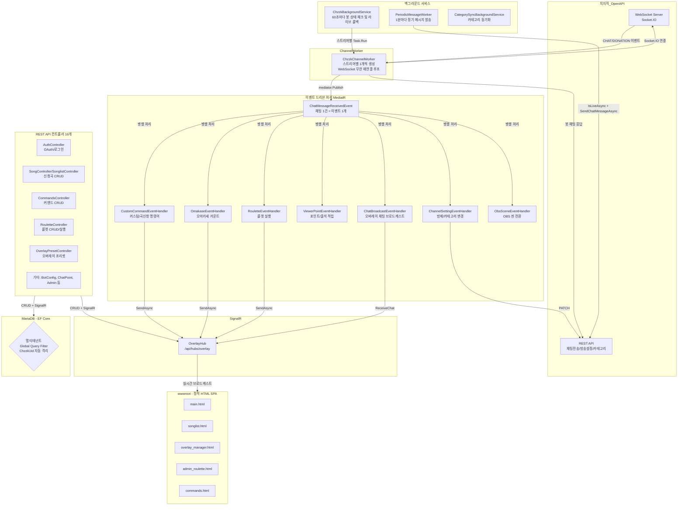
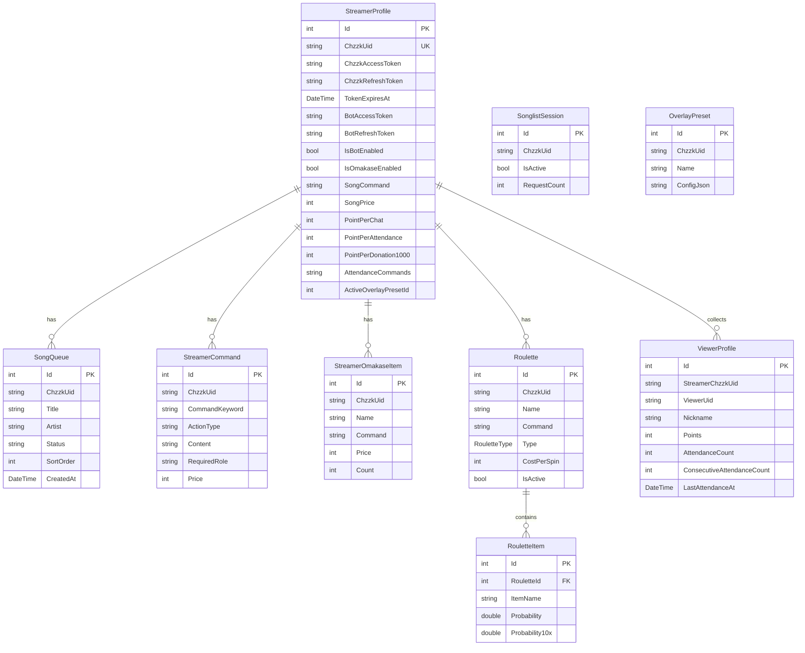

# MooldangBot (MooldangAPI) 시스템 상세 분석 보고서 v2

> 작성일: 2026-03-24  
> 분석자: 물멍 (Senior Full-Stack AI Partner)  
> 기반 문서: `md/Research.md` + 실제 소스코드 추가 심층 분석

---

## 1. 프로젝트 개요

**MooldangBot**은 치지직(CHZZK) 스트리밍 플랫폼과 연동되는 **멀티테넌트 스트리밍 봇 & 대시보드 API 서버**입니다.  
C# .NET 10, EF Core (MariaDB), MediatR, SignalR을 핵심 기술 스택으로 사용하며, **이벤트 드리븐 아키텍처(EDA)** 위에서 동작합니다.

### 핵심 기능 요약

| 기능 | 설명 |
|------|------|
| 치지직 WebSocket 봇 | 실시간 채팅 수신 및 명령어 처리 |
| 오마카세 | 치즈 후원 기반 메뉴 카운터 |
| 곡 신청 (SongQueue) | 채팅 명령어/후원 기반 신청곡 큐 관리 |
| 룰렛 | 치즈 후원 또는 포인트 사용 룰렛 |
| 시청자 포인트 & 출석 | 채팅 적립, 연속 출석 추적 |
| 커스텀 명령어 | DB 기반 동적 명령어 등록 및 응답 |
| 방제/카테고리 변경 | 채팅 명령어로 방송 설정 변경 |
| 오버레이 허브 | SignalR 기반 실시간 OBS 브라우저 소스 제어 |
| 정기 메시지 | 방송 중 일정 주기 채팅 자동 발송 |
| Chzzk OAuth 인증 | 스트리머 로그인 및 토큰 자동 갱신 |

---

## 2. 📁 주요 폴더 구조 (Directory Tree)

```
MooldangBot/
│
├── Program.cs                          ← 앱 진입점 & 전체 DI 구성
├── MooldangAPI.csproj                  ← NuGet 패키지 의존성 정의
├── appsettings.json                    ← 기본 설정 (ChzzkApi 키, DB 연결 등)
├── appsettings.Production.json         ← 운영 환경 설정 오버라이드
├── .env / .env.example                 ← 로컬/Docker 환경변수 (DotNetEnv로 로드)
├── Dockerfile                          ← 멀티스테이지 Docker 이미지 빌드
├── docker-compose.yml                  ← app + db(MySQL8) + migration 서비스 구성
│
├── ApiClients/                         ← 외부 API 클라이언트
│   ├── ChzzkApiClient.cs               ← 치지직 OpenAPI (라이브 상태 확인, 채팅 전송, 팔로우 조회)
│   └── SecretGuardian.cs               ← 민감 정보 보호 유틸리티
│
├── Controllers/                        ← REST API 엔드포인트 (16개)
│   ├── AuthController.cs               ← OAuth 로그인/로그아웃, 봇 계정 연동
│   ├── SongController.cs               ← 신청곡 큐 CRUD
│   ├── SonglistController.cs           ← 세션(SonglistSession) 관리
│   ├── SonglistSettingsController.cs   ← 신청곡 설정 (명령어, 가격)
│   ├── CommandsController.cs           ← 커스텀 명령어 + 오마카세 CRUD
│   ├── RouletteController.cs           ← 룰렛 CRUD / 수동 스핀
│   ├── OverlayPresetController.cs      ← 오버레이 프리셋 CRUD/활성화
│   ├── MasterOverlayController.cs      ← 마스터 오버레이 설정
│   ├── SharedComponentController.cs    ← 공유 컴포넌트
│   ├── ChatPointController.cs          ← 시청자 포인트 설정/조회/랭킹
│   ├── BotConfigController.cs          ← 봇 활성화 토글
│   ├── AdminBotController.cs           ← 봇 관리자 제어
│   ├── AvatarSettingsController.cs     ← 아바타 설정
│   ├── PeriodicMessageController.cs    ← 정기 메시지 CRUD
│   ├── ViewController.cs               ← HTML 페이지 라우팅
│   └── DebugController.cs              ← 개발용 디버그 엔드포인트
│
├── Data/                               ← 데이터 접근 레이어
│   ├── AppDbContext.cs                 ← EF Core DbContext (Global Query Filter, 테이블 매핑)
│   ├── IUserSession.cs                 ← 현재 로그인 스트리머 세션 인터페이스
│   └── UserSession.cs                 ← IUserSession 쿠키 기반 구현체
│
├── Models/                             ← DB 엔터티 & DTO 정의 (19개 파일)
│   ├── StreamerProfile.cs             ← 스트리머 마스터 테이블 (핵심)
│   ├── ViewerProfile.cs               ← 시청자 포인트/출석 데이터
│   ├── SongQueue.cs                   ← 신청곡 큐 엔터티
│   ├── SonglistSession.cs             ← 신청곡 세션 엔터티
│   ├── StreamerCommand.cs             ← 커스텀 명령어 엔터티
│   ├── StreamerOmakaseItem.cs         ← 오마카세 메뉴 아이템
│   ├── Roulette.cs                    ← 룰렛 엔터티
│   ├── RouletteItem.cs                ← 룰렛 아이템 (확률 설정)
│   ├── RouletteType.cs                ← Enum (Cheese / ChatPoint)
│   ├── OverlayPreset.cs               ← 오버레이 프리셋 (JSON 설정 저장)
│   ├── SharedComponent.cs             ← 공유 컴포넌트
│   ├── PeriodicMessage.cs             ← 정기 메시지 설정
│   ├── AvatarSetting.cs               ← 아바타 설정
│   ├── ChzzkCategory.cs               ← 치지직 카테고리 (동기화)
│   ├── ChzzkCategoryAlias.cs          ← 카테고리 별칭 매핑
│   ├── ChzzkResponses.cs              ← 치지직 API 응답 DTO
│   ├── SystemSetting.cs               ← 시스템 전역 Key-Value 설정 (봇 토큰 등)
│   ├── SongRequest.cs                 ← 신청곡 요청 DTO
│   └── DTOs.cs                        ← 기타 DTO 모음
│
├── Features/                          ← EDA 이벤트 처리 (도메인별 분리)
│   │
│   ├── Chat/
│   │   ├── Events/
│   │   │   └── ChatMessageReceivedEvent.cs   ← 채팅 1건 = MediatR INotification 이벤트
│   │   └── Handlers/
│   │       └── ChatBroadcastEventHandler.cs  ← SignalR로 채팅 오버레이 브로드캐스트
│   │
│   ├── Commands/
│   │   └── Handlers/
│   │       └── CustomCommandEventHandler.cs  ← 커스텀 명령어/곡신청/포인트조회 처리 (핵심)
│   │
│   ├── SongQueue/
│   │   ├── Commands/
│   │   │   └── AddSongRequestCommand.cs      ← 신청곡 추가 커맨드 (MediatR IRequest)
│   │   ├── Handlers/
│   │   │   └── OmakaseEventHandler.cs        ← 오마카세 카운트 증가 처리
│   │   └── SongQueueState.cs                 ← 인메모리 신청곡 큐 상태 (Singleton)
│   │
│   ├── Roulette/
│   │   ├── Handlers/
│   │   │   └── RouletteEventHandler.cs       ← 치즈/포인트 룰렛 트리거 처리
│   │   └── RouletteState.cs                  ← 룰렛 인메모리 상태 (Singleton)
│   │
│   ├── Viewers/
│   │   └── Handlers/
│   │       └── ViewerPointEventHandler.cs    ← 포인트 적립 & 출석 처리
│   │
│   ├── Admin/
│   │   └── Handlers/
│   │       └── ChannelSettingEventHandler.cs ← !방제 / !카테고리 명령어 처리
│   │
│   └── Obs/
│       └── Handlers/
│           └── ObsSceneEventHandler.cs       ← OBS 씬 전환 (미구현)
│
├── Services/                          ← 비즈니스 로직 서비스 & 백그라운드 워커
│   ├── ChzzkBackgroundService.cs      ← 봇 매니저 (HostedService, 60초 주기)
│   ├── ChzzkChannelWorker.cs          ← 스트리머별 WebSocket 연결 & 이벤트 처리 (핵심)
│   ├── PeriodicMessageWorker.cs       ← 정기 메시지 자동 발송 (HostedService, 1분 주기)
│   ├── ChzzkCategorySyncService.cs    ← 치지직 카테고리 DB 동기화
│   ├── CategorySyncBackgroundService.cs ← 카테고리 동기화 HostedService 래퍼
│   ├── RouletteService.cs             ← 가중치 기반 룰렛 추첨 서비스 (Scoped)
│   ├── ObsWebSocketService.cs         ← OBS WebSocket 연결 (Singleton)
│   ├── MariaDbService.cs              ← 직접 DB 접근 유틸 (Dapper 사용)
│   ├── ICommandCacheService.cs        ← 명령어 캐시 인터페이스
│   └── CommandCacheService.cs        ← 인메모리 명령어 캐시 구현체 (Singleton)
│
├── Hubs/
│   └── OverlayHub.cs                  ← SignalR Hub (/api/hubs/overlay 엔드포인트)
│
├── Strategies/
│   └── IOverlayRenderStrategy.cs      ← 오버레이 렌더링 전략 인터페이스 + 기본 구현
│
└── wwwroot/                           ← 정적 프론트엔드 (HTML + Vanilla JS)
    ├── main.html                      ← 대시보드 메인
    ├── songlist.html                  ← 신청곡 관리
    ├── songlist_settings.html         ← 신청곡 설정
    ├── songlist_overlay.html          ← OBS 송리스트 오버레이
    ├── overlay_manager.html           ← 오버레이 매니저 (101KB, 최대 규모)
    ├── overlay.html                   ← OBS 채팅 오버레이
    ├── roulette_overlay.html          ← OBS 룰렛 오버레이
    ├── admin_roulette.html            ← 룰렛 관리
    ├── commands.html                  ← 커맨드 관리
    ├── admin.html                     ← 시스템 관리
    ├── admin_bot.html                 ← 봇 제어
    ├── admin_category.html            ← 카테고리 별칭 관리
    ├── avatar_settings.html           ← 아바타 설정
    ├── avatar_overlay.html            ← 아바타 오버레이
    ├── ChatPoint.html                 ← 시청자 포인트 관리
    ├── css/                           ← 공통 스타일시트
    ├── js/                            ← 공통 JavaScript
    └── images/                        ← 이미지 에셋 (avatars 포함)
```

---

## 3. 전체 아키텍처



---

## 4. 핵심 인터페이스 & 클래스 목록

프로젝트의 주요 '입구'가 되는 인터페이스와 핵심 클래스를 정리합니다.

### 4-1. 핵심 인터페이스

| 인터페이스 | 위치 | 역할 |
|-----------|------|------|
| `INotification` | MediatR (외부 라이브러리) | 이벤트 마커 인터페이스 — `ChatMessageReceivedEvent`가 구현 |
| `INotificationHandler<TNotification>` | MediatR (외부 라이브러리) | 이벤트 핸들러 마커 — 6개 Handler가 구현 |
| `IUserSession` | `Data/IUserSession.cs` | 현재 로그인한 스트리머 세션 추상화 (멀티테넌트 격리 핵심) |
| `ICommandCacheService` | `Services/ICommandCacheService.cs` | 인메모리 명령어 캐시 추상화 |
| `IOverlayRenderStrategy` | `Strategies/IOverlayRenderStrategy.cs` | 채팅 HTML 렌더링 전략 패턴 인터페이스 |

#### `IUserSession` 상세

```csharp
// Data/IUserSession.cs
public interface IUserSession
{
    string? ChzzkUid { get; }       // 현재 로그인한 스트리머의 고유 ID
    bool IsAuthenticated { get; }   // 인증 여부 (BackgroundService는 false → 전체 데이터 접근)
}
```

> **활용 방식:** `AppDbContext`의 Global Query Filter에서 참조되어 **모든 DB 쿼리에 자동으로 테넌트 필터를 적용**합니다.

#### `ICommandCacheService` 상세

```csharp
// Services/ICommandCacheService.cs
public interface ICommandCacheService
{
    Task RefreshAsync(string chzzkUid, CancellationToken ct);
    // → 봇 접속 시 or 명령어 등록/수정 후 캐시 즉시 갱신

    StreamerCommand? GetCommand(string chzzkUid, string keyword);
    // → 특정 키워드 O(1) 탐색

    IReadOnlyList<StreamerCommand> GetAllCommands(string chzzkUid);
    // → 전체 순회용 (prefix 매칭 등)
}
```

#### `IOverlayRenderStrategy` 상세

```csharp
// Strategies/IOverlayRenderStrategy.cs
public interface IOverlayRenderStrategy
{
    string RenderChatHtml(string username, string message);
    // → Strategy 패턴: 향후 채팅 렌더링 방식을 교체 가능하도록 추상화
}

// 기본 구현체
public class DefaultChatRenderStrategy : IOverlayRenderStrategy { ... }
```

---

### 4-2. 핵심 클래스

| 클래스 | 위치 | 생명주기 | 역할 |
|--------|------|----------|------|
| `ChzzkBackgroundService` | `Services/` | Singleton + HostedService | 전체 봇 매니저. 스트리머별 Worker 생성/제거 |
| `ChzzkChannelWorker` | `Services/` | Task.Run (수동) | 스트리머 1명당 1개. WebSocket 연결 유지 및 이벤트 디스패치 |
| `AppDbContext` | `Data/` | Scoped | EF Core DB 컨텍스트. 글로벌 쿼리 필터 포함 |
| `ChatMessageReceivedEvent` | `Features/Chat/Events/` | Transient (이벤트) | MediatR 발행 이벤트 레코드 (채팅 1건) |
| `CustomCommandEventHandler` | `Features/Commands/Handlers/` | Transient | 가장 복잡한 핸들러. 커스텀 명령어 전체 처리 |
| `CommandCacheService` | `Services/` | Singleton | 스트리머별 명령어 메모리 캐시 (`ConcurrentDictionary`) |
| `OverlayHub` | `Hubs/` | Scoped (SignalR) | SignalR Hub. OBS 브라우저 소스와 실시간 연결 |
| `RouletteService` | `Services/` | Scoped | 가중치 기반 룰렛 추첨 + SignalR 결과 전송 |
| `PeriodicMessageWorker` | `Services/` | Singleton + HostedService | 1분 주기 자동 채팅 발송 |

---

### 4-3. MediatR 이벤트 / 핸들러 매핑

```
ChatMessageReceivedEvent (INotification)
    │
    ├── CustomCommandEventHandler   (INotificationHandler<ChatMessageReceivedEvent>)
    ├── OmakaseEventHandler         (INotificationHandler<ChatMessageReceivedEvent>)
    ├── RouletteEventHandler        (INotificationHandler<ChatMessageReceivedEvent>)
    ├── ViewerPointEventHandler     (INotificationHandler<ChatMessageReceivedEvent>)
    ├── ChatBroadcastEventHandler   (INotificationHandler<ChatMessageReceivedEvent>)
    ├── ChannelSettingEventHandler  (INotificationHandler<ChatMessageReceivedEvent>)
    └── ObsSceneEventHandler        (INotificationHandler<ChatMessageReceivedEvent>) ← 미구현
```

> **모두 동일한 `INotification`을 구독** → `mediator.Publish()` 1회 호출로 전부 병렬 실행됩니다.

---

## 5. 핵심 컴포넌트 상세 분석

### 5-1. 진입점 & DI 구성 (`Program.cs`)

**서비스 등록 전략:**

| 생명주기 | 서비스 | 이유 |
|----------|--------|------|
| `Singleton` | `ChzzkBackgroundService`, `SongQueueState`, `RouletteState`, `ObsWebSocketService`, `CommandCacheService` | 앱 전체에서 상태 공유 필요 |
| `Scoped` | `AppDbContext`, `UserSession`, `ChzzkCategorySyncService`, `RouletteService` | 요청별 독립 컨텍스트 |
| `Transient` | `IOverlayRenderStrategy` | 매번 새 인스턴스 허용 |
| `HostedService` | `ChzzkBackgroundService`, `PeriodicMessageWorker`, `CategorySyncBackgroundService` | 백그라운드 상시 실행 |

**주요 설정:**
- `.env` 파일 자동 로드 (Docker 환경 지원)
- Nginx/Cloudflare 리버스 프록시 대응 (`ForwardedHeaders`)
- 쿠키 기반 인증 (`CookieAuthentication`) + `StreamerId` 클레임 검증 미들웨어
- 앱 시작 시 `ChzzkClientId/Secret`을 DB (`SystemSettings`)에 자동 씨드

---

### 5-2. 멀티테넌트 DB 격리 (`AppDbContext.cs`)

**Global Query Filter** 패턴으로 테넌트 격리:

```csharp
// 현재 로그인한 스트리머의 ChzzkUid를 가진 데이터만 자동 필터링
modelBuilder.Entity<SongQueue>()
    .HasQueryFilter(e => !_userSession.IsAuthenticated || e.ChzzkUid == _userSession.ChzzkUid);
```

- **적용 대상:** StreamerProfile, SongQueue, StreamerCommand, StreamerOmakaseItem, Roulette, PeriodicMessage, SonglistSession, OverlayPreset, SharedComponent, AvatarSetting, ViewerProfile
- **배경 서비스에서의 우회:** `BackgroundService`는 인증 세션이 없어 `IsAuthenticated == false`이므로 필터가 비활성화되어 전체 스트리머 데이터 접근 가능
- **리눅스/Docker 대소문자 충돌 방지:** 모든 테이블명을 소문자로 명시적 매핑

**DB 스키마 (주요 엔터티):**



---

### 5-3. 봇 엔진 동작 흐름

#### `ChzzkBackgroundService` (봇 매니저)
- **60초 주기**로 `IsBotEnabled == true`인 모든 스트리머를 DB에서 조회
- 스트리머별로 `ChzzkChannelWorker`를 `Task.Run()`으로 독립 비동기 실행
- `ConcurrentDictionary<string, CancellationTokenSource> _activeChannels`로 채널별 생명주기 관리
- **방송 종료 감지(Live→Offline):** `Task.WhenAll()`로 병렬 라이브 상태 체크 → 오프라인 전환 시 `OverlayPreset` 자동 롤백 + SignalR 브로드캐스트

#### `ChzzkChannelWorker` (스트리머 개별 WebSocket 연결)

```
1. DB에서 스트리머 프로필 + 토큰 로드
2. 토큰 만료 임박 시 자동 갱신 (치지직 OAuth Refresh)
3. 명령어 메모리 캐시 초기화 (CommandCacheService.RefreshAsync)
4. 치지직 OpenAPI /sessions/auth 호출 → WebSocket URL 획득
5. wss:// + /socket.io/ + transport=websocket&EIO=3 조합
6. ClientWebSocket 연결
7. 수신 루프:
   - Socket.IO "0"(Open) → "40" 전송 (방 입장)
   - Socket.IO "2"(Ping) → "3" 전송 (Pong)
   - Socket.IO "42"(Event) → Task.Run(() => HandleEventAsync()) [Fire-and-Forget]
8. 연결 끊기면 3초 대기 후 재연결 (무한 루프)
```

**이벤트 라우팅 (`HandleEventAsync`):**

| 이벤트 | 처리 내용 |
|--------|-----------|
| `SYSTEM` (type: connected) | 채팅 + 후원 이벤트 구독 요청 |
| `CHAT` | 채팅 파싱 → MediatR Publish |
| `DONATION` | 치즈 후원 파싱 (payAmount 다중 타입 처리) → MediatR Publish |
| `SUBSCRIPTION` | 구독 로그 출력 (처리 예정) |

**봇 토큰 우선순위:**
1. 스트리머 커스텀 봇 계정 (`BotAccessToken`)
2. 시스템 공통 봇 계정 (`SystemSettings: BotAccessToken`)
3. 스트리머 본인 계정 (`ChzzkAccessToken`) - 최후 폴백

---

### 5-4. EDA 이벤트 처리 (`ChatMessageReceivedEvent`)

**이벤트 정의:**
```csharp
record ChatMessageReceivedEvent(
    StreamerProfile Profile,
    string Username,
    string Message,
    string UserRole,
    string SenderId,
    string ClientId,
    string ClientSecret,
    Dictionary<string, string> Emojis,
    int DonationAmount
) : INotification;
```

**핸들러별 역할 요약:**

| 핸들러 | 역할 |
|--------|------|
| `CustomCommandEventHandler` | 커스텀 명령어 실행, 포인트 조회 응답, 곡 신청 처리 |
| `OmakaseEventHandler` | 오마카세 명령어 감지 → 카운트 증가 (낙관적 동시성 3회 재시도) |
| `RouletteEventHandler` | 치즈/포인트 룰렛 트리거 → `RouletteService` 위임 |
| `ViewerPointEventHandler` | 채팅/출석/후원 포인트 적립, 연속 출석 추적 |
| `ChatBroadcastEventHandler` | 오버레이용 채팅 브로드캐스트, 아바타 명령어 처리 |
| `ChannelSettingEventHandler` | `!방제`, `!카테고리` 명령어로 치지직 방송 설정 변경 |

---

### 5-5. 오버레이 허브 (`OverlayHub`)

SignalR Hub. OBS 브라우저 소스가 연결/구독하는 실시간 채널.

**그룹 구조:**
- `chzzkUid.ToLower()`: 스트리머별 채팅·오마카세·곡신청 이벤트
- `preset-{presetId}`: 프리셋별 독립 스타일 업데이트

**클라이언트로 보내는 SignalR 이벤트:**

| 이벤트명 | 발송 주체 | 내용 |
|----------|-----------|------|
| `ReceiveChat` | ChatBroadcastEventHandler | 채팅 메시지 + 이모티콘 |
| `ReceiveAvatarCommand` | ChatBroadcastEventHandler | 아바타 애니메이션 명령 |
| `RefreshSongAndDashboard` | CustomCommandEventHandler, OmakaseEventHandler | 신청곡/대시보드 새로고침 |
| `SongAdded` | CustomCommandEventHandler | 신곡 신청 알림 |
| `RouletteTriggered` | RouletteService | 룰렛 결과 |
| `ReceiveOverlayStyle` | ChzzkBackgroundService, OverlayHub | 오버레이 프리셋 스타일 |
| `ReceiveOverlayState` | OverlayHub | 오버레이 상태 |

---

## 6. 외부 의존성 세부사항

### 6-1. NuGet 패키지 전체 목록 (`MooldangAPI.csproj`)

| 패키지 | 버전 | 용도 |
|--------|------|------|
| `Microsoft.EntityFrameworkCore` | **9.0.0** | ORM — DB 엔터티, 마이그레이션, LINQ |
| `Pomelo.EntityFrameworkCore.MySql` | **9.0.0** | MariaDB/MySQL EF Core 드라이버 |
| `Microsoft.EntityFrameworkCore.Design` | **9.0.0** | `dotnet ef migrations` CLI 툴 |
| `MediatR` | **14.1.0** | EDA — `INotification` / `INotificationHandler` |
| `MediatR` (내장: `RegisterServicesFromAssembly`) | 14.1.0 | DI 자동 등록 |
| `DotNetEnv` | **3.1.1** | `.env` 파일 환경변수 로드 |
| `Dapper` | **2.1.72** | 경량 SQL 직접 실행 (`MariaDbService.cs`) |
| `SocketIOClient` | **3.1.2** | ⚠️ 설치되어 있으나 **직접 사용하지 않음** (아래 설명 참조) |
| `obs-websocket-dotnet` | **5.0.0.3** | OBS WebSocket 연동 (`ObsWebSocketService.cs`) |
| `AspNet.Security.OAuth.Naver` | **8.1.0** | 네이버 OAuth — 현재는 직접 치지직 OAuth 구현으로 대체 |

> **타겟 프레임워크:** `net10.0`
> **Nullable 참조 타입:** 활성화 (`<Nullable>enable</Nullable>`)

---

### 6-2. ⚠️ Socket.IO 통신 방식 — 중요 세부사항

**`SocketIOClient` NuGet 패키지가 있지만 실제로는 사용하지 않습니다.**

치지직 OpenAPI의 웹소켓 연결은 **.NET 내장 `ClientWebSocket`으로 직접 구현**되어 있으며,  
Socket.IO 프로토콜을 **수동으로 파싱**합니다.

#### 실제 연결 과정 (코드 기반)

```csharp
// 1단계: 치지직 세션 인증 URL 획득
GET https://openapi.chzzk.naver.com/open/v1/sessions/auth
// Headers: Client-Id, Client-Secret, Authorization: Bearer {accessToken}

// 2단계: URL 조립 (Socket.IO v3 호환 수동 구성)
UriBuilder uriBuilder = new UriBuilder(socketUrl);
uriBuilder.Scheme = "wss";                    // https → wss 강제 변환
if (uriBuilder.Path == "/")
    uriBuilder.Path = "/socket.io/";          // Socket.IO 경로 추가
uriBuilder.Query += "&transport=websocket&EIO=3";  // EIO=3 (Socket.IO v3)

// 3단계: 순수 WebSocket 연결
using var ws = new ClientWebSocket();
ws.Options.SetRequestHeader("User-Agent", "Mozilla/5.0");
ws.Options.SetRequestHeader("Origin", "https://chzzk.naver.com");
await ws.ConnectAsync(new Uri(finalSocketUrl), stoppingToken);
```

#### Socket.IO 수동 프로토콜 처리

| 수신 패킷 | 의미 | 응답 |
|-----------|------|------|
| `0{...}` | Open (핸드셰이크) | `40` 전송 (Connect) |
| `2` | Ping (20초마다 서버→클라이언트) | `3` 전송 (Pong) |
| `42[...]` | Event (실제 이벤트 데이터) | `message.Substring(2)` 파싱 후 처리 |

```csharp
// 메시지 타입 분기
if (message.StartsWith("0"))       // Open
    await SendMessageAsync(ws, "40", stoppingToken);
else if (message.StartsWith("2"))  // Ping
    await SendMessageAsync(ws, "3", stoppingToken);  // Pong
else if (message.StartsWith("42")) // Event
    _ = Task.Run(() => HandleEventAsync(message.Substring(2), ...));
```

#### 이중 JSON 파싱 구조

```csharp
// Socket.IO 이벤트: ["이벤트명", "페이로드문자열"]
using var doc = JsonDocument.Parse(jsonArray);
string eventName    = doc.RootElement[0].GetString();   // "CHAT" or "DONATION" 등
string payloadString = doc.RootElement[1].GetString();  // 또 다른 JSON 문자열
using var payloadDoc = JsonDocument.Parse(payloadString); // 2중 파싱 필요!
```

> ⚠️ **설정 요약:** `EIO=3` (Socket.IO v3 엔진), `transport=websocket`, 60초 수신 타임아웃, 3초 재연결 대기

---

### 6-3. 치지직 OpenAPI 엔드포인트 목록

| 용도 | Method | URL |
|------|--------|-----|
| WebSocket 세션 인증 | `GET` | `https://openapi.chzzk.naver.com/open/v1/sessions/auth` |
| 채팅 이벤트 구독 | `POST` | `https://openapi.chzzk.naver.com/open/v1/sessions/events/subscribe/chat?sessionKey={key}` |
| 후원 이벤트 구독 | `POST` | `https://openapi.chzzk.naver.com/open/v1/sessions/events/subscribe/donation?sessionKey={key}` |
| 채팅 전송 (봇 응답) | `POST` | `https://openapi.chzzk.naver.com/open/v1/chats/send` |
| 공지 설정 | `POST` | `https://openapi.chzzk.naver.com/open/v1/chats/notice` |
| 방송 설정 변경 (방제/카테고리) | `PATCH` | `https://openapi.chzzk.naver.com/open/v1/lives/setting` |
| 카테고리 검색 | `GET` | `https://openapi.chzzk.naver.com/open/v1/categories/search?query={q}&size=30` |
| OAuth 토큰 갱신 | `POST` | `https://openapi.chzzk.naver.com/auth/v1/token` |

---

### 6-4. 인프라 구성 (`docker-compose.yml`)

```yaml
services:
  db:
    image: mysql:8.0           # MariaDB 호환 MySQL 8.0 사용
    ports: "3306:3306"
    database: ChzzkSongBook
    healthcheck: mysqladmin ping

  migration:
    entrypoint: ./efbundle     # EF Bundle 마이그레이션 자동 실행
    depends_on: db (healthy)

  app:
    ports: "8080:8080"
    ASPNETCORE_URLS: http://+:8080
    env_file: .env             # 치지직 API 키 등 민감 정보
    depends_on: db, migration
    volumes:
      - avatar_data:/app/wwwroot/images/avatars  # 아바타 이미지 영속
```

**DB 연결 문자열 형식:**
```
Server=db;Database=ChzzkSongBook;Uid=root;Pwd=YOUR_PASSWORD_HERE;
```

**EF Core MariaDB 서버 버전 (코드 내 명시적 고정):**
```csharp
var serverVersion = new MySqlServerVersion(new Version(8, 0, 36));
// 💡 Docker 빌드 시 실제 DB 없이도 컨텍스트 구성 가능하도록 버전 명시
```

---

## 7. 동시성 및 스레드 안전성 분석

| 상황 | 해결 방법 |
|------|-----------|
| 다수 채널 봇 동시 실행 | `ConcurrentDictionary<uid, CTS>` + `Task.Run()` 독립 실행 |
| 채팅 이벤트 Fire-and-Forget | `_ = Task.Run(() => HandleEventAsync(...))` |
| MediatR 병렬 핸들러 | 핸들러별 독립 `IServiceScope` 생성으로 DbContext 분리 |
| 오마카세 동시 후원 충돌 | `DbUpdateConcurrencyException` 캐치 + `[ConcurrencyCheck]` + 3회 재시도 |
| 명령어 캐시 동시 읽기 | `ConcurrentDictionary` 사용 |
| 라이브 상태 병렬 체크 | `Task.WhenAll(tasks)` 패턴 적용 |

---

## 8. 개선 포인트 및 기술 부채

| 항목 | 현황 | 권고사항 |
|------|------|----------|
| 마스터 UID 하드코딩 | `ca98875d5e0edf02776047fbc70f5449` 소스 내 고정 | DB 또는 환경변수로 이동 |
| 봇 UID 하드코딩 | `445df9c493713244a65d97e4fd1ed0b1` 소스 내 고정 | SystemSettings 연동 |
| HttpClient 인스턴스 남발 | Handler마다 `new HttpClient()` | `IHttpClientFactory`로 통합 |
| 카테고리 사전 중복 | `ChzzkChannelWorker`와 `ChannelSettingEventHandler` 동일 사전 복사 | static 공용 상수로 분리 |
| `PeriodicMessageWorker` 토큰 갱신 로직 중복 | ChzzkChannelWorker와 동일 패턴 | 공용 `TokenRefreshService` 추출 |
| OBS SceneEventHandler 미완성 | 파일만 존재, 구현 없음 | OBS WebSocket 연동 구현 예정 |
| `ChzzkChannelWorker` 파일 크기 | 666줄, 단일 파일 과부하 | Socket 처리와 이벤트 파싱 분리 리팩토링 권고 |
| `SocketIOClient` 패키지 미사용 | csproj에 포함되어 있으나 코드에서 미사용 | 제거하여 빌드 사이즈 최적화 |

---

## 9. 데이터 흐름 요약 (채팅 명령어 1건 처리)

```
시청자 채팅 입력
    ↓
치지직 WebSocket 서버 (CHAT 이벤트)
    ↓
ChzzkChannelWorker.HandleEventAsync()
    ↓ [Fire-and-Forget Task.Run]
ChatMessageReceivedEvent 생성 및 mediator.Publish()
    ↓ [병렬 실행]
┌──────────────────────────────────────────────┐
│ H1: CustomCommandEventHandler               │ → 명령어 응답/신청곡 처리 → Chzzk REST
│ H2: OmakaseEventHandler                     │ → 오마카세 카운트++ → SignalR
│ H3: RouletteEventHandler                    │ → 룰렛 스핀 → SignalR
│ H4: ViewerPointEventHandler                 │ → 포인트/출석 적립 → DB
│ H5: ChatBroadcastEventHandler               │ → 오버레이 채팅 → SignalR
│ H6: ChannelSettingEventHandler              │ → 방제/카테고리 변경 → Chzzk REST
│ H7: ObsSceneEventHandler                    │ → (미구현)
└──────────────────────────────────────────────┘
    ↓
OBS 브라우저 소스 / 대시보드 실시간 업데이트
```

---

*이 보고서는 `md/Research.md`를 기반으로 폴더 구조, 핵심 인터페이스, 외부 의존성 세부사항을 추가 심층 분석하여 작성되었습니다.*  
*분석 기준: 2026-03-24, 물멍(AI) 작성*
