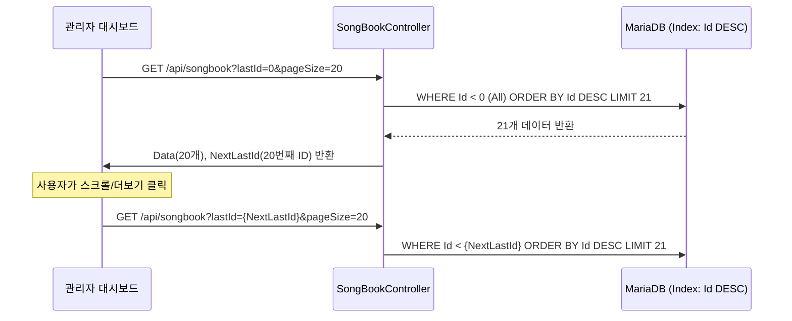

# MooldangBot (MooldangAPI) 시스템 상세 분석 보고서 v4

> 작성일: 2026-03-25  
> 분석자: 물멍 (Senior Full-Stack AI Partner)  
> 기반 문서: `md/Research3.md` + `md/SongQueueResearch.md` 통합 분석

---

## 1. 프로젝트 개요

**MooldangBot**은 치지직(CHZZK) 스트리밍 플랫폼과 연동되는 **멀티테넌트 스트리밍 봇 & 대시보드 API 서버**입니다.  
C# .NET 10, EF Core (MariaDB), MediatR, SignalR을 핵심 기술 스택으로 사용하며, **이벤트 드리븐 아키텍처(EDA)** 위에서 동작합니다.

### 최신 업데이트 (v4)
- **노래책(Songbook) 설계**: 대량의 곡 목록 관리를 위한 신규 엔터티 및 **인풋 페이징(Seek Pagination)** 도입 확정.
- **오버레이 안정화**: `undefined` 표시 버그의 원인(PascalCase 필드명 불일치) 규명 및 전역 규격 통일 계획 수립.
- **룰렛 시스템 고도화**: 애니메이션 지연 알림(SpinId) 및 PascalCase 전역 통일 완료.

---

## 2. 📁 주요 폴더 구조 및 핵심 파일

- `Controllers/SongBookController.cs`: **[NEW]** 노래책 CRUD 및 인풋 페이징 처리.
- `Models/FuncSongBooks.cs`: **[NEW]** 스트리머 전체 레퍼토리 관리 엔터티.
- `wwwroot/songlist_overlay.html`: PascalCase 동기화 적용으로 **UI 버그 해결 예정**.
- `md/SongQueueResearch.md`: **[NEW]** 신청곡 및 노래책 시스템 상세 설계 도큐먼트.

---

## 3. 핵심 아키텍처: 인풋 페이징 (Seek Pagination)

대규모 데이터를 조회할 때 `OFFSET` 방식의 성능 한계를 극복하기 위해 `LastId` 기반의 페이징 아키텍처를 적용합니다.

---

## 4. 데이터 정합성 강화 계획
- **PascalCase 통일**: 백엔드 `JsonOptions` 설정에 맞춰 프론트엔드 속성 참조를 `Title`, `Artist`, `Status` 등으로 즉시 일원화.
- **오버레이 렌더링**: `songlist_overlay.html`의 렌더링 루프에서 `undefined` 방지 처리(`item.Title || "제목 없음"`) 추가.

---

## 5. 향후 과제 (Next Steps)

1. **노래책 구현**: `FuncSongBooks` 테이블 생성 및 인풋 페이징 API/UI 실제 구축.
2. **검색 기능**: 노래책 내 제목/가수 통합 검색 인덱스 적용.
3. **오마카세 연동**: 오마카세 메뉴와 노래책의 곡 정보를 매핑하여 자동 신청 기능 강화.

---
*분석 기준: 2026-03-25, 물멍(AI) v4 작성*
