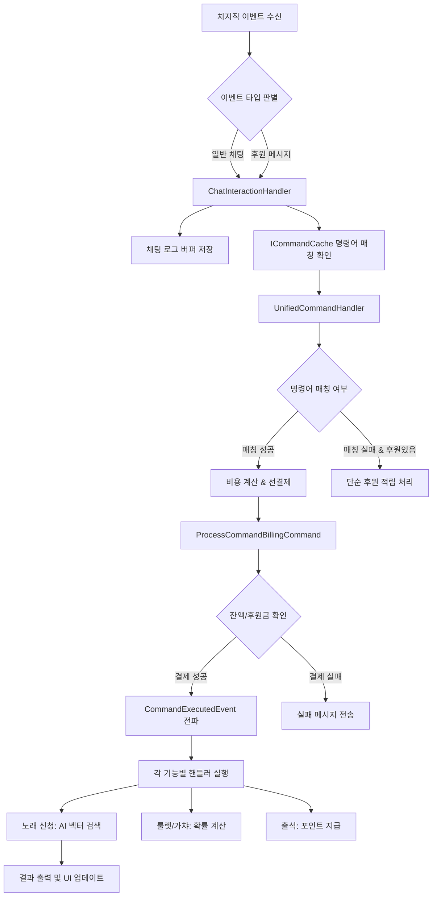

# [보고서] 치지직 명령어 및 후원 통합 처리 프로세스

## 1. 개요
본 시스템은 치지직 플랫폼에서 발생하는 채팅 및 후원 이벤트를 실시간으로 수신하여, 단순 채팅 기록부터 정교한 명령어 매칭, 후원금 기반 포인트 정산, 그리고 AI 벡터 검색 기반의 노래 신청까지 통합적으로 처리합니다.

---

## 2. 통합 처리 순서도 (Flowchart)

---

## 3. 주요 단계별 상세 설명

### 1단계: 이벤트 수신 및 다형성 처리 (`UnifiedCommandHandler`)
- **이벤트 변환**: `ChzzkChatEvent`와 `ChzzkDonationEvent`를 단일한 `ChatMessageEvent` 포맷으로 변환하여 명령어가 포함된 후원 메시지도 일반 명령어처럼 처리할 수 있도록 합니다.
- **멱등성(Idempotency) 검사**: 동일한 메시지 ID에 대해 10분간 중복 처리를 방지하여 네트워크 재시도 등으로 인한 이중 결제를 차단합니다.

### 2단계: 지능형 명령어 매칭 (`ICommandCache`)
- **다중 매칭**: 하나의 메시지에 여러 명령어가 포함된 경우(예: 출석과 노래 신청을 동시에) 이를 모두 찾아내어 처리합니다.
- **정교한 매칭 엔진**: 단순 일치(Exact)뿐만 아니라 접두사(Prefix), 정규표현식(Regex) 등을 지원합니다.

### 3단계: 통합 결제 및 정산 (`ProcessCommandBillingCommand`)
- **하이브리드 결제**: 명령어가 요구하는 비용을 사용자의 '후원 잔액(Donation Point)' 또는 '채팅 포인트(Chat Point)'에서 우선순위에 따라 자동 차감합니다.
- **동적 비용 처리**: 노래 신청과 같이 상황에 따라 비용이 변하는 경우, 선결제가 아닌 기능 실행 단계에서 실시간 정산이 이루어집니다.

### 4단계: AI 벡터 검색 기반 노래 신청 (`MariaDbVectorConverter`)
- **의미 기반 검색**: 노래 제목이 정확히 일치하지 않아도 AI 임베딩 벡터를 통해 유사한 곡을 찾아냅니다.
- **바이너리 최적화**: MariaDB 11.7의 `VECTOR` 타입을 사용하여 고속 유사도 계산을 수행하며, 최근 수정을 통해 768차원 최적화 및 바이너리 직접 주입 방식으로 검색 정확도와 속도를 극대화했습니다.

---

## 4. 최근 주요 개선 사항
1.  **바이너리 벡터 주입**: 기존의 문자열 기반 벡터 입력을 바이너리 직접 주입 방식으로 교체하여 소수점 오차 및 파싱 오류를 원천 차단했습니다.
2.  **임베딩 차원 고정**: Gemini API 요청 시 `outputDimensionality: 768`을 명시하여 데이터베이스 규격과의 완벽한 호환성을 확보했습니다.
3.  **후원/포인트 통합**: 후원금이 들어왔을 때 명령어 실행 여부와 관계없이 설정에 따라 포인트가 자동 누적되도록 정산 로직을 강화했습니다.
